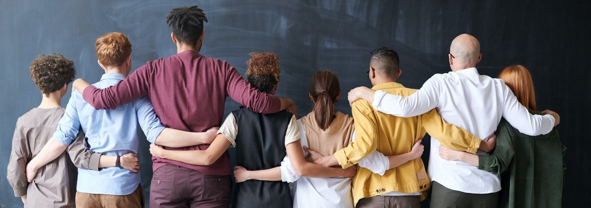

# Understanding Culture

## Overview {-}

***Welcome to ANTH 101!***

> Anthropology is the study of all humans in all times in all places” (Wesch, 2017).

I have chosen two textbooks for this course. One that introduces you to a wide range of topics through a systematic, descriptive approach. However, you will notice that we do not cover all topics nor all chapters – there simply are too many. I have selected instead, the most common topics that will expose you to how contemporary people across the world live their lives differently than how you live yours. That textbook, called ***Perspectives,*** fittingly has numerous authors for the different chapters. However, I will refer to this resource as ***Perspectives*** rather than by the individual names of authors for each chapter.
<!--
If we want learners to cite properly, we need to model the same.
-->

The second textbook called ***The Art of Being Human*** is limited in scope and topics, but it takes you on a journey of discovery. The author, Michael Wesch, asks questions, and challenges you to find answers. He is masterful in working with core themes, which he presents as videos and challenges for you to do yourself. The New York Times recognized Wesch as an innovative teacher who “give(s) students an experience that might change how they think, what they care about or even how they live their lives" (p. 359).

Here are a couple of quotes that introduce you to the experience you are about to have through this course:

> Anthropology is not only the science of human beings, but also the art of asking questions, making connections, and trying new things” (p. 5).

> You will have to overcome your fears, step outside your comfort zone, and get comfortable with the uncomfortable” (p. 5).

> … my willingness to change myself might be simultaneously the ONLY and BEST thing I can offer the world … “ (p. 353).

Wesch talks about being stretched himself – and he challenges you to be stretched – and become a healthy and responsible individual who can create a healthy and responsible society. If each of us does that, we collectively can create a healthier more inclusive and humane world. The fundamental experience of this textbook and the challenges through ***The Art of Being Human,*** is summarized this way:

>“You cannot just think your way into a new way of living. You have to live your way into a new way of thinking” (p. 6).

<!--hidden comment-->
### Topics {-}  

This unit is divided into the following topics:

 1. What is Anthropology? What is Cultural Anthropology?  
 2. Anthropological Perspectives- Why is Anthropology Important?  
 3. What is Culture?  

### Learning Outcomes {-}  

When you have completed this unit, you should be able to:

Define *culture* and the six characteristics of culture.  

Discuss *ethnocentrism* and the role it played in early attempts to understand other cultures.

Explain how the perspectives of *holism*, *cultural* *relativism*, *comparison*, and *fieldwork*, as well as both *scientific* and *humanistic* tendencies make anthropology a unique discipline.  

Evaluate the ways in which anthropology can be used to address current *social*, *political*, and *economic* issues.  

### Activity Checklist {-}  

::: {.callout-note}

Here is a checklist of learning activities you will benefit from in completing this unit. You may find it useful for planning your work.

#### Learning Activities {-} 

1. Read and Reflect    (20 minutes)  
2. Watch the video...    (8 minutes)  
3. Explore the online resources...    (10 minutes)  
4. Read the Case Study...    (10 minutes)  
5. Take the ungraded quiz...    (10 minutes)  

:::

::: {.callout-tip}

#### Assessments {-}

*Unit 1 Discussion Post*: Respond to the questions posted.  
*Unit 1 Quiz (5%)*: Assesses your understanding of Unit 1 learning outcomes. Refer to Chapter 1 of your textbook and other online resources.
:::

::: {.callout-warning}
**Tips for Instructors**
Learning activities are typically ungraded, and can be optional for students, however they are designed to help students learn the material and prepare for the assignments.
:::

## What is Anthropology?

We begin our study by introducing the discipline of anthropology. Anthropology is an attempt to systematically study and document cultural differences. This course is solely a study of one sub-field: cultural anthropology. We will not study the other sub-fields which are archaeology, biological anthropology and linguistic anthropology. All four sub-fields are “applied” meaning that applied anthropologists span the subfields and use anthropological methods, and findings to solve practical problems in public and private sectors such as business and health.

## Anthropological Perspectives and Problem-Solving

Anthropology is unique from other social sciences, like psychology and sociology, in that anthropological perspectives involve four features:

- Holism  
- Relativism  
- Comparison  
- Fieldwork  

Because of its focus on differing and shifting perspectives, the study of anthropology enables students to think their way to another way of relating and living, and therefore “the anthropological perspective is an essential skill for nearly any career in today’s globalized world” (p. 17).

The *Perspectives* textbook introduces you briefly to the dual perspectives of anthropology being both scientific and humanistic (see p. 17). It is a science in its systematic approach. It is an art in that individuals are unique in their experience of their humanity. Michael Wesch, the author of your second textbook, shares “what the science of human beings can tell us about the art of being human.”

::: {.callout-caution}

***Note** that the learning activities in this course are ungraded, unless specified.  They are designed to help you succeed in your assessments in this course, so you are strongly encouraged to complete them.*

:::

### Resources {-}

::: {.callout-note}
The resources below will help you better understand the content explored in this unit. Take some time to explore this material; it will be discussed during the Learning Lab and will play an important role in course assessments.
:::

In order to build a foundational understanding of anthropology, it is important that we first understand why anthropology is important. The readings provided below are intended to guide your exploration of anthropology. When reading chapters in the textbooks, the chapters should be read in their entirety, unless you are instructed that you can omit certain sections. The entire articles have been provided for your reference but the instructions below outline important sections to focus your attention on.

### Activity Reading {-}

::: {.callout-note}

#### Reading {-}

We begin with a reading that introduces the field of anthropology. Below is an outline of the reading that is to be followed in conjunction with the reading- it will help focus your attention:

<!--
 

  
Outline

  <h5>Learning Objectives</h5>  
  - Four subfields of anthropology  
  - Culture  
  - Ethnocentrism  
  - How anthropology is unique  
  - Using anthropology to address current issues  

<h5>What is anthropology?  </h5>
  - The study of humanity; everything and anything that makes us human  
  - Cultural Anthropology  
  - Achaeology  
  - Biological Anthropology  
  - Linguistic Anthropology  
  - One practical subfield  
    - Applied Anthropology  

<h5>What is Cultural Anthropology?</h5>
  - Cultural Anthropologists study the similarities and differences among living societies and cultural groups  
  - Also ask broader questions about humankind  
  - Often study social groups different from their own, but examine subcultures in their own society  

<h5>What is Culture?</h5>
  - A set of beliefs, practices, and symbols that are learned and shared  
    - beliefs: all mental aspects of culture  
    - practices: behaviours and actions  
    - symbols: meanings of cultural objects and ideas  
  - Humans have the capacity to learn any culture  
  - culture changes in response to internal and external factors  
  - Humans are not bound by culture but can choose to resist or change it
  - culture is symbolic
  - our reliance on culture distinguishes us from other animals
  - culture and biology are interrelated

<h5>The (other) subfields of anthropology</h5>
  - Biological Anthropology
    - the study of human origins, evolution, and variation
  - Archaeology
    - the study of the material past using excavation
  - Linguistic Anthropology
    - study of human language
  - Applied Anthropology
    - application of anthropological theories, methods, and findings to solve practical problems

<h5>Anthropological perspectives</h5>
  - Fieldwork
    - ethnography based on participation-observation
    - descriptive accounts of culture with theory
  - Scientific vs Humanistic Approaches
    - biological subfield uses a more scientific approach
    - cultural subfield uses a more humanistic approach

<h5>Why is anthropology important?</h5>
  - broad knowledge of other cultures
  - skills in observation and analysis
  - critical thinking
  - clear communication
  - applied problem solving
  - The anthropological perspective undermines ethnocentrism and the idea that people are 'Other'

 

After reading through the slides, take a moment to read the following section from the textbook- it will help support your understanding of the content presented above
-->

 

  
**Outline**

  <h5>Learning Objectives</h5>  
 - Four subfields of anthropology  
 - Culture  
 - Ethnocentrism  
 - How anthropology is unique  
 - Using anthropology to address current issues  
- What is anthropology?  
  - The study of ...
  - Four subfields  
    - ...  
    - ...  
    - ...  
    - ...  
 - One practical subfield  
    - ...  
- What is Cultural Anthropology?  
  - ...  
  - ...  
  - ...  
- What is Culture?  
  - A set of ..., ..., and ... that are ...  
    - ...  
    - ...  
    - ...  
  - Humans have the capacity ...  
  - culture changes in response to ...  
  - humans are not bound by culture but ...
  - culture is ...
  - our reliance on culture ...
  - ... and ... are interrelated
- The (other) subfields of anthropology
  - ...
    - ...
  - ...
    - ...
  - ...
    - ...
  - ...
    - ...
- Anthropological perspectives
  - ...
    -  based on
    - ... accounts of culture with ...
  - ... vs ... approaches
    - biological subfield uses a ...
    - while the cultural subfield uses a ...
- Why is anthropology important?
  - broad knowledge of ...
    - skills in ... and ...
    - ...
    - ...
    - ...
  - The anthropological perspective undermines ... and the idea that people are .... 

 

After reading through the slides, take a moment to read the following section from the textbook - it will help support your understanding of the content presented above.

**Read** [**An Open Introduction to Anthropology**](assets/unit1/Introduction_to_Anthropology.pdf) 

:::

::: {.callout-caution}
**Note:** *Read the introduction and be guided by the outline. Omit the brief history and sub-fields section. Read all other sections, including the “Applied Anthropology” section (pp 13-14) and “Why is anthropology important?” (p 17). Reading the illustrations of anthropologists at work is optional.*

**Note:** *Reading chapters from either of the two textbooks provides the foundation and content to the course topics. Understanding of this will be tested in 4 Unit tests.*
:::
<!--hidden comment-->
### Activity Learning {-}

::: {.callout-note}

#### Personal Reflection  {-}

To build upon the first reading, this article offers additional context around the importance of anthropology:

#### Read: [**Art of Being Human- Introduction**](assets/unit1/ArtOfBeingHuman2017Intro.pdf) {-}

#### Reflect {-}

*After reading the article, complete the following:*

Take a few moments to read through the chapter; towards the end of the letter to students you will find a section titled **"Ten Big Ideas."** Take some time to carefully read through this section again- identify which of those "big ideas" are particularly significant (from your perspective).

Next, consider the following quote:

**We fail to examine our assumptions**.

While many of us may not think that *"we are the center of the universe,"* this Learning Activity provides an opportunity to reflect on some of our own assumptions. For this reflection, consider the following guiding questions:

1. How much of your daily routine, thoughts and habits focus on YOU?
2. What do you think about (daily)?
3. What do I do that is all about ME?

*Be prepared to share your thoughts with the rest of class during the Learning Lab.*

:::

## What is Culture?

Several sources will be used to learn and reinforce the fundamental ideas about culture. This section has several important terms and concepts. You will learn about the characteristics of culture and also learn about cultural universals versus cultural relativism, and about ethnocentrism which influences how you see yourself and others.

We will cycle through the ideas of Culture with three rounds. First an introductory exposure to the study of culture, then aim to gain perspective through a classic article about Americans and a modern perspective on a Western pastime, golf. The third round of readings and embedded videos will revisit some concepts you’ve already been introduced to, and add important new ideas. The material covered in this unit provides the fundamental concepts, and therefore, we will cycle through some terms or concepts more than once.  

::: {.callout-note}
#### Critical Thinking Question {-} 
*Why is ethnocentrism the major obstacle to the understanding of other cultures? How might it be overcome?*
:::

### Resources {-}

The resources below will help you better understand the content explored in this unit. Take some time to explore this material- it will be discussed during the Learning Lab and will play an important role in course assessments.

### Learning Activity {-}

::: {.callout-note}

We begin this section by reading Lesson Two from Wesch's text. This reading is intended to help us better understand what culture is. 
Click on the links below -

#### **Read** {-}

  - [**The Art of Seeing**](assets/unit1/Art_Of_Seeing.pdf)

  - [**Body Ritual among the Nacirema**](assets/unit1/Body_Ritual_Article.pdf)

  - [**Growing Up Among The Nacirema**](assets/unit1/growing-up-among-the-nacirema.pdf) 

#### Watch and Reflect {-}

Take a moment to watch the following video and consider how some of the themes explored in this unit and the readings connect to subject of this video.

#### **Watch** [Adventures with the Nacirema] {-}

<iframe width="560" height="315" src="https://www.youtube-nocookie.com/embed/Hxusdfb3g04" title="YouTube video player" frameborder="0" allow="accelerometer; autoplay; clipboard-write; encrypted-media; gyroscope; picture-in-picture; web-share" allowfullscreen></iframe>

<!-- #### *Reading #4* {-} -->

#### *Reading* {-}

Read the following article. As you read the article, it is suggested to follow along with and complete the outline provided which will help you better prepare for assessments in the course.

- **Read** [**Perspectives- Chapter 13**](assets/unit1/u1_perspective-chapter13.pdf) 

***To support your learning, please copy and paste the outline below into your own note-taking app and write while you read.***

The Development of Anthropological Ideas Outline

- Questions  
 - How did cultural anthropology concepts define the discipline?  
 - How does the anthropological perspective differ from other prespectives?  
 - What is the relationship between colonialism and anthropology?  
 - How do specializations reflect the range of questions that anthropologists address?  
- Central Concepts  
 - Culture  
   - Tylor ...  
   - Morgan ...  
 - Holism  
   - taking a broad view ...  
   - Boas ...  
 - Plasticity  
   - Boas ...  
 - Participant Observation  
   - Malinowski ...  
 - Area studies and beyond
   - ...

<!-- #### *Reading #5* {-} -->

Read the following article. As you read the article, it is suggested to follow along with the slides provided- they will help you better prepare for assessments in the course.

- **Read** [**Perspectives- Chapter 2**](assets/unit1/Perspectives-ch2.pdf)

***To support your learning, please copy and paste the outline below into your own note-taking app and write while you read.***

The Culture Concept Outline

- Main Topics  
 - Ethnocentrism and cultural relativism  
 - Early anthropologists Frazer and Tylor  
 - armchair anthropology vs. participant-observer fieldwork  
 - Franz Boas and culture  
 - Ethics  
- Thoughts on culture over a cup of coffee  
 - How do you define culture?  
 - anthropologists developed the culture concept  
 - Importance of ...  
 - How anthropology became a ...  
- Stories as a reflection of culture  
 - *The Other* ...  
 - *Gulliver's Travels* ...  
 - Armchair anthropology ...  
 - Ethnocentrism ...
 - Early explorations and ... created ideas of ...  
 - Sir James Frazer- *The Golden Bough* (1890)  
   - ...  
 - Sir EB Tylor- *Primitive Culture* (1871)  
   - ...  
   - ...  
   - human groups go through stages of ..., ..., and ...
 - the 20th century brought ... to anthropology and the importance of ...  
   - ...  
   - Bronislaw Malinowski ...  
- The development of the theories of culture  
 - Anthropology in Europe  
   - Functionalism  
     - ...  
   - Structural-functionalism  
     - ...  
   - However, these theories do not explain ...  
 - Anthropology in the US  
   - Franz Boas
 - Cultural relativism ...  
 - Benedict, Mead, and Kroeber  
   - ...  
- Ethical issues in truth telling
 - American Anthropological Association Code of Ethics
   - ...  
 - Malinowski in the Trobriand Islands  
   - ...  
   - ...  
 - Chagnon and Neel in the Amazon of Brazil and Venezuela
   - ...

<!-- #### **Read** {-} -->

At this point, you will revisit some ideas you have learned about, and also add a few more new concepts to your understanding of culture. 

- **Read** [**Understanding Culture**](https://humangeography.pressbooks.com/chapter/understanding-culture/){target="_blank"} from the beginning, and finish just before the section titled *"Culture Change."*"

The chapter includes a video on *Symbols, Values, and Norms*, and a second one on *Cultures, Sub-Cultures and Counter-Culture*. End at that point. You do not need to read the *Cultural Change* section we will pick that idea up at the very end of the course.

- **Read** [**Understanding Culture**](https://humangeography.pressbooks.com/chapter/understanding-culture/)

:::

### Learning Lab Information {-}

Welcome to the first Learning Lab of the course. Each week, it is expected that students attend, and actively engage in a Learning Lab. For this course, the structure and expectations of this time will vary. During this time, however, students will be engaging with their Instructor and/or their Facilitator- they will be leading the session and providing guidance. Additionally this time provides an opportunity for students to seek support or ask questions about any of the elements of the course.

It is expected that students preview the **Learning Lab** section of each unit ***prior*** to attending this session. Often their are readings or activities that you will need to complete in order to prepare for this component of the course. It is also important to note any guiding questions from the Learning Activities embedded throughout each topic- your Facilitator will also be using this time to review the themes from these activities. It is important to review each so that you are prepared to engage with the rest of the group.

{--For most Learning Lab sessions, students will earn marks towards their "Participation" grade for the course. However, some of the Learning Labs will require students to formally present their ideas and research- this will count towards the "Activities" component of your final grade.--}

Be sure to carefully read through the instructions for the Learning Lab each week and organize your time accordingly.

### Learning Lab: Talking to Strangers {-}

We begin our first Learning Lab with a challenge: talking to strangers! As you have learned in this unit, anthropology involves exploring the lives and cultures of others. Based on that exploration, we can develop an understanding of how people live and what things make them unique.

***To begin this activity,*** follow the link below. Here you will find instructions for this challenge.

[**Talking to Strangers**](https://anth101.com/challenge1/){-}

Once you have completed the challenge, you will be asked to share your experience. Use the guidelines provided on the link to prepare your thoughts.

During the set time for the Unit 1 Learning Lab, students will be expected to share their thoughts and ideas from their experience during this *challenge.* Your Facilitator will be guiding the conversation but will be expecting each of you to engage and contribute to the conversation.

As noted above, some time during this Learning Lab will also be set aside so that you can ask any questions you have about the course. Your Facilitator will also be taking some time to review some general information and expectations for the course.

In addition to the activity above, each student should be prepared to discuss the readings and activities found throughout Unit 1. The Instructor and/or Facilitator will be using the Learning Lab to explore these resources.

::: {.callout-caution}

**Note:** *Students will be assessed, during Learning Labs, based on the* ***"Participation"*** *criteria. This criteria can be found under the* **Assignment** *tab at the top of the page. It is important to review this information prior to the Learning Lab.*

:::

## Summary{-}

[add content]

//todo #1

## Assessment {-}

::: {.callout-tip}
Students are not responsible for submitting any assignments for grading in Unit 1. Please note, however, that **the content of Unit 1 will be assessed as part of the test you will take at the end of Unit 2.** It is strongly recommended that students review the content from Unit 1 to prepare for this assessment. One way to do that is to use the blank outlines provided on this page and try to reproduce the full outline without looking at your notes or the readings. Once you have finished that, then compare to your completed notes and the readings to will see what you need to review. Repeat this process before your exam, and/or as many times as you need to.
:::

## Checking your Learning {-}

::: {.callout-important}
Now that you have completed the learning activities and assignments for this unit, check the unit learning outcomes below to see if you are able to do the following:

- Define *culture* and the six characteristics of culture.  
- Discuss *ethnocentrism* and the role it played in early attempts to understand other cultures.  
- Explain how the perspectives of *holism*, *cultural relativism*, *comparison*, and *fieldwork*, as well as both *scientific* and *humanistic* tendencies make anthropology a unique discipline.  
- Evaluate the ways in which anthropology can be used to address current *social*, *political*, and *economic* issues.  

Feel free to review topics more in depth or continue on to the next unit.
:::
