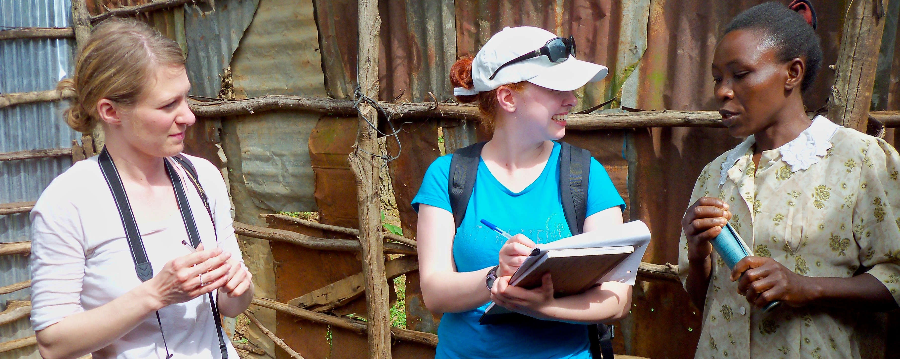

# Fieldwork

*TWU travel study students interview a Kenyan villager. Photo by Ruth Anaya*

## Overview

In Unit 1, we began our exploration of Anthropology by introducing the field and, in particular, developing an awareness of the importance of culture. Unit 2 will continue to build on your understanding of culture by focusing on how to do research in Cultural Anthropology and that involves: *Talking to strangers!*

For any of you who have been in a situation where you meet someone new *(a stranger)*, you will know how challenging it can be to establish rapport - typically this is done with "small talk" (also known as relationship building). As an Anthropologist, we might (or might not) be interested in relationship-building, but this vital step is critical for something we are VERY interested in: ***discovering answers to BIG questions.*** Without the ability, and skills, to build rapport with strangers, it is very difficult to get a relationship to a place where we can ask the bigger questions we really seek answers to. It is important to remember then, that the more you connect with others, that is, deeply connect with others, the more you will discover the differences that *“represent [a] vast range of human potential and possibility” (Wesch, p. 27).*

This unit will prepare you to start exploring the world....

### Topics {-}

This unit is divided into the following topics:

 1. Perception  
 2. Fieldwork (Methods)  
 3. Fieldwork (Practice)  
 4. Implications of Fieldwork  

### Learning Outcomes {-}

When you have completed this unit, you should be able to:

- Demonstrate how to go about doing an ethnography
- Describe how ethnographic fieldwork differs from other approaches
- Explain contemporary ethnographic fieldwork techniques and perspectives, including the difference between cultural and cross-cultural research methods
- Identify and list ethical considerations in fieldwork
- Explain the difference between individualism and collectivism

### Activity Checklist {-}

Here is a checklist of learning activities you will benefit from in completing this unit. You may find it useful for planning your work. Note that all Learning Lab activities contribute towards your Participation mark for this course.

::: {.callout-note}
<!-- [plugin:content-inject](../_2-1)  -->
#### Learning Activity 2.1 {-}
  At the end of Topic 1, students will find Learning Activity 2.1. For this activity, students will be exploring a resources that will challenge your "views" of the world around you. Carefully consider your experience as you engage in this activity. You will be asked to share your thoughts as part of the Learning Lab for Unit 2.
:::

<!--[plugin:content-inject](../_2-8) -->
### Topic 2 Resource {-}

At the bottom of the page in Topic 2, students will find some important resources. It is expected that each student read through the slides and the articles. It is important to note that this content will be assessed and will help support your learning throughout the course.

<!--[plugin:content-inject](../_2-9) -->
## Learning Lab {-}

During this Learning Lab, students will be presenting their photos from the **Ethnography Challenge.**
Refer to the information found on the "Assessment" tab as it will provide direction as to what is expected as part of this presentation.
**Be sure to arrive to the Learning Lab prepared to present your photos!!!**
  
### Assessment {-}

::: {.callout-tip}
Each student is expected to submit their first assignment for the course: the "Ethnography Challenge - Activity #1." Carefully read through the instructions - your completed assignment can be submitted to the dropbox found at the bottom of the page.
**Please also note that there is a presentation component to this assignment as well. This will be part of the Learning Lab for Unit 2**.
Finally, each student will need to complete their first Unit Test at the end of Unit 2. This test will cover content from Units 1 and 2. The link, and additional information, can be found on the "Unit Test #1" link at the bottom of the page.
Your Facilitator will provide additional direction and support for any questions you may have.
:::

### Resources {-}

  - Biswas-Diener, R. & Thin, N. (2020). Culture. In R. Biswas-Diener & E. Diener (Eds), *Noba textbook series: Psychology.* DEF Publishers. <http://noba.to/y9xcptqw>
  - Brown, N., de González, L. T., McIlwraith, T. F., & American Anthropological Association. (2018). *Perspectives: An Open Invitation to Cultural Anthropology.* <http://perspectives.americananthro.org/Chapters/Introduction_to_Anthropology.pdf>
  - Wesch, M. (2018). *The Art of Being Human: A Textbook for Cultural Anthropology.* New Prairie Press. <https://anth101.com/wp-content/uploads/2018/01/ArtOfBeingHuman2017Intro.pdf>
  - Other online resources will be provided in the unit.

## Perception – *How You See and Experience Culture*  

Our first topic of Unit 2 reinforces, and expands, our understanding of culture. We will begin with the topic of perception: *how we see.*

In Unit 1, you were introduced to the works of Wesch in his quest for answers to important questions. Throughout the course I will often refer to his words as he articulately captures some of the big ideas we are exploring in this course. In this unit, we will introduce some more of his thoughts in his approach to fieldwork. Wesch says:

*We can respond to human differences with hate or ignorance, or we can choose to open up to them and ask questions we have never considered before.*

<!-- 
[plugin:content-inject](../_2-2) -->

::: {.callout-note}
### Learning Activity {-}

 - Our exploration of fieldwork requires developing our skill of awareness. To begin, turn your attention to:

[**Asking Questions,  Making Connections, and Trying New Things**](https://twu-fhss.github.io/anth101book/fieldwork.html)

:::

::: {.callout-caution}
***Note:*** *Although you are directed to a specific page, [please feel free to explore the rest of the site](https://anth101.com/) as it can offer many resources, and challenges, to help support your learning.*

Here, we learn about the *Art of Seeing:*

- ***Seeing our own Seeing*** to work past our assumptions.
- ***Seeing Big*** using complex models of culture.
- ***Seeing Small*** and noticing how the little things matter

And putting it all together to ***“See it all”*** using the holistic perspective.
:::

## Fieldwork – *How to Study Culture*

We now turn our focus to read about other's experiences in their endeavors to learn about others. Once again, our study will turn to Nacirema as we learn how traditional approaches differ from the approaches we use today. While anthropologists make choices as to the techniques they use, they are duty-bound to give ethical consideration to every study. A fundamental guideline for all Anthropologists is ***"Do no Harm."***

Below, you will explore culture through two activities. One activity will be **etic:** *you as an observer;* the other activity will be **emic:** *you as a participant.*

<!-- 
[plugin:content-inject](../_2-3) -->
### Resources {-}

The resources below will help you better understand the content explored in this unit. Take some time to explore this material - it will be discussed during the Learning Lab and will play an important role in course assessments.

### Activity: Reading{-}

::: {.callout-note}

#### *Reading #1* {-}

We now turn our attention to expanding our understanding of culture. We begin by following the link below:

- [**NOBA - Culture**](https://nobaproject.com/modules/culture#content)

Pay special attention to the "Social Psychology Research Methods" section, and note the difference between ***ethnographic study*** and ***cross-cultural research methods*** (Table 1).

Also, take a moment to reflect on how self is understood (situational identity) and valued differently in individualist and collectivistic cultures (Table 3). I also invite you to take a few moments to consider how cultural relativism and ethnocentrism lead us to value self and others differently (*cultural intelligence*).  

#### *Reading #2* {-}

Next, we turn our attention to reinforcing our understanding of fieldwork. Below is an outline that should be followed in conjunction with the reading. Please copy and paste the outline into your notes and complete them as you read.

<!--
[presentation="anth101/presentations/u4"]

Click to Open

<h5>Learning Objectives</h5>
- doing ethnography
- how ethnographic fieldwork contrasts with other approaches
- contemporary ethnographic fieldwork techniques and perspectives
- ethical considerations
- how do data become a story with meaning

<h5>Finding the Field</h5>
- Fieldwork
  - the most important method by which cultural anthropologists gather data
  - Chapter author Katie Nelson conducted fieldwork among a Brazilian tribe.
- *Coming of Age in Samoa* by Mead (1925)
- *Body Ritual Among the Nacirema* by Miner (1956)
- Ethnography
  -the in-depth study of everyday practices and lives of a people
  - "thick description"
- Participant Observation 
  - main method of doing ethnography
- Emic (insider) and Etic (outsider) perspectives

<h5>Traditional Ethnographic Approaches</h5>
- "Armchair" Anthropology 
  - relying on the stories of others and selecting those that fit pre-conceived ideas
- Bronislaw Malinowski, *Argonauts of The Western Pacific* (1922) pioneered the field method of participant observation
- Salvage ethnography - sought to preserve, document, and collect artifacts of "primitive" and "disappearing"
cultures
  - Flaherty's film *Nanook of the North* (1922)
  - Catlin and Curtis curated scenes of Native Americans, creating the image of the "Noble Savage"
- Holism - integrating all aspects of culture in order to understand the world's cultures
- In anthropology in the United States, this resulted in the Four-Fields Approach: Cultural, Biological, Linguistic and Archaeological anthropology
  - Emphasized links between fields, such as language and cognition (Sapir-Whorf hypothesis)

<h5>Ethnography Today</h5>
- Ethnography may be conducted in urban environments and multiple sites, not only in far away or hard-to-reach locations
- Using a deductive approach
- Qualitative vs. Quantitative
- Mixed methods are used more often today

<h5>Ethnographic Techniques and Perspectives</h5>
- Cultural relativism - the idea that we should seek to understand another person's beliefs and behaviors from the perspective of their own culture
- Ethnocentrism - the tendency to view one's own culture as important and correct and as a stick by which to measure all other cultures
- Activist anthropology strives to helps others, not only research their practices objectively
- Symbolic and Interpretive anthropology believes there is no objectivity, and that culture is a body of "texts" to be read
- Participant observation
  - Develops rapport with informants
- Conversations and Interviews
- Life histories
- Genealogy
- Key informants
- Field notes

<h5>Ethical Considerations</h5>
- American Anthropological Association's Code of Ethics
  - Stresses informed consent of study participants and making the results accessible

<h5>Writing Ethnography</h5>
- Data analysis
- Challenging the old idea of "ethnographic authority"
- Polyvocality
- Reflexivity

-->

Click to Open

<h5>Learning Objectives</h5>
- doing ethnography
- how ethnographic fieldwork contrasts with other approaches
- contemporary ethnographic fieldwork techniques and perspectives
- ethical considerations
- how do data become a story with meaning

<h5>Finding the Field</h5>
- Fieldwork
  - the most important method by which ...
  - Chapter author Katie Nelson conducted fieldwork ...
- ... by Mead (1925)
- ... by Miner (1956)
- Ethnography
  -the in-depth study ...
  - "t... d..."
- Participant Observation
  - ...
- ... (insider) and ... (outsider) perspectives

<h5>Traditional Ethnographic Approaches</h5>
- "Armchair" Anthropology
  - ...
- Bronislaw Malinowski, ... (1922) pioneered the ...
- Salvage ethnography
  - sought to ...
  - Flaherty's film ... (1922)
  - Catlin and Curtis curated ..., creating the image of ...
- Holism
  - integrating ...
- In anthropology in the United States, this resulted in the ... Approach: ..., ..., ..., and ... anthropology
  - Emphasized links between fields, such as ... (... hypothesis)

<h5>Ethnography Today</h5>
- Ethnography may be conducted ...
- Using a ... approach
- Q... vs. Q...
- ... are used more often today

<h5>Ethnographic Techniques and Perspectives</h5>
- Cultural relativism
  - the idea that ...
- Ethnocentrism
  - the tendency to ...
- ... anthropology strives to ..., not only research their practices objectively
- ... and ... anthropology believes there is no ..., and that culture is ...
- Participant observation
  - Develops ... with informants
- Conversations and Interviews
- Life histories
- Genealogy
- Key informants
- Field notes

<h5>Ethical Considerations</h5>
- ...'s Code of Ethics
  - Stresses ... of study participants and ...

<h5>Writing Ethnography</h5>
- Data analysis
- Challenging the old idea of "..."
- Poly...
- ...

In addition to the outline above, read through the following chapter which will help support your understanding of the ideas and themes identified in the outline above:

[**An Open Introduction to Anthropology**](https://pressbooks.pub/perspectives/chapter/doing-fieldwork-methods-in-cultural-anthropology/)

*Pay special attention to the section on "Ethical Considerations," and reflect on the principle of "Do no harm."*

:::

## Learning Lab {-}

As part of your Learning Lab, you will also present your **Ethnography Challenge** assignment. This assignment can be found by selecting the "Assessment" tab for Unit 2.

As we come to the end the end of Unit 2, your facilitator will help organize groups for this unit's Learning Lab. Once you have joined a group, your task is to select, and discuss, ONE of the following questions about culture change. *Please note, you will be asked to share your thoughts with the rest of the group at the end.*

 1. ***Ethnotourism*** (people travelling to visit and experience Indigenous cultures and societies) is becoming more popular. While it offers economic opportunities, it is also changing these cultures. How might a small-scale culture be affected, and how might an anthropologist work with them to adjust to changes brought about by tourism?  
 2. ***Dishwashers*** are not common in Japanese homes. If you were tasked with marketing dishwashers in Japan how would conduct the research?  
 3. How might the introduction of ***computers*** in a small-scale society change people’s ideas attitudes and behaviours?  
 4. If you were working with an Indigenous people in rural India to improve ***irrigation,*** what questions would you ask?

::: {.callout-caution}
**Note:** *Students will be assessed during Learning Labs based on the* ***"Participation"*** *criteria. This criteria can be found under the* **Assignment** *tab at the top of the page - it is important to review this information prior to the Learning Lab.*
:::

<!-- 
[plugin:content-inject](../_2-6) -->
### ***Looking Ahead...*** {-}

Although your Facilitator will mention this to you, please take some time to look ahead to Unit 5 as you will have a major assessment involving a Case Study. While it might be premature to begin that assignment now, *it is certainly a good time to start thinking about it.*

Below are a few resources to help with this process. For now, the goal is to expose you to two similar yet different indigenous cultures: the **Maori** of New Zealand, and the **Aborigines** of Australia.

As you watch this videos, be observant! I would encourage you to watch these short clips several times to capture the details of the environment, the things that are said (*and how they are said*), and relationships – self to the physical world, the social world, and the spiritual world.

<iframe width="560" height="315" src="https://www.youtube-nocookie.com/embed/NrgYGMv5dYw" title="YouTube video player" frameborder="0" allow="accelerometer; autoplay; clipboard-write; encrypted-media; gyroscope; picture-in-picture" allowfullscreen></iframe>

<iframe width="560" height="315" src="https://www.youtube-nocookie.com/embed/uwN3TcsLXsU" title="YouTube video player" frameborder="0" allow="accelerometer; autoplay; clipboard-write; encrypted-media; gyroscope; picture-in-picture" allowfullscreen></iframe>

<iframe width="560" height="315" src="https://www.youtube-nocookie.com/embed/79II_eXKoWo" title="YouTube video player" frameborder="0" allow="accelerometer; autoplay; clipboard-write; encrypted-media; gyroscope; picture-in-picture" allowfullscreen></iframe>

## Assessment {-}

::: {.callout-tip}
Students are responsible for two graded assessments during this unit. The first assignment, the **Ethnography Challenge - Activity #1,** is outlined below - this assignment will be presented as part of this unit's Learning Lab.

Additionally, students are responsible for taking **Unit Test #1.** This test will assess your understanding of content from Units 1 & 2.
:::

### Ethnography Challenge - Activity #1 {-}

Unit 2 presents your first formal assessment. This will involve participating in an activity that focuses on ethnography. Your task, for this *Challenge,* will be to gather your own cultural material in the form of pictures or videos so that they can be used for interpretation - by you and others!

::: {.callout-caution}
***Please Note:*** *Part of this assignment (the Discussion) will be shared during your Learning Lab!*
:::
<!-- 
[plugin:content-inject](../_2-4) -->

#### ***To Begin*** {-}

Below, you will find a link that outlines this *Challenge.* Take a moment to carefully read through the instructions. Additionally, you will also find some examples of what materials could look like.

Click on the link below to begin:

[**Fieldwork of the Familiar**](https://anth101.com/challenge2/)

::: {.callout-caution}
**Important**  *We will not be expecting students to post their pictures on Instagram (or any other social media platform). Instead, this step is to prepare for our Learning Lab where you will be sharing your pictures with the group so that we can respect everyone's privacy from the public - these materials will, however be uploaded to the assignment dropbox found at the bottom of this page.*
:::
<!-- 
[plugin:content-inject](../_2-5) -->
#### ***Next...*** {-}

Now that you have read through an outline of this activity, it is expected that each student will bring four or five photos to share with class - ***these will be shared during the Learning Lab for Unit 2.***

***TIP for sharing your photos*** - Do not distort your picture if you paste it to a PPT slide or a Word document. You may crop a picture but you should not stretch it in any one direction. It should always look as it was when you took the picture. In MS Word or PPT, you can select 'Lock Aspect Ratio' when resizing.

By this point in the course, you have learned how important detail is to an Anthropologist - for this reason, it is important that you are ***very, very descriptive.*** As part of your presentation, each student must create a list of at least **20 descriptive words or phrases** that describe elements/components of your photos - these will be shared with the class.

As part of developing these descriptions, consider the following guiding questions:

 1. Is there a prominent use of a particular color or colors?  
 2. Does quantity or size appear to be emphasized?
 3. Is there a lot of variety within one domain (an area of focus)?  
 4. Are things simple or complex and detailed?  
 5. Do you see conformity in behaviors? What things appear to be the  same? What is everyone doing, or wearing, etc...?  

<!-- [plugin:content-inject](../_2-7)  -->
#### ***Finally...*** {-}

Following the Learning Lab, it is expected that you will upload your ***favorite*** photo to the dropbox provided (i.e their *one* favorite photo).

As part of this submission, students **MUST include a caption.** Again, consider how important descriptive language is to an anthropologist - get creative!

Once this step has been completed, upload your photo and caption to the **Ethnography Challenge - Activity #1** dropbox.

Here are the grading criteria that will be used to assess your submission:

|   | Assessment Criteria | **%** |
| :------- | :------ | :----- |
|    **Meaningfulness**    | Evidence of meaningful thought put into searching out, and  seeing the "unfamiliar." | 1     |
|   **Quality of Data**    | The picture is meaningful in the sense that it was chosen to  document cultural features in a meaningful manner that is intentional in its  focus of the subject matter. | 1     |
| **Creativity of Images** | Image composition demonstrates creativity in some form (e.g. use  of light, color, perspective, etc...) | 1     |
|      **Discussion**      | Your oral description of your pictures should be accurate, rich  and vivid. Also, clearly explain your field experience. | 1     |

*This activity will represent 4% of your overall grade for the course - your Facilitator will be grading this assessment*

## Unit Test #1

In addition to the Ethnography Challenge, each student is required to complete the first unit test at the end of Unit 2.

::: {.callout-caution}

***Please note*** that this unit test will focus on all content covered in Units 1 & 2. Be sure to take some time to review the content in each section.

Additional information can be found by selecting the **Unit Test #1** tab at the bottom of the page. Here, you will find instructions for taking the test.

*This test will represent 10% of your overall grade for the course.*

:::

## Checking your Learning {-}

::: {.callout-important} 

Before you move on to the next unit, check that you are able to:

  - Demonstrate how to go about doing an ethnography
  - Describe how ethnographic fieldwork differs from other approaches  
  - Explain contemporary ethnographic fieldwork techniques and perspectives, including the difference between cultural and cross-cultural research methods  
  - Identify and list ethical considerations in fieldwork
  - Explain the difference between individualism and collectivism

:::