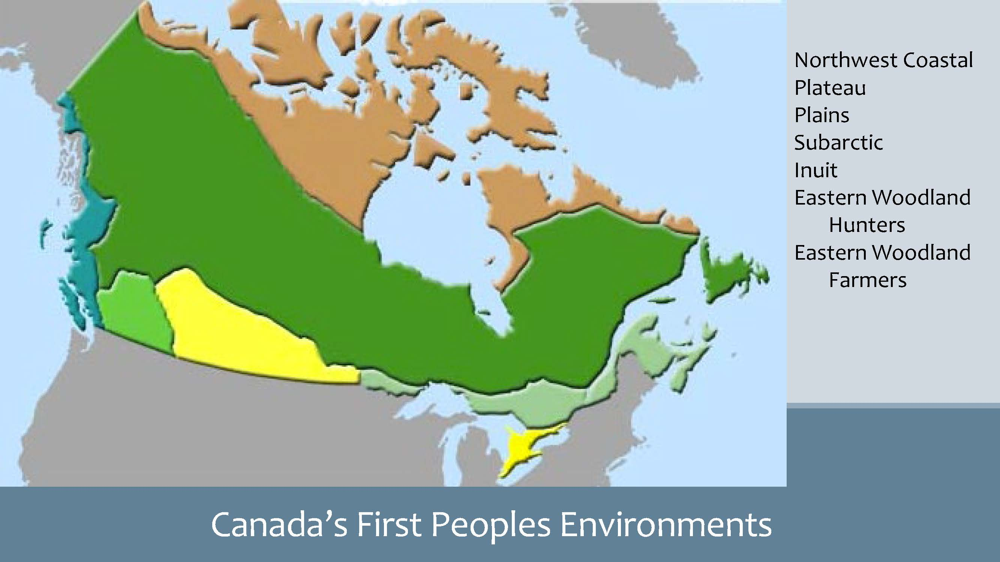
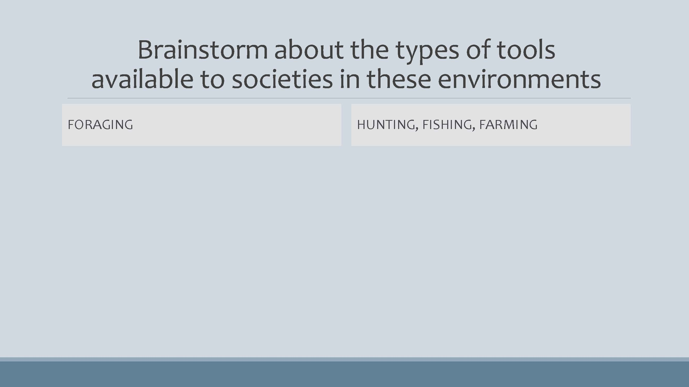

# Understanding Livelihoods (Subsistence and Economics)

*Market Day in a town in Uganda. Photo by Ruth Anaya*

## Overview {-}

In Unit 3, we will shift our focus to learning about the many different ways in which societies lived across the span of history, and how they live across the span of distance, in the many different geographies and environments of the world. Topics in this unit intersect with every other topic of anthropology, and the ways of getting or producing food, and ways of distributing and consuming products have wide-ranging implications. You will be introduced to some of the most unique cultures of the world, cultures whose way of life starkly contrasts with your own. This unit concludes with a challenge to live life differently for two weeks, without a tool or technological item. This short-lived experience will challenge you to think about how you could, or how you perhaps should, live your life differently than you have been doing.

### Topics {-}

This unit is divided into the following topics:

 1. Subsistence
 2. Economics
 3. Tools and Technologies

### Learning Outcomes {-}

When you have completed this unit, you should be able to:

- Identify the four modes of subsistence and describe the major activities associated with obtaining food in each system.  
- Assess the ways in which subsistence systems are linked to expectations about gender roles.  
- Categorize the social and economic characteristics associated with agriculture and describe the benefits and drawbacks of the agricultural subsistence system.  
- Describe the characteristics of the informal economy and of fair trade (modes of production).  
- Provide cultural illustrations of reciprocity, redistribution, and market exchange.  
- Explain how modes of exchange, and the use of money, shape everyday life and social relations.  
- Explain how intentional deprivation significantly and positively changed your values, attitudes and behaviors.  

### Activity Checklist {-}

Here is a checklist of learning activities you will benefit from in completing this unit. You may find it useful for planning your work. Note that all Learning Lab activities contribute towards your Participation mark for this course.

<!-- 
[plugin:content-inject](../_3-1)
[plugin:content-inject](../_3-5) -->

::: {.callout-note}
### Learning Activities {-}

- At the bottom of the page in Topic 1, students will find some important resources. There are a number of readings and slides for you to review. Additionally, take a few moments to watch through the video.
- At the bottom of the page in Topic 1, students will find some important resources. There are a number of readings and slides for you to review. Please note that the resources on Ten Thousand Villages and Fair Trade will be discussed during the Learning Lab for this unit.

:::

<!-- 
[plugin:content-inject](../_3-6)-->
### Learning Lab {-}

During this Learning Lab, students will be introduced to the **UnThing Experiment.** This activity will take place over a period of time   - for this reason, students are being introduced to the activity in Unit 3....
As part of this challenge, students will be submitting a reflection   - **it will be due at the end of Unit 5.**
This assignment will be outlined, in detail, on the "Assessment" page in Unit 5   - please preview the assignment before attending the Learning Lab for Unit 3.

## Resources {-}

- Brown, N., de González, L. T., McIlwraith, T. F., & American Anthropological Association. (2018). *Perspectives: An Open Invitation to Cultural Anthropology.*
- [Subsistence](http://perspectives.americananthro.org/Chapters/Subsistence.pdf)
- [Economics](http://perspectives.americananthro.org/Chapters/Economics.pdf)
- Wesch, M. (2018). *The Art of Being Human: A Textbook for Cultural Anthropology.* New Prairie Press.
- Other online resources will be provided in the unit.

## Subsistence Systems

Our first topic, in Unit 3, teaches us about the different ways in which peoples of the world get their food. You will be reading two chapters from the *Perspectives* text that will give you systematic information about how small-scale societies forage (gather plants and hunt or fish).We will also learn about how increasing complexity, and favorable environmental conditions, have allowed societies to become horticulturalist (farmers) or pastoralists (herders).  Ultimately, an important objective of this section is to introduce you (through video clips) to lifeways that are very different than your own.

As humans use the environment, they also affect it. That impact can be degrading to the environment, and can threaten small people groups whose existence is dependent on a fragile environment.  To better understand this crisis, you will explore some resources that advocate for the survival of indigenous peoples.

<!-- 
[plugin:content-inject](../_3-2)  -->
### Resources {-}

The resources below will help you better understand the content explored in this unit. Take some time to explore this material   - it will be discussed during the Learning Lab and will play an important role in course assessments.

<!-- ### *Reading #1* {-} Hidden comment -->
### Activity {-}

::: {.callout-note}

#### Reading 1 {-}

- We continue our study subsistence systems by focusing on a sequenced perspective of getting food: from small-scale foraging to horticulture, and eventually to large-scale agriculture. Below is a set of slides that are to be followed in conjunction with the reading   - they will help focus your attention:

:::

<!-- Hidden comment 

Click to Open

<h5>Learning Objectives</h5>
  - four modes of subsistence  
  - Domestication of resources  
  - How susistence and wealth are connected  
  - Sunsistence systems and gender roles  
  - Agriculture  
  - How global agricultural system contribute to wealth differences  
<h5>Studying Subsistence Systems</h5>
  - Subsistence systems  
    - the set of practices used by members of a society to acquire food  
  - Foodways - the cultrural norms and attitutdes surrounding food and eating  
  - Food is essential for humans, dependent on the carrying capacity of the land  
  - Every person plays a role as a producer,
  - distributor, or consumer of food  
  - Modes of Subsistence  
    - Every household must feed its members,creating a domestic economy that interacts with modes of production and exchange  
  - Immediate return system vs.Delayed return system
    - Four modes of subsistence:
      - Foraging,
      - Pastoralism,
      - Horticulture,
      - Agriculture

<h5> Foraging </h5>
    - Relies on wild plant and animal food resources already available in the environment
    - hunting,
    - fishing,
    - gathering of wild plant resources
    - broad spectrum diet
  - Small groups,with low population densities
    - Egalitarian social structre  
    - Generosity and sharing are social norms and a survival strategy  
    - Work is divided among gender lines  
    - Mostly nomadic groups, although a few sedentary foraging societies have existed  
    -  Marshall Sahlins:
    -  "the orginal affluent society"
      -  However, foraging is challengin and lesure time varies by group  
    - Not isolated, but in competition for resources with non-foraging groups  
    - Even foragers have manipulated the environment  

<h5>Pastoralism</h5>
    - Relies on herd of domesticated livestock
    - Nomadic pastoralism moves herds to available graxing fields and water several times a year
    - Animals are kept alive and fed well to produce diary products, wool, dung  
    - Trade with neighboring farms for other products  
    - Social life and status revolve around animal herds  
    - Men own cattle, women (and children) tend cattle  
    - Personal property is owned  
    - Act to conserve their environments using land restrictions and regulations  
    - Modern pressure threaten this lifestyle  

<h5> Horticulture </h5>
    - Relies on small gardens that move periodically  
    - Simple tools and physical labor  
    - Crops consumed by family units or exchanged with others in the community  
    - Also supplement their diets by raising animals for protien  
    - Use shifting cultivation  
    - ("slash and burn")  
    - Multi-cropping and intercropping  
    - Social life revolves around growing crops,which are used as gifts and signs of social status  

<h5> Agriculture </h5>
    - Cultivation of domesticated plants and animals using technologies such as irrigation,
    - draft animals, mechanization,and chemical inputs  
    - Allows for intensive and continious use of land resources  
    - led to Neolithic Revolution  
    - Reliance on few staple crops, often starches  
    - Population growth likely need to the need to create larger and more productive farms  
    - Farms also require more labor,encouraging farmers to have more children as laborers  
    - Division of labor and specializatio occur, leading to wealth differences  
    - Can be argued that it lead to a lower quality of life  

<h5> The Global Agricultural System </h5>
    - Enough food production exists to feed all the people on the planet,but unequally distributed  
    - Today, food exists in a world system  
    - Each product has a commodity chain, moving items far from their point of origin  
    - Distance and competition replace communal experiences  

 
-->

Click to Open

<h5>Learning Objectives</h5>
  - four modes of subsistence  
  - Domestication of resources  
  - How susistence and wealth are connected  
  - Sunsistence systems and gender roles  
  - Agriculture  
  - How global agricultural system contribute to wealth differences  

<h5>Studying Subsistence Systems</h5>
  - Subsistence systems ...
  - Foodways ...
  - Food is essential for humans ...
  - Every person plays a role ...

<h5>Modes of Subsistence</h5>
    - Every household must feed its members, ...
  - Immediate return system vs. ...
  - Four modes of subsistence: ...

<h5>Foraging</h5>
    - Relies on ...
    - Hunting ...
  - Small groups, ...
    - Egalitarian ...
    - Generosity and sharing are ...
    - Work is divided among ...
    - Mostly nomadic groups, ...
    -  Marshall Sahlins: ...
      -  However,
      -  foraging is challengin ...
    - Not isolated,
    - but in competition for resources with ...
    - Even foragers have manipulated the ...
<h5>Pastoralism</h5>
    - Relies on ...
    - Nomadic pastoralism ...
    - Animals are kept alive and fed well to produce ...
    - Trade with neighboring farms ...
    - ... and status revolve around animal herds
    - Men own cattle, ... tend cattle
    - ... property is owned
    - Act to conserve their environments using ...
    - Modern pressure threaten this ...
<h5> Horticulture </h5>
    - Relies on ... that move periodically
    - ... tools and ... labor
    - ... consumed by family units or exchanged with others in the community
    - Also supplement their diets by ... for protien
    - Use shifting cultivation - ...
    - Multi-cropping and ...
    - Social life revolves around ...,
    - which are used as ... and signs of ... status
<h5> Agriculture </h5>
    - Cultivation of ... and animals using technologies such as ... ,
    - draft animals,
    - ... ,
    - and chemical inputs
    - Allows for intensive and continious use of ... resources   -
    - led to ... Revolution
    - Reliance on few staple ... ,
    - often starches
    - ... growth likely need to the need to create larger and more productive ...
    - Farms also require more ... ,
    - encouraging farmers to have more ... as laborers
    - ... of labor and specializatio occur,
    - leading to ... differences
    - Can be argued that it lead to a ... quality of life
<h5> The Global Agricultural System </h5>
    - Enough food ... exists to feed all the people on the planet,
    - but ... distributed
    - Today,
    - food exists in a world system
    - Each product has a ... chain,
    - moving items far from their point of origin
    - ... and competition replace communal experiences

***Download the Chapter and read it as you follow along with the set of slides:***

- [**Subsistence**](http://perspectives.americananthro.org/Chapters/Subsistence.pdf)

*You can omit the section on “The Built Environment” and “The Origins of Agriculture”.*

#### Reading 2 {-}

- We know turn our focus to a presentation created by Dr. Anaya. Below the slideshow, you will also find some illustrative videos that support the content introduced in the slides. Together, these resources introduce you to the !Kung and Hadza as gatherers and hunters of Sub-Saharan Africa, and the Inuit as seal hunters of Canada’s northern Arctic. You are also introduced to the Masai cattle herders, and Somali camel, herders of Kenya. Through the use of pictures, you will also explore the hunting and fishing performed by a First Nation's group: the Sto:lo. Also of interesting note, it is in the Sto:lo territory that Trinity Western University is located. Finally, we end this section with a look at a North American example of agriculture as practiced by the Amish peoples (*you will learn more about the Amish in Unit 5*).

*Consider every concept mentioned in this set of notes as material that you will be tested on.*

**Click to Open**

<h5>Getting Food</h5>

  - Food-getting strategies vary widely from one society to another
  - Five major categories
    - Food collection
    - Horticulture
    - Pastoralism
    - Agriculture (ranching)
    - Industrialization
    - + combination of strategies
  - A culture's food getting strategy depends on the culture's environment and technology (tools)
  - Environment does not determine food-getting patterns but rather sets broad limits on possible alternatives through:
    - Water sources (type and location)
    - Climate: temperatures,
    - rainfall
    - Length of growing season
  - The environment affects the mobility of a people group
  - Technology helps people adapt to their specific environment

<h5>Subsistence Strategies</h5>

  - Foraging
    - Hunting animals
    - Gathering wild plants
  - Horticulture
    - Small-scale cultivation
    - Low intensity
    - Relies on human power and simple tools
  - Pastoralism
    - Animal husbandry
    - Products used as food and for exchange
  - Intensive Agriculture
    - Large-scale complex
    - Use of animal or mechanical power
    - Irrigation systems
    - Fertilizers
  - Industrial Agriculture
    - Larger, more complex
    - Technology
    - GMOs
    - Processing systems  

*image of the Yanomamö of the Amazon, Brazil*

- The Yanomamö practise shifting cultivation and supplement their diet with fishing and hunting.  
- This way of life is rapidly disappearing due to disease, disappearance of the rainforest, and run-ins with illegal gold miners.  
  - Human adaptation: also known as cultural ecology or human ecology  
  - Anthropologists examine both cultural and biological adaptations  
  - Many small-scale societies have adapted extremely well to their environment  
  - This does not mean that they always live in total harmony with their environments. There are instances of over-farming, over-grazing, polluting waters, etc.,particularly in recent years.  
  - Today, industrial practices have created many environmental tragedies such as deforestation, alteration of habitats, degradation of the soil.
  
<h5>Foraging Societies</h5>

*map of Foraging Societies*

*map of Canada's First Peoples Environment*

<h5>Wild Edibles (& medicinal plants)</h5>

*image of wild edibles (& medicinal plants)*

*image of forest wild berries & sea weed*

<h5>Food Collection</h5>
  - HUNTERS & GATHERERS  
  - FORAGING  
  - GATHERING,FISHING,HUNTING  
  - OMIT P.81 (Great Basin) to p.91 top.  
    - Food sources are wild plants and animals  
    -  All human societies were foragers, yet now very few foraging societies still exist  
    -  Have very low population densities (small groups);
    -less than half-million left  
    - Are usually nomadic or semi-nomadic rather than living in one place  
    - Basic social unit is the family or band  
    - Contemporary food-collecting peoples occupy the remote and marginally useful areas of the earth (deserts, etc)  
    - Foragers have always had contact with non-foraging peoples through trade, and have adapted to modern-day technologies (cell phone)  
  

*image of fisherman at a market, Madagascar*

<h5>The !Kung of the Kalahari Region</h5>
  - Inhabit area too dry to support either agriculture or the keeping of livestock  
  - Totally dependent on foraging for their food  
  - Food-gathering techniques are effective  
  - Selectively consume edible plants  
  - Survival rate and life expectancy are high  
  - Number of hours spent gathering food is low  

### 🎥 Watch and Reflect - *Human Mammals, Human Hunter | Attenborough | Life of Mammals| BBC(7:09)*

<iframe width="560" height="315" src="https://www.youtube-nocookie.com/embed/826HMLoiE_o" title="YouTube video player" frameborder="0" allow="accelerometer; autoplay; clipboard-write; encrypted-media; gyroscope; picture-in-picture; web-share" allowfullscreen></iframe>

- You might also want to watch:

**Why the native people of the Kalahari are struggling to stay. (7:39)**

<iframe width="560" height="315" src="https://www.youtube-nocookie.com/embed/yJiuyKLM2vo" title="YouTube video player" frameborder="0" allow="accelerometer; autoplay; clipboard-write; encrypted-media; gyroscope; picture-in-picture; web-share" allowfullscreen></iframe>

//todo #6

<h5>The Inuit of the Arctic</h5>
  - Like !Kung, the Inuit inhabit one of the least hospitable regions of the world  
  - Rely almost entirely on fishing and hunting of sea and land mammals  
  - Adapt by organizing their lives around the availability of different types of game animals and the strategies required for hunting them.  

</h5>Watch</h5>
  - A Seal Hunt In Nunatsiavut (2:27)
    - 
 <iframe width="560" height="315" src="https://www.youtube-nocookie.com/embed/mJx61m_IfUs" title="YouTube video player" frameborder="0" allow="accelerometer; autoplay; clipboard-write; encrypted-media; gyroscope; picture-in-picture; web-share" allowfullscreen></iframe>
  

  
- Inuit Tradition - Hunting Seal in the Summer (6:47)
  - 
 <iframe width="560" height="315" src="https://www.youtube-nocookie.com/embed/V6_l5b6vmMQ" title="YouTube video player" frameborder="0" allow="accelerometer; autoplay; clipboard-write; encrypted-media; gyroscope; picture-in-picture; web-share" allowfullscreen></iframe>

  
  - Group Hunting on the Spring Ice (4:57)
    - 
<iframe width="560" height="315" src="https://www.youtube-nocookie.com/embed/mJx61m_IfUs" title="YouTube video player" frameborder="0" allow="accelerometer; autoplay; clipboard-write; encrypted-media; gyroscope; picture-in-picture; web-share" allowfullscreen></iframe>

    - 
//todo #7

*image of a drop-down chart Brainstorm about the types of tools available to societies in these environments*

<h5>Brainstorm about the types of tools available to societies in these environments</h5>
  - FORAGING
    - Baskets  
    - Slingshot  
    - Bow & arrow  
    - Spear, harpoon  
    - Digging stick, hoe  
    - Nets  
  - HUNTING, FISHING, FARMING  
    - Rifle  
    - Plow  
    - Commercial fishing nets  
    - Combine harvesting machine

<h5>In Modern Times</h5>
  - THE !KUNG, BOTSWANA BUSHMEN OF THE KALAHARI DESSERT
    - Government regulation  
    - The issue / problem  
    - Current status: success or failure  
    - The future?  
  - THE YANOMAMO, BRAZIL
    -  Worldwide protests  
    -  The issue / problem  
    -  Current status: success or failure  
    -  The future?
  - Video clip:
    -  Why the native people of the Kalahari are struggling to stay
  -  Survival website:  
    -  https://www.survivalinternational.org/

<h5>indigenous rights are at the heart of our fight against climate change</h5>
  - (HTTPS://US1.CAMPAIGN-
ARCHIVE.COM/?U=B14580B05B832FB959C4EE444&ID=16A4F9D55
o&E=E1FF52C8AF)

<h5>battle to save people and the Amazon from destruction</h5>
  - (HTTPS://MAILCHI.MP/SURVIVALINTERNATIONAL/WEVE-JUST-HEARD-SOME-AMAZING-NEWS-WED-LIKE-TO-SHARE-WITH-YOU?E=E1FF52C8AF)

<h5>Horticulture</h5>

*image of plantian crop burning by a local man*

*image of step farming on a hill*

<h5>FOOD PRODUCING</h5>
  - Horticulture  
  - Pastoralism  
  - Agriculture  
  - Ranching
  - Food production is the domestication of plants and animals  
  - Changes resulting from food production:
    - Increased food supply to support larger populations  
    - Fertility rates are higher - children are more useful economically for farmers and herders  
    - Populations become more sedentary  
    - Stimulated a greater division of labor  
<h5>FOOD PRODUCING</h5>
  - Note:  
    - use of the horse  
    - 30 varieties of corn
  - Simplest type of farming that uses basic hand tools (hoe or digging stick) rather than plows or other machinery driven by animals  
  - Does not use irrigation or fertilizers  
  - Has insufficient surpluses to develop extensive market systems  
  - Crops can be divided into three categories  
    - 1. Tree crops  
    - 2. Seed crops: squash, beans, corn  
    - 3. Root crops  
  - Many horticulturalists supplement cultivation with other food-getting strategies (e.g. hunting)  
  - Cannot support high densities of population (in contrast to intensive agriculture)  
  - Reasonably efficient form of food production

<h5>FOOD PRODUCING</h5>
  - Not used much by First Nations
  - Intensive cultivation  
  - Relies on animal power and technology rather than human power alone  
  - Characterized by the use of the plow, draft animals, fertilizers, irrigation, and other technological innovations  
  - Greater use of technology enables the support of many times more people per unit of land  
  - Requires a greater investment of capital and labor  
  - Closely associated with both higher levels of productivity and more settled communities  
  - A fully efficient system of food production, brought about by intensive agriculture, is a necessary, if not sufficient, condition for the rise of civilization  
  - Enabled development of a more complex specialization of labor
  
<h5>INTENSIVE AGRICULTURE</h5>
  - Can support many times more people per unit of land than horticulturalism  
  - Must devote vast numbers of hours of hard work to prepare the land:
  -  peasantry  
  -  Requires a much higher investment of capital

<h5>AGRICULTURE</h5>

*image of Amish farmers in the USA & Canada*

<h5>INDUSTRIAL AGRICULTURE</h5>

*image of industrial farm equipments being used in farming*

<h5>PASTORALISM</h5>
  - E.g. Masai
  - Involves the keeping of domesticated herd animals  
  - Found in areas of the world that cannot support agriculture  
  -  Associated with geographic mobility
  
<h5>WATCH</h5>
  - Masai cow herders competing for limited grazing land (0:43)
    - 
<iframe width="560" height="315" src="https://www.youtube-nocookie.com/embed/Q8bfa-yre60" title="YouTube video player" frameborder="0" allow="accelerometer; autoplay; clipboard-write; encrypted-media; gyroscope; picture-in-picture; web-share" allowfullscreen></iframe>
 

- Day in the Life of the Maasai (8:02) Watch the first 4 minutes  
  - 
<iframe width="560" height="315" src="https://www.youtube-nocookie.com/embed/E-q17B1nf54" title="YouTube video player" frameborder="0" allow="accelerometer; autoplay; clipboard-write; encrypted-media; gyroscope; picture-in-picture; web-share" allowfullscreen></iframe>

  
  - Transhumance  
    - Some men move livestock seasonally to different pastures.  
    - Women, children, and older men remain in permanent settlements.  
  - Nomadism  
    - No permanent villages  
    - Whole social unit moves with livestock to new pastures.  

*image of local patoral farmer with his herd of goat in India*

*image of a chart to Compare the Inuit seal hunt with Masai cattle herding*

*image of a BUFFALO/BISON & BIG GAME HUNTING*

*image of a The STO:LO FRASER RIVER INDIAN net fishing and drying salmon*

<h5>Question</h5>
  - The gathering of wild vegetation and the hunting of small game is the strategy of ...
    -  a. horticulture  
    -  b. pastoralism  
    -  c. agriculture  
    -  d. foraging
  -  ... is a basic form of plant cultivation using simple tools and small plots of land and relying on human power.
    -  a. pastoralism  
    -  b. horticulture  
    -  c. foraging  
    -  d. agriculture
  -  Because of its reliance on animal power and technology, ... differs from horticulture, and is a more intensive and efficient system.
    -  a. hunting and gathering  
    -  b. nomadism  
    -  c. intensive agriculture  
    -  d. pastoralism  

<h5>What is a FREEGAN?</h5>
  - Waste reclaimation  
  - Waste minimization  
    - Eco-friendly transportation
  - Going green  
  - Working less  

####  🎥 Learning Activity   - Watch and Reflect {-}

Below are three videos that will help support your understanding of the content covered throughout this unit. These videos provide some examples of the information discussed in the presentation above. Take a few moments to watch each one and be prepared to discuss them during your Learning Lab.

<iframe width="560" height="315" src="https://www.youtube-nocookie.com/embed/826HMLoiE_o" title="YouTube video player" frameborder="0" allow="accelerometer; autoplay; clipboard-write; encrypted-media; gyroscope; picture-in-picture; web-share" allowfullscreen></iframe>

<iframe width="560" height="315" src="https://www.youtube-nocookie.com/embed/yJiuyKLM2vo" title="YouTube video player" frameborder="0" allow="accelerometer; autoplay; clipboard-write; encrypted-media; gyroscope; picture-in-picture; web-share" allowfullscreen></iframe>

<iframe width="560" height="315" src="https://www.youtube-nocookie.com/embed/H8q8tfzdNNA" title="YouTube video player" frameborder="0" allow="accelerometer; autoplay; clipboard-write; encrypted-media; gyroscope; picture-in-picture; web-share" allowfullscreen></iframe>

<:::{block2, type='I have not removed any content as fill in the blanks from the above presentation as the last section has already some fill in the blanks slides'>
:::

<iframe width="560" height="315" src="https://www.youtube-nocookie.com/embed/H8q8tfzdNNA" title="YouTube video player" frameborder="0" allow="accelerometer; autoplay; clipboard-write; encrypted-media; gyroscope; picture-in-picture; web-share" allowfullscreen></iframe>

<:::{block, type='I have not removed any content as fill in the blanks from the above presentation as the last section has already some fill in the blanks slides'>
:::

## Economics

This focus of this Topic aligns with Chapter 6 in your *Perspectives* textbook.  This chapter introduces you to the three distinct phases of economic activity: ***production, exchange,*** and ***consumption.*** Production *involves transforming nature and what it produces into the material goods we need, or want.* That transformational process involves having knowledge, skills, and tools with which to make products that will be distributed and eventually consumed.  

Chapter 6 also presents two interesting case studies: One on Fair Trade coffee (Guatemala); and another on Darjeeling tea (India).  Your professor, Dr. Anaya, has spent 20 years going to coffee farms in Guatemala every year with the objective of having students learn about agricultural trade commodities and international development.  Many students are motivated by social justice, which can be partly understood through studying Fair Trade.  The objective of Fair Trade, is to achieve sustainable and equitable trade relations.  It can be applied to various products, including chocolate and clothing.  

The Activities below provide opportunity to learn about economic sustainability and equity through two interesting resources: One is a fair trade company (*Ten Thousand Villages*) that aims to provide equitable trade globally; and the other (*Freegan*) is website devoted to like-minded people who reject consumerism and encourage responsible local consumption.  

### Topic 2 Resources {-}

::: {.callout-caution}
**Note:** The resources below will help you better understand the content explored in this unit. Take some time to explore this material   - it will be discussed during the Learning Lab and will play an important role in course assessments.
:::

<!-- #### *Reading #1* {-} -->
### Activity Reading {-}

::: {.callout-note}

#### *Reading #1* {-}

We begin by studying economics, as it relates to Anthropology, by reading Chapter 6 in our *Perspectives* textbook.   Below is a set of slides that are to be followed in conjunction with the reading   - they will help focus your attention:

Click to Open

<h5>Learning Objectives</h5>
  - Three modes of production  
  - Three modes of exchange  
  - General purpose money  
  - Commodities  
  - Global economic inequality
  
<h5>Economic Anthropology</h5>
  - How humans work to obtain the material necessities such as food, clothing, and shelter  
  - How people produce, exchange, and consume material objects  
  - The role that immaterial things such as labor, services, and knowledge play in our livelihood  
  - Economic anthropologists describe what people actually do and why

<h5>Modes of Production</h5>
  - Domestic Production (kin-ordered)  
    - Foragers and small-scale farmers  
    - Egalitarian  
    - Labor organized by kinship relations  
    - Collective ownership of means of production  
    - Lower rates of social domination  
    - Sharing  
  - Tributary Production  
    - Societies with classes of rulers and subjects  
    - Farmers and herders who produce for themselves but also give portion to rulers as tribute  
    - Communities organized by kinship  
    - Tribute is used by ruling class rather than exchanged  
    - Relationships often conflictual  
    - Production is controlled politically  
  - Capitalist Production  
    -  Began during 17th and 18th Centuries  
    -  Private property owned by a capitalist class  
    -  Workers sell their labor to others, are separated from the means of production  
    -  Keep wages low in order to sell products for more than it costs to produce the products  
    -  Generates a surplus  
  
<h5>Modes of Production: Examples</h5>
  - Fair-Trade Coffee Farmers: 21st Century
Peasants  
    - Small-scale, semi-subsistence farmers in highland Guatemala (Maya)  
  - Salaula in Zambia: The Informal Economy  
    - Global clothing recycling business  
  
<h5>Modes of Exchange</h5>
  - Reciprocity - Giving gifts create relationships  
    -  Generalized - Exact value of the gift and time is not specified  
    -  Balanced - Something of equal value and time period is expected (Kula ring)  
    -  Negative - attempt to get something for nothing  
    -  Ex: Christmas giving  
  - Redistribution - the accumulation of goods or labor by a particular person or institution for the purpose of dispersal at a later rate  
    - Requires a centralized political body to coordinate and enforce  
    - Found in all societies  
    - Ex: potlatch  
  - Markets - social institutions with prices or exchange equivalencies  
    - Regulated by supply and demand  
    - Based on transactions, often impersonal but not always  
    - Ex: Maine lobster markets  
  - Money - General purpose money  
    - medium of exchange  
    - tool for storing wealth  
    - way to assign interchangeable values  
    - Increases opportunities for unequal exchang  
  
<h5>Consumption and Global Capitalism</h5>
  - Consumption - the process of buying, eating, or using a resource, food, commodity or service  
  - Forms of behavior that connect our economic activity with the cultural symbols that give our lives meaning  
  - Commodity - a good that is produced for sale or exchange for other goods  
  - Objects have a "social life" (a lifespan)  
  - Global supply chains move commodities around the world  
    - Ex: Darjeeling Tea production and consumers  

<h5>Conclusion</h5>
  - Multiple forms of economic production and exchange structure our daily lives  
  - Community economies framework may decrease economic inequities by recognizing our interdependence  
  - Central goal of economic anthropology is to support equality

- [**Economics**](http://perspectives.americananthro.org/Chapters/Economics.pdf)

*After reviewing the slides above, read through the following chapter. This reading will help provide additional understanding of economics as it relates to the field of anthropology*

#### *Reading #2* {-}

This resource provides you with an opportunity to explore the non-profit, Fair Trade organization called *Ten Thousand Villages.* It has become a global leader that markets handcrafted products, made by disadvantaged artisans, in more than 35 developing countries. Explore the website to learn more:

- [**Ten Thousand Villages**](https://www.tenthousandvillages.ca/)

- [**Our Story: About Fair Trade**](https://www.tenthousandvillages.com/about-fair-trade/ )

***Specifically, take a look at the “Our Story: Fair Trade” page linked below. This will help you understand how fair trade works, and how it improves lives to strengthen communities:***

#### *Reading #3* {-}

This resource provides you with an opportunity to explore “alternative strategies for living based on limited participation in the conventional economy and minimal consumption of resources.” Once you click on the link below, take a moment to notice, and reflect upon their values – summarized on their home page as embracing “community, generosity, social concern, freedom, cooperation, and sharing in opposition to a society based on materialism, moral apathy, competition, conformity, and greed.” *How do they compare with your values?*

- [**Freegan**](https://freegan.info/)

:::

## Tools and Technologies

We end this unit by looking at how tools have shaped our subsistence and our economy, and how they are intertwined with each other and many aspects of culture.  Wesch provides an interesting illustration of how shoes have affected the shape of our feet.  Today we might talk about how cell phones and social media affect our sleep and our relationships.

Below, you are asked to view two blogs by *Food for the Hungry*, a Christian international relief, development, and advocacy organization that seeks to “help without hurting” those it is helping.  It addresses injustices and poverty of all types, through partnerships, that is, through connecting  North American individuals and communities (groups and churches) with communities in the Global South.  Specifically, it aims to serve the poor, the marginalized and vulnerable. It works in multiple sectors (agriculture, health, education, and more), and does so in over 20 countries globally.

## Learning Lab
:::{block, type='progress'}
The Learning Lab for Unit 3 will focus on an ongoing "experiment." During this unit's Learning Lab, students will be introduced to the "experiment." The purpose of this experiment is to provide an opportunity to consider how your life is influenced in our modern culture. As part of this "experiment," each student will be asked to *give something up,* in order to discover something new...
:::

::: {.callout-caution}
**Important:** *While students will begin this experiment during Unit 3, assessment of this experience will occur at the end of Unit 5.*
:::

To familiarize yourself with this experiment, follow the instructions found in the link below   - there are also some additional resources here to help you along:

- [**The UnThing Experiment**](https://anth101.com/challenge5/)

During this unit's Learning Lab, your facilitator will ask you to share what you intend to give up and explain why you have chosen this particular "deprivation." You will also be expected to share how you hope to change because of the new behaviour.

As noted above, this "experiment" involves an ongoing process. Students will be expected to submit a reflection of their experience at the end of Unit 5. To understand how you will be assessed, please review the expectations found on the [**Unit 5 Assessment**](https://learn.twu.ca/course/view.php?id=15582&section=5#tabs-tree-start) page.

::: {.callout-caution}
**Note:** *Students will be assessed, during Learning Lab's, based on the* ***"Participation"*** *criteria. This criteria can be found under the* **Assignment** *tab at the top of the page   - it is important to review this information prior to the Learning Lab.*
:::

## Assessment {-}

### Activity: Reading {-}

## Unit Summary{-}

## Assessment{-}

Although students will be graded based on their participation during the Learning Lab, *there are no other assignments that students are responsible for submitting at the end of Unit 3.*

Students are, however, responsible for submitting a reflection of their experience as part of the ***UnThing Experiment*** introduced during the Learning Lab. It is strongly recommended that students familiarize themselves with this assignment. It can be found on the "Assessment" tab in Unit 5.

Additionally, students will be tested on the content in Unit 3 during their second Unit Test. This will also occur at the end of Unit 5.
 :::

:::

## Checking for Learning {-}

Before you move on to the next unit, check that you are able to:

- Identify the four modes of subsistence and describe the major activities associated with obtaining food in each system.  

- Assess the ways in which subsistence systems are linked to expectations about gender roles.

- Categorize the social and economic characteristics associated with agriculture and describe the benefits and drawbacks of the agricultural subsistence system.

- Describe the characteristics of the informal economy and of fair trade (modes of production).

- Provide cultural illustrations of reciprocity, redistribution, and market exchange.

- Explain how modes of exchange, and the use of money, shape everyday life and social relations.

- Explain how intentional deprivation significantly and positively changed your values, attitudes and behaviors.

- Explain how intentional deprivation significantly and positively changed your values, attitudes and behaviors.
