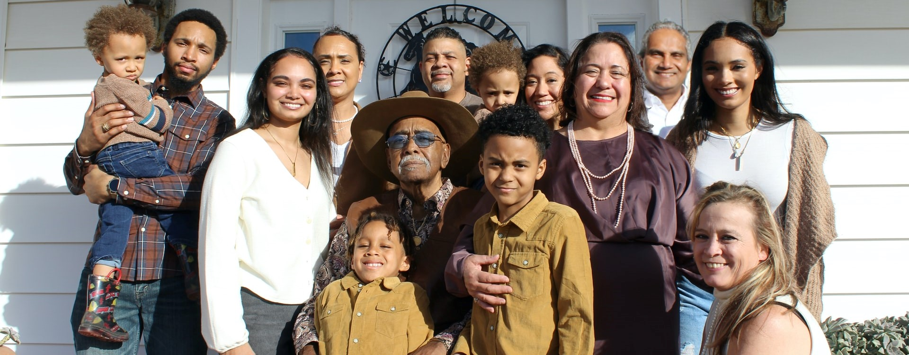
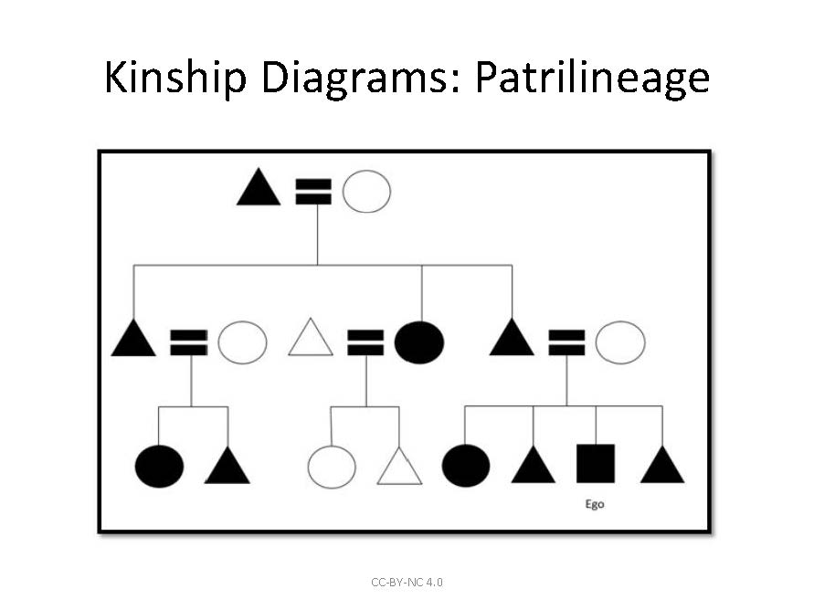
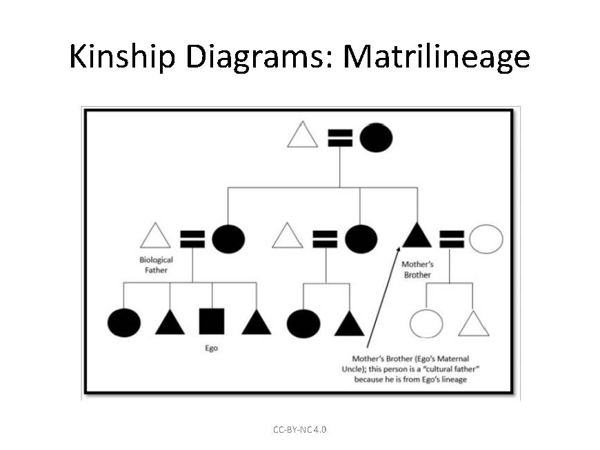
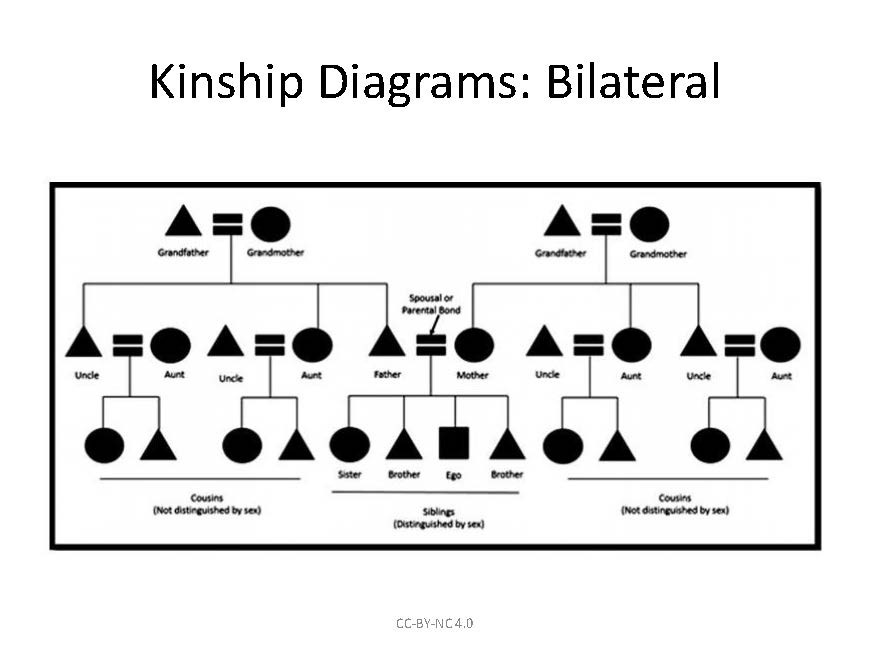
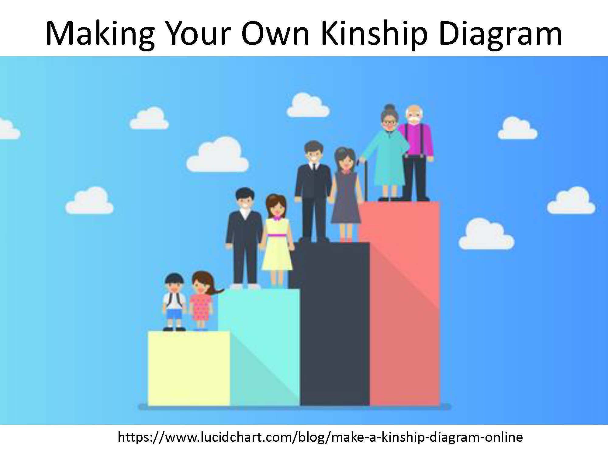
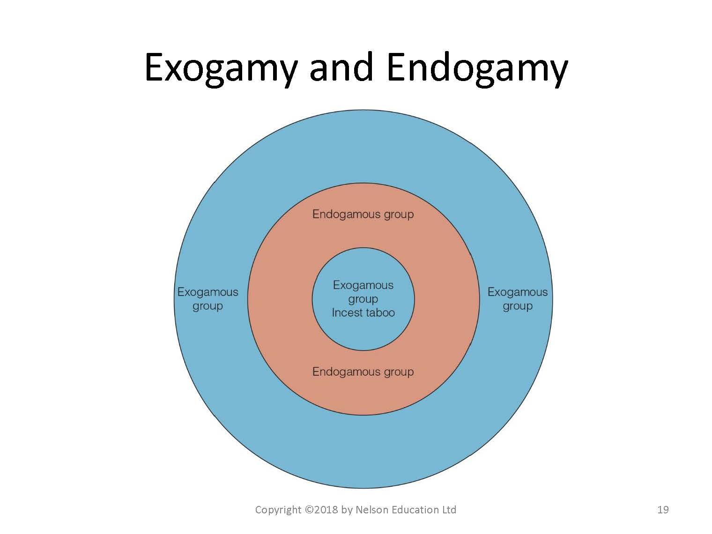
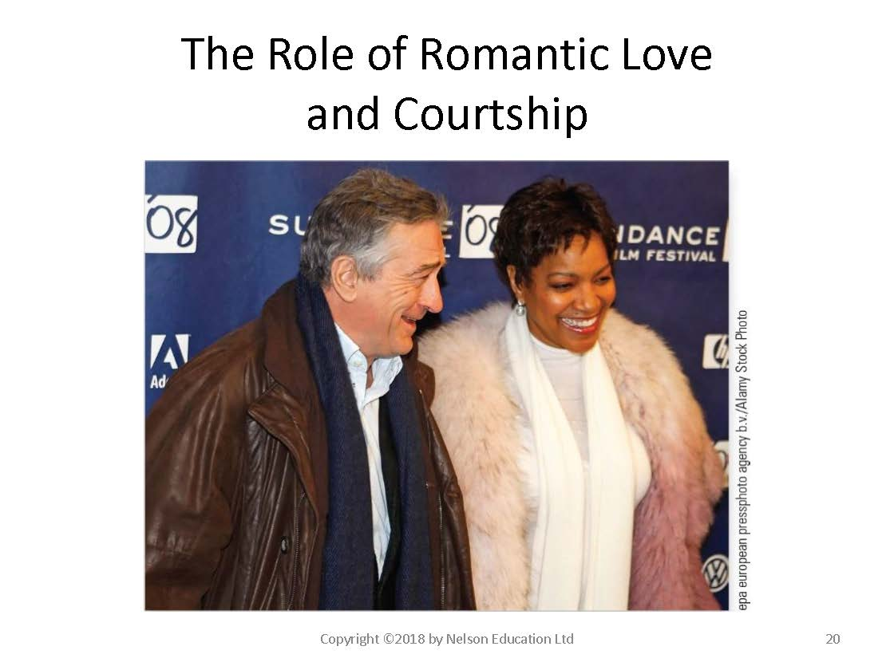
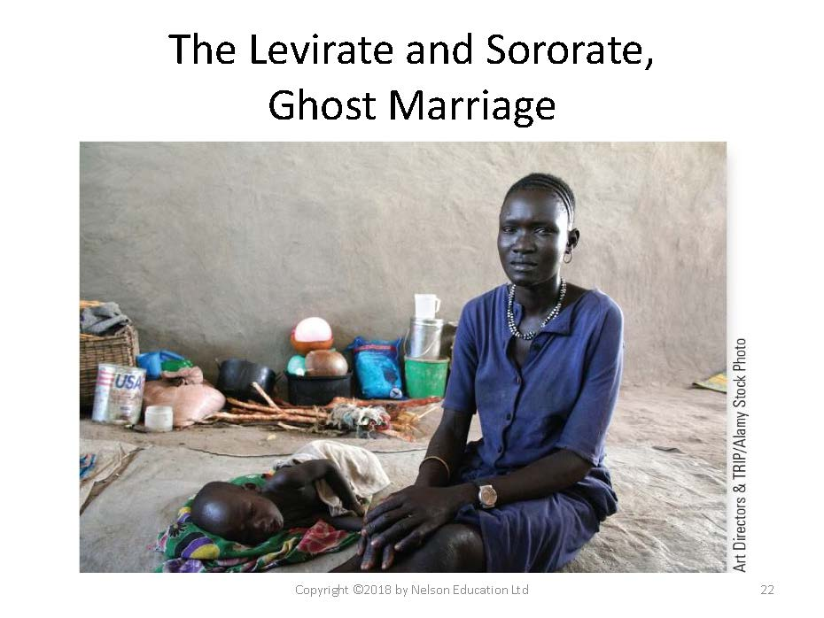
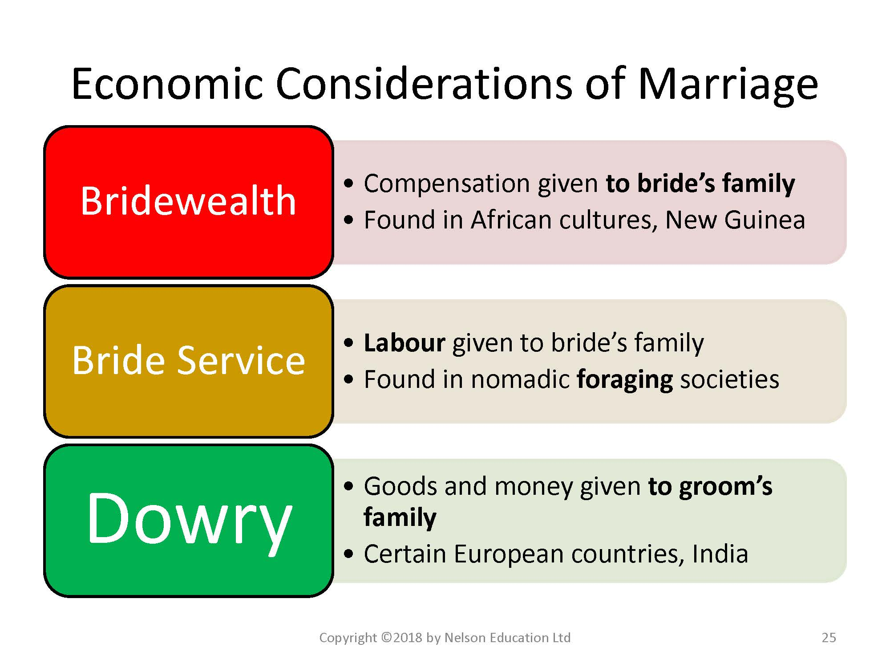
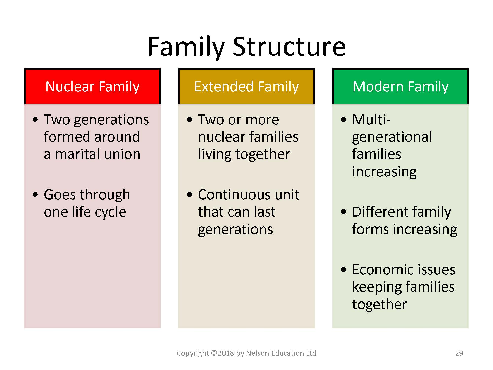

# Understanding Social Structures of Family

*Photo by Rajiv Perera from Unsplash*

## Overview {-}

In Unit 4, we will study how societies around the world demonstrate remarkable variation in cultural understandings of family and marriage, and in how roles have certain rights and responsibilities, and provide status, privilege and power. Through readings and videos you will learn about different types of marriage: *who you can and may not marry, age for marriage, number of partners in marriage, and whether you even have a choice in choosing your marriage partner or in deciding where you will live or how many children you will have.*

### Topics {-}

This unit is divided into the following topics:

1. Kinship and Descent  
    - A Comparison of Kinship Terms in 4 Cultures: Croatia, China, Navajo, USA  
2. Marriage and Family  
    - A Comparison of 4 Types of Love: Papua New Guinea, Kenya, South India, Scotland  

### Learning Outcomes {-}

When you have completed this unit, you should be able to:

- Discuss the variation in rights and responsibilities and how these are associated with roles and status within a family and community.  
- Identify the differences between kinship establish by blood and kinship established by marriage.  
- Describe and illustrate the variety of human families cross-culturally; discern the different terms that define types of relationship.  
- Distinguish between matrilineal, patrilineal, and bilateral kinship systems.  
- Describe the variety of human families cross-culturally with examples.  
- Evaluate the differences between dowry and bridewealth, as well as between different types of post-marital residence.  
- Illustrate, with cultural examples, the types of relationship involving love and/or marriage.  

### Activity Checklist {-}

::: {.callout-note}
Here is a checklist of learning activities you will benefit from in completing this unit. You may find it useful for planning your work. Note that all Learning Lab activities contribute towards your Participation mark for this course.

<!--[plugin:content-inject](../_4-1)
### Topic 1 Resources  -->

- At the bottom of the page in Topic 1, students will find some important resources. There are a number of readings and slides for you to review. Additionally, take a few moments to watch through the video.

<!-- ### Topic 2 Resources {-} 
[plugin:content-inject](../_4-5)-->

- At the bottom of the page in Topic 1, students will find some important resources. There are a number of readings and slides for you to review. Additionally, take a few moments to watch through the videos.  

:::

::: {.callout-caution}

***Note:*** *Some of these resources may be considered controversial. The intention, however, is to engage in dialogue and consider the cultural context as it relates to the subject matter of this unit.*  

<!-- content goes here -->
:::

The content from these videos will be discussed during this unit's Learning Lab so come prepared for a discussion.  

## Learning Lab {-}

- The Learning Lab in Unit 4 will begin with a group discussion on the subject matter from the videos in Topic 2. Be sure to preview the videos before arriving to the Learning Lab.

- Additionally, this Learning Lab will introduce the concept of Kinship Maps. Students will watch a video during the Learning Lab that explains how to create a Kinship Map and what the purpose of one is. This will serve as important background information before you begin your assignment for Unit 4. Your Facilitator will be leading the discussion - take some time to review the information found on the "Assessment" tab for Unit 4 before you arrive.

### Assessment {-}

::: {.callout-tip}

- For Unit 4, each student is expected to submit a Kinship map. The instructions and some resources are posted on the "Assessment" tab in Unit 4. It is strongly recommended that you review this page prior to attending your Learning Lab as the Facilitator will be providing some additional information.

- Once you have completed your assignment, submit it for grading by uploading it to the <b>Kinship and Descent Mapping - Activity #2</b> dropbox found on the bottom of the page.

:::
### Topic 1 Resources {-}

- Brown, N., de González, L. T., McIlwraith, T. F., & American Anthropological Association. (2018). [*Perspectives: An Open Invitation to Cultural Anthropology.*](http://perspectives.americananthro.org/Chapters/Family_and_Marriage.pdf)  
- Wesch, M. (2018). *The Art of Being Human: A Textbook for Cultural Anthropology.* New Prairie Press.
- Other online resources will be provided in the unit.

## Kinship and Descent

Unit 4 begins by introducing the idea of kinship. In particular, we will explore an important question: *Who are the people you are related to by blood or through marriage?*

This topic covers terms and linkages for how to different ethnic groups identify and interact with their relatives.  

This topic also follows Chapter 8 in your *Perspectives* textbook. In this chapter, you will be introduced to a lot of new terminology. You do not need to memorize every term in the chapter glossary, but you should be able to work with terminology and understand that the same term can mean different things in different cultures, (e.g. who is ‘mother’) and the same relationship can have different terms (e.g. a female marriage partner can be a first or third wife, or a widow or be re-married to her deceased husband’s brother).

We begin with a more in-depth study with the resources below....

### Resources {-}

The resources below will help you better understand the content explored in this unit. Take some time to explore this material - it will be discussed during the Learning Lab and will play an important role in course assessments.

### Activity {-}

::: {.callout-note}

#### *Reading #1* {-}

To begin, take some time to read about ***Family and Marriage.*** Here you will be introduced to some important terms, and ideas, when it comes to our understanding of what "family" actually means. Below is a set of slides that are to be followed in conjunction with the reading - they will help focus your attention:

<!-- Hidden comment 

Click to Open

Learning Objectives

  - Human families cross-culturally
  - Parental rights and responsibilities
  - Kinship systems
  - Marriage exchanges (dowry and bridewealth)
  - Post-marital residence

Rights, Responsibilities, Statuses and Roles in Families

  - Words used to describe family members ("mother" or "cousin") indicate rights and responsibilities of family members
  - Status - a culturally-designated position a person occupies in a particular setting ("father" or "younger brother")
  - Role - the set of behaviors expected of a person who occupies a particular status

Kinship and Descent

  - Kinship - culturally recognized ties between members of a family
    - Both blood (consanguineal) and marriage (affinal), as well as "chosen kin"
  - Descent - how people reckon their kinship
    - Patrilineal - through the father's line
    - Matrilineal - through the mother's line
    - Bilateral - through both lines

The Formation of Descent Groups

  - Patrilineal
    - Most common
    - Inheritance through sons
    - Daughters marry out
  - Matrilineal
    - 15% of unilineal descent groups
    - Inheritance through daughters
    - Sons marry out

Kinship and Descent

  - Lineage - descent from a common ancestor
  - Matrilineage (descent) does not mean matriarchal (power)
  - Example: Nayar of Southern India
    - Men and women did not live together after marriage
    - Husbands were not seen as "relatives" since they were not part of the matrilineage

*image of black and white diagram representation of Kinship: Patrilineage
*

*image of black and white diagram representation of Kinship: Matrilimiage*

*image of black and white diagram representation of Kinship: Bilateral*

*image of bar diagram with pictorial representation of making your own Kinship Diagram*

Kinship Terminology

  - The terms used in a language to describe particular categories of relatives
  - Differences provide insight into how people think about families and their roles
  - **Generation** : Some distinctions are made based on generation, e.g., mother, father, and their siblings are one generation.
  - **Sex or gender** : Certain kin may be grouped together because of common gender; e.g., brother, father,father's brother, etc. are always males.
    - A term not distinguished by gender in Anglo systems is cousins.

Principles of Kinship Classification

  - 1. Generation
  - 2. Sex or Gender
  - 3. Lineality versus Collaterality
  - 4. Consanguineal versus Affinal Kin
  - 5. Relative Age
  - 6. Sex of the Connecting Relative
  - 7. Social Condition
  - 8. Side of the Family

CASE STUDY

  - Croatia
    - Uncles: Father's brother (stric) is an authority figure, while mother's brother (ujak) is nurturing
  - China
    - Different names for family statuses reflect different roles  
  - Navajo
    - People are "born to" their mother's clan
  - United States
    - Bilateral, equally related socially and legally

Functions of Marriage

  - 1. To create fairly stable relationships between men and women to regulate mating and reproduction
  - 2. To provide a means to regulate the sexual division of labour
  - 3. To create an environment that supports the material, educational, and emotional needs of children

Marriage and Family

  - Nuclear family
    - two generations
  - Extended family - at least three generations
    - Stem family or Joint family
  - Serial monogamy 
    - marriage to a succession of spouses, one at a time
  - Polygamy
    - plural marriages of either multiple wives or multiple husbands
        - Polygyny or Polyandry

Number of Spouses

  - Monogamy
    - One spouse at a time
    - Canada, the U.S.A., Western Europe
  - Polygyny
    - Multiple wives at a time
    - India, China, Asia, Africa, Middle East
  - Polyandry
    - Multiple husbands at a time
    - Remote villages of the Himalayas
  
Who Can You Marry?   
  - Endogamy - marriage within a cultural group
  - Exogamy -  marriage outside a cultural group
  - Marriages have been arranged throughout history and across cultures
  - If someone dies, then rules dictate how to keep a spouse in the family
    - Sororate and Levirate

*image of diagram for Exogamy and Endogamy*

*image of a couple depicting roles of romantic love and courtship*

*image of a woman with a child in rural Africa*

Mate Selection: Who can you NOT marry?
  - The Incest taboo: the prohibition of sexual intimacy between close relatives

Mariage Exchanges
  - Marriage Exchanges - most often given to the family who is losing a member
  - Dowry - gifts given by a bride's family to the groom's family or to the new couple
  - Bridewealth - gifts given from a groom's family to the bride's family

*image of a chart for Economic Considerations of Marriage*

Families, Households, and Domestic Groups
  - Family - the smallest group of individuals who see themselves as connected to one another
  - Household/Domestic Group - family members who reside together or who share resources and activities pertaining to domestic life (may also include chosen kin)

Post-Marital Residence
  - Family of orientation - the family in which a person is raised
  - Family of procreation - new household for raising children
  - Residence patterns
    - Neolocal
    - Patrilocal
    - Matrilocal
    - Avunculocal

*image of a chart for Residence Patterns*

*image of a chart for Family Structre*

  
-->

Click to Open

Learning Objectives 

  - Human families cross-culturally  
  - Parental rights and responsibilities  
  - Kinship systems  
  - Marriage exchanges (dowry and bridewealth)  
  - Post-marital residence  

Rights, Responsibilities, Statuses and Roles in Families 

  - Words used to describe family members ("..." or "...") indicate ...  
  - Status - a ...-designated position a person occupies ... ("..." or "...")  
  - Role - the set of ... of a person who ...  

Kinship and Descent

  - Kinship - culturally ... between ...  
    - Both blood (...) and marriage (...), as well ... "..."  
  - Descent - how people ...  
    - Patrilineal - ...  
    - Matrilineal - ...  
    - Bilateral - ...  

The Formation of Descent Groups

  - Patrilineal  
    - Most common  
    - ...  
    - Daughters ...  
  - Matrilineal  
    - ...% of ...  
    - Inheritance through ...  
    - Sons ...  

Kinship and Descent

  - Lineage - ... from a ...  
  - Matrilineage (descent) does not ... (...)  
  - Example: Nayar of ...  
    - Men and women ... after marriage  
    -... as "relatives" since ... matrilineage  

Kinship Terminology

  - The terms used ... particular categories of ...  
  - Differences provide ... about ...  
  - **Generation** : Some ... based on generation, e.g., ..., ..., and their ... are ...  
  - **Sex or gender** : ... together because of ...; e.g., ..., father,..., etc. are ...  
    - A term not ... by gender in ... is cousins.  

Principles of Kinship Classification

  - 1. Generation  
  - 2. Sex or Gender  
  - 3. Lineality versus ...  
  - 4. Consanguineal versus ...  
  - 5. Relative Age  
  - 6. Sex of ...  
  - 7. Social ...  
  - 8. ... the Family  

CASE STUDY

  - Croatia  
    - Uncles: ... (stric) is ..., while mother's brother (...) is ...
  - ...  
    - Different names for family statuses reflect different roles  
  - Navajo  
    - People are "...'s clan  
  - United States  
    - ..., equally related ...  

Functions of Marriage

  - 1. To ... between men and women to ... and ...  
  - 2. To provide ...  
  - 3. To create an ... that supports the ..., ..., and ... needs of ...  

Marriage and Family

  - Nuclear family  
    - two ...  
  - ... - at least three generations  
    - ... or Joint family  
  - Serial ...  
    - marriage to a succession of spouses, one at a time  
  - Polygamy  
    - ... or multiple husbands  
        - ... or Polyandry  

Number of Spouses

  - Monogamy  
    - One ...  
    - Canada, the U.S.A., ...  
  - Polygyny  
    - ... at a time  
    - ..., China, Asia, ..., Middle East  
  - Polyandry  
    - ... at a time  
    - Remote ...  
  
Who Can You Marry?

  - Endogamy - ...  
  - Exogamy -  ...  
  - Marriages have been arranged throughout ...  
  - If someone dies, then ...  
    - Sororate and ...  

Mate Selection: Who can you NOT marry?

  - The Incest taboo: ...  

Mariage Exchanges

  - Marriage Exchanges - most often given ...  
  - Dowry - gifts given ...  
  - Bridewealth - gifts given ...  

Families, Households, and Domestic Groups

  - Family - ...  
  - Household/Domestic Group - ... pertaining to domestic life (may also include ...)  

Post-Marital Residence

  - ... - the family in which a person is raised
  - Family of procreation - ...  
  - Residence patterns  
    - ...  
    - Patrilocal  
    - ...  
    - ...  

  

***Download the Chapter and read it as you follow along with the set of slides:***

- [**Family and Marriage**](http://perspectives.americananthro.org/Chapters/Family_and_Marriage.pdf ){target="_blank"}

#### Watch and Reflect {-}

We now shift our focus to learning more about kinship systems. Below is a short clip that focuses on Australian Aboriginal Kinship Systems.

As you watch the video, note that the terms of reference to family members, is common in smaller collective societies. Learn that you can have more than one mother, and discover that when using other cultural ways of identifying relationships, you could have more brothers and sisters than you thought you had.

<iframe width="560" height="315" src="https://www.youtube-nocookie.com/embed/SCZWjoDg2Nw" title="YouTube video player" frameborder="0" allow="accelerometer; autoplay; clipboard-write; encrypted-media; gyroscope; picture-in-picture; web-share" allowfullscreen></iframe>

:::

## Marriage and Family

We next shift our focus to exploring cultural norms about marriage and family. Below, this topic will be studied using several videos showing uncommon practices. Some ideologies and practices are unique to small and isolated people groups (*e.g. marriage among the Na people living in the foothills of the Himalayas* (Perspectives, 2020, p. 254)). Other perspectives, however,  are not universal, but are global in that they are found in societies around the world - especially nowadays due to migration transferring traditional practices into modern cities (*e.g. female genital mutilation*). Some gender practices are harmful and have been addressed by advocacy groups. Examples of these include child marriage, dowry deaths, and honor killings. Many of these practices that you will learn about,  are changing due to the influence of globalization, as members of their communities are exposed to contrasting outsider practices.  

We begin with our resources below:

### Topic 2 Resources {-}

The resources below will help you better understand the content explored in this unit. Take some time to explore this material - it will be discussed during the Learning Lab and will play an important role in course assessments.

We begin with resources that tell stories of how love and relationships are seen in societal structures around the world. Most of the practices you will watch and read about may not be practiced in your country or ethno-cultural group; however, they are still practiced to a greater or lesser extent, depending on country laws and changing cultural patterns. Many of these practices are changing due to global objections and the work of advocacy groups that fight for the basic Human Rights of dignity and equality of all persons.

The first video you are to watch is about child brides in India, Yemen, Afghanistan, Nepal and Ethiopia. Very often child brides are not the only wife, they may be the first or last wife in a polygamous marriage. The next video shows you what polygamy looks like in Togo, West Africa.

The article “Love in Four Cultures” illustrates how love is experienced in Papua New Guinea, in a Masai boarding school in Kenya, in a village in South India, and in Scotland. Sometimes, marriages are not built on love, but on family agreements that require a dowry or payment to either the bride’s family or groom’s family. Some dowry practices are harmful and may even be unethical or illegal, as you will see in the last video filmed in Bangladesh and India.

*With each of these practices, it is likely that there are stark differences to how your family expresses love, and observes marriage and family customs. Note that these practices need to be understood before they are criticized.* ***Your purpose here should be to understand the practice, and why and how it is practiced.***

### Activity Learning {-}

::: {.callout-note}
#### Watch and Reflect {-}

We begin our study of marriage practices around the world by watching a video on *The Secret World of Child Brides.* Every year, throughout the world, millions of young girls are forced into marriage. Child marriage is outlawed in many countries, and international agreements forbid the practice, yet this tradition still spans continents, language, religion, and caste.

This multi-media presentation reveals child marriage practices in India, Yemen, Afghanistan, Nepal and Ethiopia. It is important for you to be informed about the difficult experiences child brides face. Read the notes under the video to learn about how you can get involved in taking action against this practice.

<iframe width="560" height="315" src="https://www.youtube-nocookie.com/embed/qYleXcpbzKY" title="YouTube video player" frameborder="0" allow="accelerometer; autoplay; clipboard-write; encrypted-media; gyroscope; picture-in-picture; web-share" allowfullscreen></iframe>

Over an eight-year period, photographer Stephanie Sinclair has investigated the phenomenon of child marriage in India, Yemen, Afghanistan, Nepal and Ethiopia. Her multimedia presentation, produced in association with National Geographic, synthesizes this body of work into a call to action.

Stephanie Sinclair's images are featured in a story on child marriage in the June 2011 issue of National Geographic magazine.

***How to help:*** National Geographic has compiled a list of organizations that encourage families to delay marriage and give girls an opportunity to reach their full potential.

In a related post Stephanie Sinclair shares the difficult experiences child brides face. She discusses the need for their voices to be heard and the challenges she faced as a journalist who witnessed their struggles and abuse.

To learn more, follow the link:

 - [**Too Young to Wed**](https://pulitzercenter.org/reporting/too-young-wed-multimedia)

This next video shifts focus to the idea of polygamy as a practice of marriage. It features a Muslim tribe in Togo, West Africa, that practices polygamy. For them, another wife means another set of hands to do the work...:

 - [**Multiple Marriage**](https://video.nationalgeographic.com/video/00000144-0a40-d3cb-a96c-7b4d52580000)

 - Next, we explore the opposite of polygamy: polyandry. Here, we are introduced to one group of people in the Himalayas that practices the lifestyle of a woman having multiple husbands.

<iframe width="560" height="315" src="https://www.youtube-nocookie.com/embed/d4yjrDSvze0" title="YouTube video player" frameborder="0" allow="accelerometer; autoplay; clipboard-write; encrypted-media; gyroscope; picture-in-picture; web-share" allowfullscreen></iframe>

#### Reading {-}

Our focus now turns to a reading by Wesch on Love in the Four Cultures. As you read, reflect on the role of love, passion, choice, and commitment play in marriage in the four different cultures.
[**Love in Four Cultures**](U4Love-Cultures.pdf)

####  Watch and Reflect {-}

Our last resources for this section looks at an ancient marriage custom called "paying dowry." Paying dowry is an ancient marriage custom whereby money and goods are transferred from a woman's family to her new husband’s family. While it is officially banned in Bangladesh and India, there still is a demand for this type of economic advantage. For women, it often leads to a life of suffering, even torture and death. As you watch, Reflect on how you can take action against family violence.

<iframe width="560" height="315" src="https://www.youtube-nocookie.com/embed/e85mnwHuaoM" title="YouTube video player" frameborder="0" allow="accelerometer; autoplay; clipboard-write; encrypted-media; gyroscope; picture-in-picture; web-share" allowfullscreen></iframe>

:::

## Learning Lab

The Learning Lab for Unit 4 will focus on expanding our understanding of some of the themes and concepts from Topics 1 and 2 in this unit. Before you arrive to this unit's Learning Lab, be sure to review the content from each section.

In addition to these discussions, the Facilitator will also be introducing the idea of ***kinship systems*** - this component of the Learning Lab will be integral for your **Kinship and Descent Mapping - Activity #2** assignment you will be submitting at the end of Unit 4.

To learn more about kinship systems, and to help prepare you for your assignment, watch the video below - as you watch, compare your own understanding of family relationships to what you are learning about here.

<iframe width="560" height="315" src="https://www.youtube-nocookie.com/embed/YOi2c2d3_Lk" title="YouTube video player" frameborder="0" allow="accelerometer; autoplay; clipboard-write; encrypted-media; gyroscope; picture-in-picture; web-share" allowfullscreen></iframe>

## Assessment 

::: {.callout-tip}

For this assignment, each student will be completing and submitting a kinship diagram. To complete this assignment, follow the directions on the link below:

 - [**How to Make a Kinship Diagram**](https://www.lucidchart.com/blog/make-a-kinship-diagram-online)

*You are welcome to sign up for a free account as well...*

Each student is expected to draw their own kinship diagram according to the directions outlined in the link above. Each kinship diagram should include the following:

- At least three generations
  - you, your parents, and your grandparents  
- Both paternal sides  
- All siblings of both parents  
- All immediate relationships  
  - i.e marriage and children  

This diagram should capture all the people you are in your direct circle of relationships.

:::

::: {.callout-caution}
**Note:** This activity may be completed in any format you like - it does, however, need to be uploaded to the dropbox below. If you choose to use *pen and paper* to complete this assignment, please take a picture and attach it as your assignment - be sure it is clear enough for the instructor to see.
:::

The following criteria will be used to assess your submission:

| Grade |  %   |                     Assessment Criteria                      |
| : | :-- | :- |
|  A+   |  4   | Above and beyond. Outstanding visual presentation and write-up.  An A+ effort will involve several of the following: risk-taking, innovative  thinking, resolving a difficult contradiction or paradox, and connecting or  synthesizing ideas. |
|   A   | 3.8  | Excellent work. Clear evidence that the core ideas of the topic  or assignment have been understood and implemented. |
|   B   |  3   | Good work, but there is not clear evidence that the core ideas  of the topic or assignment have been understood, or the work could be  improved through better writing, more writing, or better visuals. |
|  C+   | 2.2  | Fair work. Work is complete but it appears rushed and  unpolished, or there is no evidence of understanding and some evidence of  misunderstanding. |
|   D   |  1   | Poor work. Work was submitted but it is incomplete, incorrect,  or off the mark. |
|   F   |  0   | Very poor work. Something was submitted but it is minimal,  incomplete, wrong, or off the mark. |

Once you have completed your diagram, submit it for grading by selecting the **Kinship and Descent Mapping - Activity #2** assignment dropbox at the bottom of the page.

*This activity will represent 4% of your overall grade for the course - this submission will be graded by your Facilitator.*
