# Identity

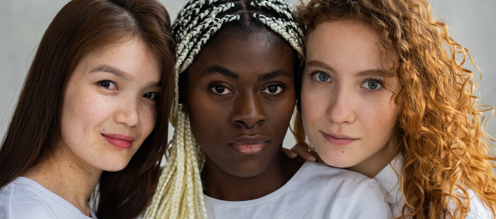

*Photo by Monstera on Pexels*

## Overview {-}

In Unit 5, we learn about how aspects of our personal appearance, our families, and the groups we belong to affect how others interact with us. Often, how others perceive us is different than how we think of ourselves. It is how others ‘see’ us, that has favorable or unfavorable consequences for us.

Those consequences can be understood as social stratification, a social hierarchy of access and privilege. Social inequality arises out of compartmentalizing characteristics, thus noting similarities and differences. Commonly recognized differences that impact daily life for the full span of our lives are age, gender, race and ethnicity, and class. In some countries, religious and political affiliation is a strong indicator of identity. In this unit we will only look at race and ethnicity, and gender and sexuality.

The notion of race is a fairly recent idea and one that is changing over time. It is also perceived differently in different regions of the world. A major resource for this unit is an interactive website that has six sections; three of these have been included as learning activities for this unit. The intent is to have you self-check your own understanding of race through looking at and debunking myths, and to have you test your logic for categorizing people according to visual physical characteristics.
Because race is socially constructed, education is an important approach to changing society’s views about who we are. Being confronted by facts and truths is the first step to adjusting one’s world view, and ultimately to addressing issues like racism, a type of discrimination whereby people are treated differently based on the race they belong to.

Gender and sexuality are also experienced through the prism of the culture, and therefore this unit ends with a look at gender ideologies. Some ideologies are becoming more globally accepted. For example: *equal worth of boys and girls*; therefore girls and boys should have equal opportunity to a primary education. The same value expressed later in life as *equal worth of men and women*, and therefore there should be equal pay for equal work.

You will be introduced to two sub-cultures that practice marriage and family different than the host societies in which they live. You will watch a documentary on the Amish, who comprise small, traditional communities living in the United States of America. Across the continent going west, and across the border going north, you will observe a polygamous, religious community living in their own small town of Bountiful in Western Canada.

### Topics {-}

This unit is divided into the following topics:

 1.	Race and Ethnicity
- Race in America
 2.	Gender and Sexuality
- American Amish and Canadian Polygamists

### Learning Outcomes {-}

When you have completed this unit, you should be able to:

 - Identify myths about race and explain why human diversity cannot be justified biologically.
 - Identify ways in which racism is a variable of social stratification and has disproportionately disadvantaged certain groups of society.
 - Describe ways in which gender and sexuality organize and structure the societies in which we live.
 - Assess the range of possible ways of constructing gender and sexuality by sharing examples from different cultures, including small-scale societies.
 - Explain how respect of cultural and personal differences is critical in building a more just and equitable society.

### Activity Checklist {-}

::: {.callout-note}
Here is a checklist of learning activities you will benefit from in completing this unit. You may find it useful for planning your work. Note that all Learning Lab activities contribute towards your Participation mark for this course.

:::

###  Resources {-}
 At the bottom of the page in Topic 1, students will find some important resources. There are a number of readings and slides for you to review.
 
 Additionally, please take some time to engage with the Learning Activities. Carefully note your experiences - these will be shared during the Learning Lab for Unit 5.
 
Please take some time to watch some important videos. It is strongly recommended that you watch through these videos and take some notes as we will be discussing them during the Learning Lab. Please come prepared to share your thoughts.
 

## Learning Lab 

 The Learning Lab for Unit 5 will be busy. It will begin with a discussion of the videos viewed in Topic 2. Next, students will engage in a conversation about race. Each student will need to read through the resource provided on the Learning Lab tab before arriving to class that day. It will also be helpful to review the questions as those will be guiding the conversation.
 
 During this Learning Lab, students will also be presenting their experiences from the **UnThing Experiment** - this was introduced in Unit 3. Be sure to arrive to the Learning Lab ready to share your presentation.
 

## Assessment {-}

::: {.callout-tip}

 In addition to their presentations during the Learning Lab, students will also need to submit their UnThing Experiment assignment to the **UnThing Experiment** - Activity #3 dropbox found at the bottom of the page.
 
 Additionally, each student will also need to complete the ***Unit Test #2*** - this can also be found by scrolling to the bottom of the page.

:::

### Resources {-}

- Brown, N., de González, L. T., McIlwraith, T. F., & American Anthropological Association. (2018). *Perspectives: An Open Invitation to Cultural Anthropology.*
 - http://perspectives.americananthro.org/Chapters/Race_and_Ethnicity.pdf
 - http://perspectives.americananthro.org/Chapters/Gender_and_Sexuality.pdf
- PBS Foundation. (2003). *Race – The Power of an Illusion.* California News Real.
- Other online resources will be provided in the unit.

## Race and Ethnicity

We begin this unit with an important question: ***What is "race?"*** As we begin to explore this question, you will discover that the most common assumptions are not true, yet the consequences of racism are very real. Through an interactive website, you will uncover myths and misconceptions, and realize truths you did not know. Here are a few quotes from the *Race – The Power of an Illusion* website:

 - Race is a modern idea. Ancient societies did not divide people according to physical differences, but according to religion, status, class, even language.  
 - Geneticists have discovered that 85% of all genetic variants can be found within any local population.  
 - [Almost] Every human trait...can also be found in Africa.  
 - Race is a powerful social idea with real consequences for people's lives.  
 - Colorblindness will not end racism...Race is more than stereotypes and individual prejudice.  

The resources that follow help us better understand race and ethnicity:

### Topic 1 Resources {-}

The resources below will help you better understand the content explored in this unit. Take some time to explore this material - it will be discussed during the Learning Lab and will play an important role in course assessments.

### Activity: {-}

::: {.callout-note}

#### *Reading #1* {-}

To begin, take some time to read about ***Race and Ethnicity.*** Here you will be introduced to some important terms and ideas. Below is a set of slides that are to be followed in conjunction with the reading - they will help focus your attention:

<!-- Hidden comment

Click to Open

<h5>Learning Objectives</h5>
  - No biological basis for human race  
  - Race is a socially constructed concept  
  - Racial formation and the one-drop rule  
  - What racism is and how it is exhibited  
  - The distinction between race and ethnicity  

<h5>Is Anthropology the "Science of Race?"</h5>
  - Anthropologists in the 18th and 19th centuries sought a biological basis for race  
  - Race is not a biological category, but a socially and culturally defined one  
  - People continue to think of race as a biological category because the idea has been *reified* - when an inaccurate concept is so heavily promoted that it seems to be an unquestioned "truth"  

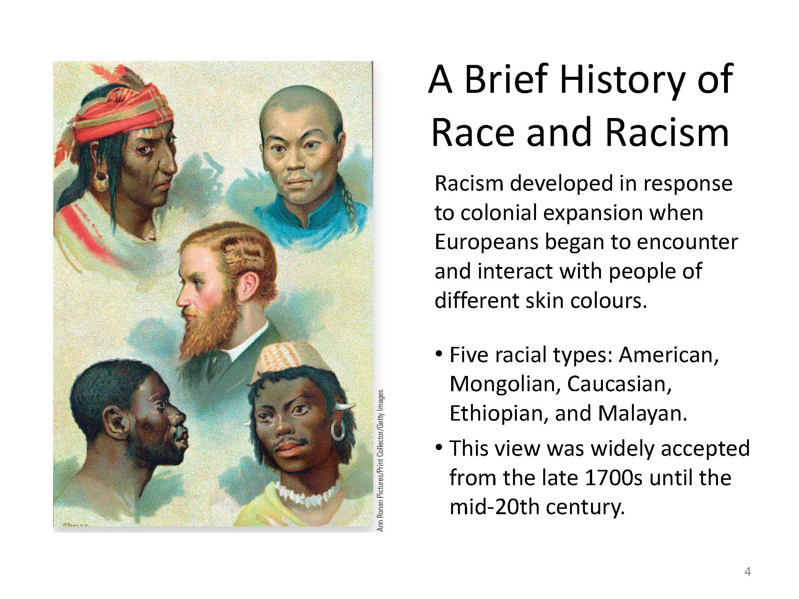
*image of various racial identity men's faces*

<h5>Race: A Discredited Concept in Human Biology</h5>
  - In the 1700s the inaccurate concept of race was promoted so heavily that it seemed to be an unquestioned "truth"
  - Categories were arbitrary divisions and based on subjective criteria
  - 88-92% of genetic diversity can be found within people who live on the same continent

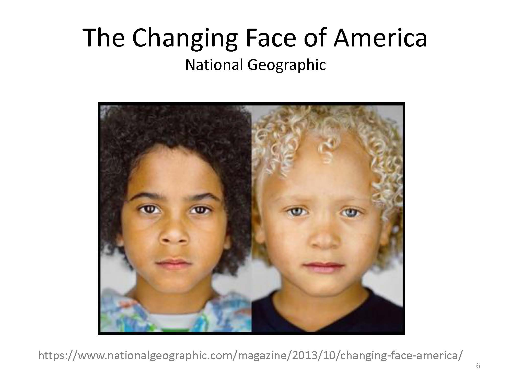
*image of two racially different kid's faces*

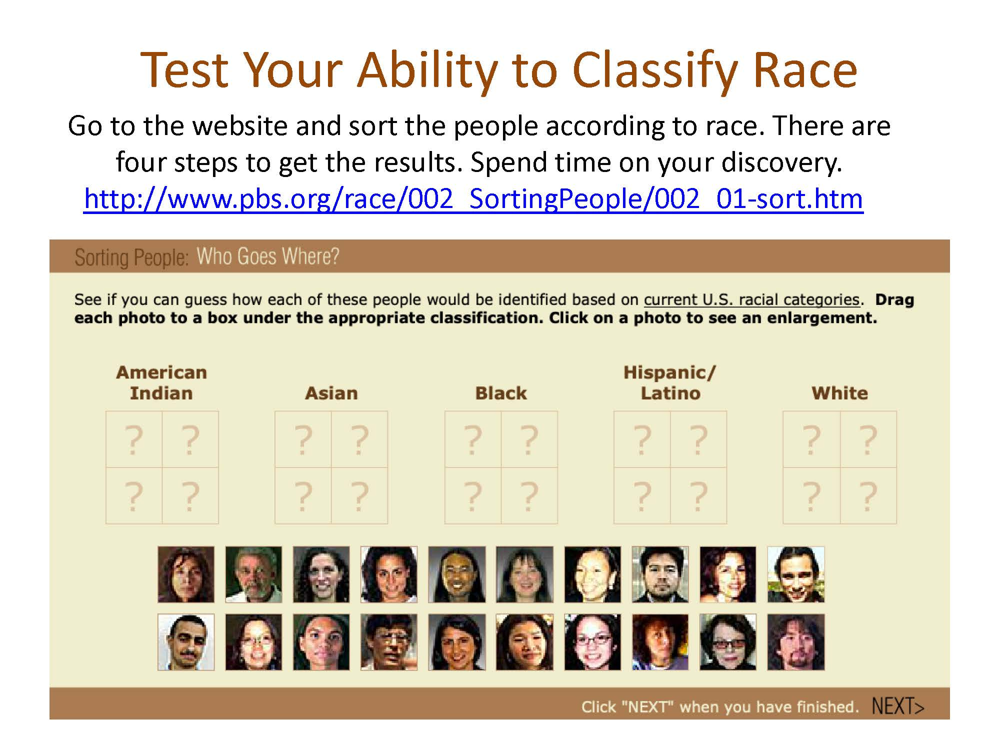
*image of a chart to test your ability to classify race*

<h5>Ethnic Identification</h5>
  - How correct were you with each category?
  - Did you do better with one of the five categories than the others? Why? Might you be a member of that category that you were able to access most correctly
  - Explain your reasoning for why you sorted according to certain features.
  - What did you learn?
  - Does your country have the same or different racial categories? These categories are usually the ones a country uses for Census data collection.

<h5>Race and Intelligence</h5>
  - Race is real as a social concept, but not a biological one; it has important effects on people's lives socially
  - Intelligence is not biologically determined by race
  - Intelligence tests are accurate measures of how well an individual has mastered his or her *mainstream cultural knowledge*

<h5>Ethnicity and Ethnic Groups</h5>
  - Ethnic groups claim a distinct identity based on shared ancestry and social experience, and on shared cultural characteristics including religion, dietary practices, language, humour, clothing, cultural heritage, folklore, and national origins.  
  - Ethnicity - the linguistic and cultural characteristics and heritage that a person identifies with; can fluctuate over time.  
  - Symbolic ethnicity - expressive limited displays of ethnic pride (for public display) even after some cultural knowledge and practice has been lost.  

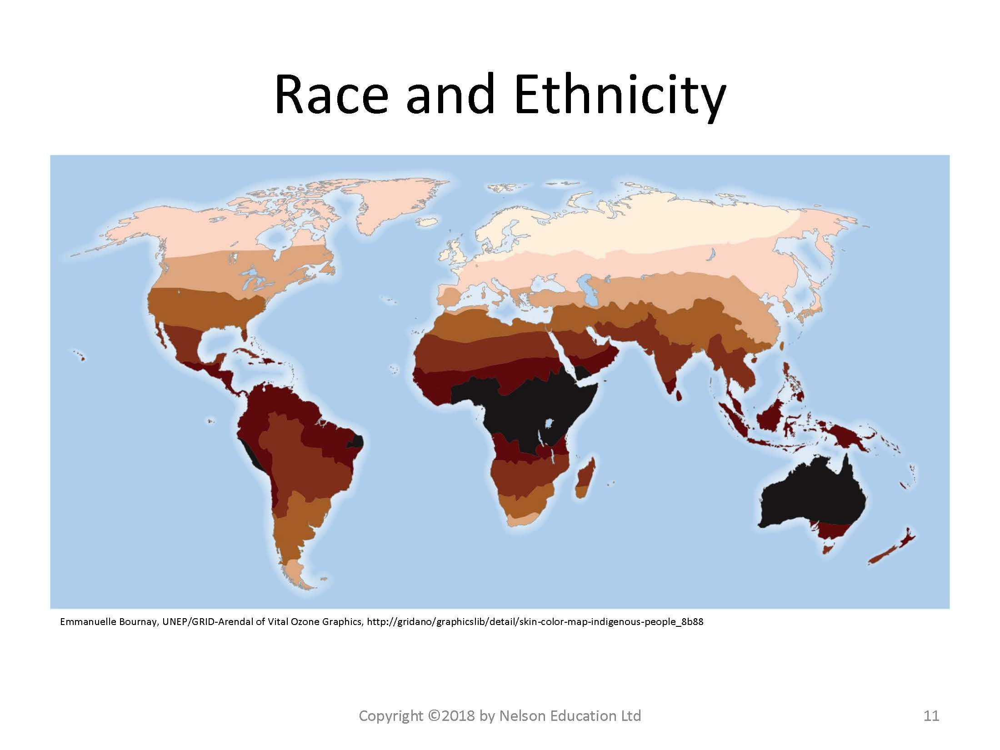
*image of a world map showing distribution of skin colour*

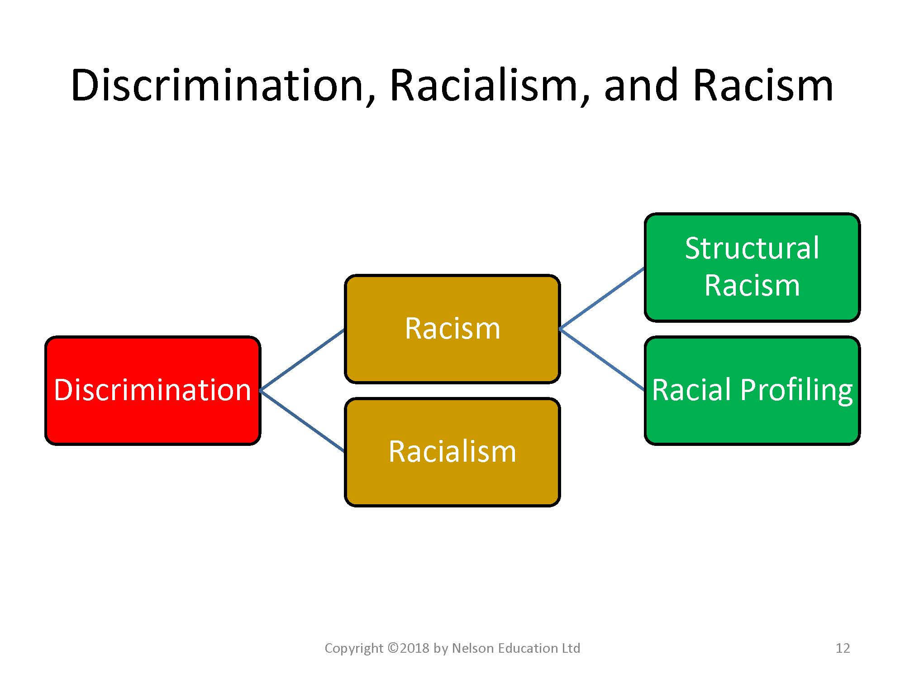
*image of a flow-chart showing Discrimination, Racialism, and Racisim*

<h5>Discrimination, Racialism, and Racism</h5>
  - Discrimination: the practice of treating individuals differently based on the age, sex, race, or ethnic or religious group that they belong to rather than to individual merit  
  - Reverse discrimination: treating members of the dominant group differently in an effort to remedy previous discrimination against members of subordinate groups  
  - Racialism: the idea that race determines specific characteristics and capacities, such as intelligence, and that some races are superior to others  
  - Racism: a type of discrimination whereby people are treated differently based on the race they belong to  
  - Structural racism: where the institutions and systems of society are structured such that the subordinate group is disadvantaged or discriminated against  
  
  - 1.What are some examples of discrimination and reverse discrimination in our society?  
  - 2.What are some of the stereotypes of First Nations people in Canada (or another ethnic group) as a rest of racialism?  
  - 3.What are some examples of structural racism in our society?  

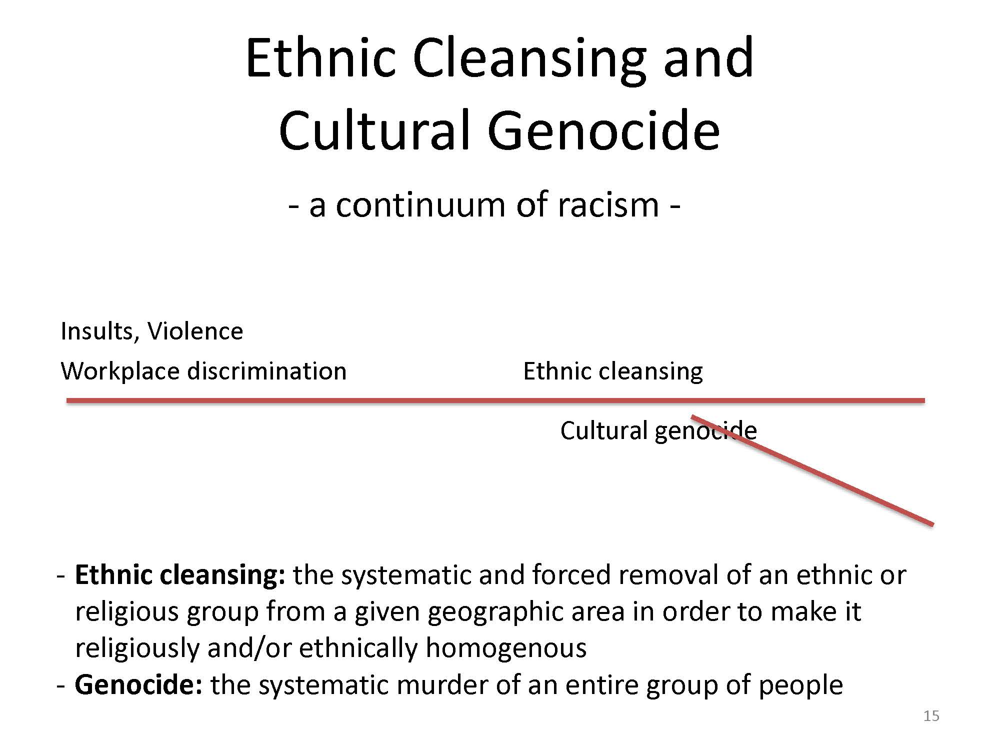
*image of a slide explaining Ethinc Cleansin and Cultural Genocide*

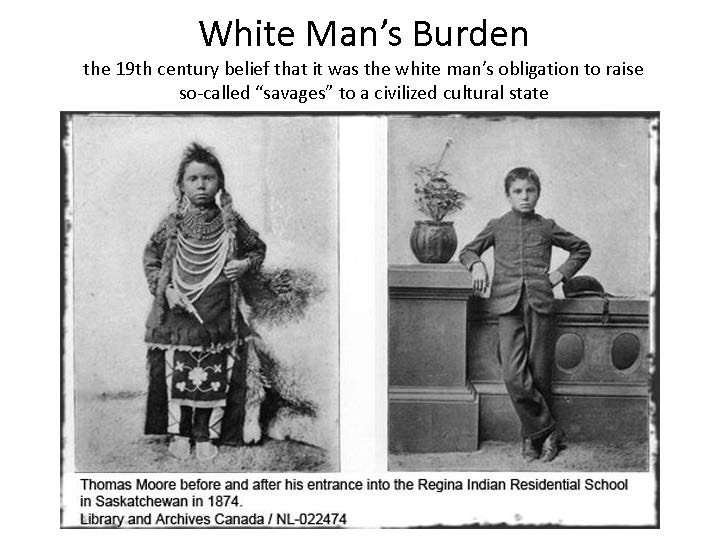
*image of a slide explaining Ethinc Cleansin and Cultural Genocide*

<h5>Black Like Me</h5>
 - "extrinsic differences separate us instead of the deeper commonalities that should unite us..." (Bonazzi, 2010)  
 - The commonalities he was referring to are survival and basic needs, raising families, creating art, desiring peace, risking love, daring to hope, enduring pain, and dying.  

<h5>Human Nature</h5>
  - Human beings draw close to one another by their common nature, but habits and customs keep them apart.(Confucian saying) 

 -->

Click to Open

<h5>Learning Objectives</h5> 
  - No biological basis for human race  
  - Race is a socially constructed concept  
  - Racial formation and the one-drop rule  
  - What racism is and how it is exhibited  
  - The distinction between race and ethnicity

<h5>Is Anthropology the "Science of Race?"</h5>
  - Anthropologists in the ... and ... centuries sought ...
  - Race is not a ..., but a ... and ... one  
  - People continue to think of race as a ... because the idea has been ... - when an ... is so heavily ...

*image of various racial identity men's faces*

<h5>Race: A Discredited Concept in Human Biology</h5>
  - In the ...s the inaccurate concept of ... was promoted so heavily that it seemed to be ...
  - Categories were arbitrary ... and based on ...
  - ...% of ... can be found within people who ...

*image of two racially different kid's faces*

*image of a chart to test your ability to classify race*

<h5>Ethnic Identification</h5>
  - How correct were you with each category?
  - Did you do better with one of the five categories than the others? Why? Might you be a member of that category that you were able to access most correctly
  - Explain your reasoning for why you sorted according to certain features.
  - What did you learn?
  - Does your country have the same or different racial categories? These categories are usually the ones a country uses for Census data collection.

<h5>Race and Intelligence</h5>
  - Race is real as a ... concept, but not a biological one; it has ...
  - Intelligence is not ... determined by race
  - Intelligence tests are ... measures of how well an individual has mastered his or her ...

<h5>Ethnicity and Ethnic Groups</h5>
  - Ethnic groups claim a distinct identity based on shared ... and ... experience, and on shared cultural characteristics including ...
  - Ethnicity - the ... and cultural characteristics and ... that a person identifies with; can ...
  - ... ethnicity - expressive limited displays of ethnic pride (for public display) even ...  

*image of a world map showing distribution of skin colour*

*image of a flow-chart showing Discrimination, Racialism, and Racisim*

<h5>Discrimination, Racialism, and Racism</h5>
  - Discrimination: the practice of treating ..., or ... or religious group that they belong to rather than ...
  - Reverse discrimination: treating members of the ... group differently in an effort to ...  
  - Racialism: the idea that race determines specific ... and ..., such as ..., and that some races are ...
  - Racism: a type of ... whereby people are treated differently based ...  
  - Structural racism: where the ... and systems of society are structured such that ...
  
  - 1.What are some examples of discrimination and reverse discrimination in our society?  
  - 2.What are some of the stereotypes of First Nations people in Canada (or another ethnic group) as a rest of racialism?  
  - 3.What are some examples of structural racism in our society?  

*image of a slide explaining Ethinc Cleansin and Cultural Genocide*

*image of a slide explaining Ethinc Cleansin and Cultural Genocide*

<h5>Black Like Me</h5>
 - "extrinsic differences separate us instead of the deeper commonalities that should unite us..." (Bonazzi, 2010)  
 - The commonalities he was referring to are ... and ..., raising families, creating ..., desiring peace, risking ..., daring to ..., ..., and dying.  

<h5>Human Nature</h5>
  - Human beings draw close to one another by their ..., but ...(Confucian saying) 

***Download the Chapter and read it as you follow along with the set of slides:***

- [**Race and Ethnicity**](http://perspectives.americananthro.org/Chapters/Race_and_Ethnicity.pdf )

#### Learning Activity: Sorting People {-}

Next, you have an opportunity to "categorize" people's race by looking at them. After completing the activity, be sure to review your results. ***It is important to read the "correct" answer in order to better learn.***

To begin, follow the link below:

 - [**Sorting People**](http://www.pbs.org/race/002_SortingPeople/002_00-home.htm) (to open website page needs the right version of the flash plugin)

#### Learning Activity: Human Diversity Quiz {-}

In this activity, you will be taking a quiz to discover how much you understand about why people look different. You will learn that race is not biological and it is more than the color of your skin. Be sure to review your results closely to learn how we are different.

***Note**: This quiz is ungraded*

To begin, click on the link below

 - [**Human Diversity Quiz**](http://www.pbs.org/race/004_HumanDiversity/004_00-home.htm)

#### *Optional Activity: American Racial Identity* {-}

Although this activity is optional, it is an interesting section that I included for those wishing to explore more. Follow the link to learn more about the *Power of Illusion.*
*Hover over each eye and you will be presented with a different question. From there CLICK “Learn More”. Notice the 10 Quick Facts at the bottom of the page.*

 - [**Race: The Power of Illusion**](http://www.pbs.org/race/000_General/000_00-Home.htm)

:::

## Gender and Sexuality

The second part of this unit focuses on gender and sexuality - these two topics are intertwined with marriage and family. This topic goes further, however, in observing gendered identities and behaviors. Even as you study the topic, be observant about gender markers (*i.e. symbols or clues that ‘hint at’ a particular preference*). For example: ***Who wears lipstick? Who carries a purse? Who carries a baby on their arms rather than on their back?***

As you interact with the resources below, you will see that we conclude this unit with a deeper look at two sub-cultural groups that distinguish themselves from the host society they are part of. It might surprise you to find these communities within Canada and the United States. I suggest that you watch each documentary twice - the first time, sit back and enjoy the narrative; the second time, focus on the gender ideology of the Pennsylvania Amish and the Mormon Fundamentalists of Bountiful.

### Topic 2 Resources {-}

The resources below will help you better understand the content explored in this unit. Take some time to explore this material - it will be discussed during the Learning Lab and will play an important role in course assessments.

### Activity  {-} 

::: {.callout-note}

#### Reading  {-} 

Read the chapter alongside the PPT. Chapter 10 distinguishes between sex, gender and sexuality. Read carefully the section on Gender Ideologies, Biology, and Culture. Know what is meant by each of these terms.Throughout the chapter, notice how the prefix *matri-* and *patri-* define lineage, where a couple will live, and more. Look up *matri-* and *patri-* terms in the Glossary....

<!-- Hidden comment 
[presentation="anth101/presentations/u10"]

Click to Open

<h5>Learning Objectives</h5>
  - How culture shapes sex, gender, and sexuality  
  - How gender and sexuality organize and structure society  
  - The range of gender and sexual identities across cultures  
  - Cultural "origin" stories
  - How anthropology is affected by gender norms  

<h5>Gender Ideologies, Biology, and Culture</h5>
  - Gender ideologies change throughout time and vary widely  
  - In 19th and to mid-20th century U.S., gender ideologies were based on biological determinism  
     - Males and females were born fundamentally different  
    - "Naturally attracted to one another  
    - Women's sex drive was less developed and reproductively oriented  

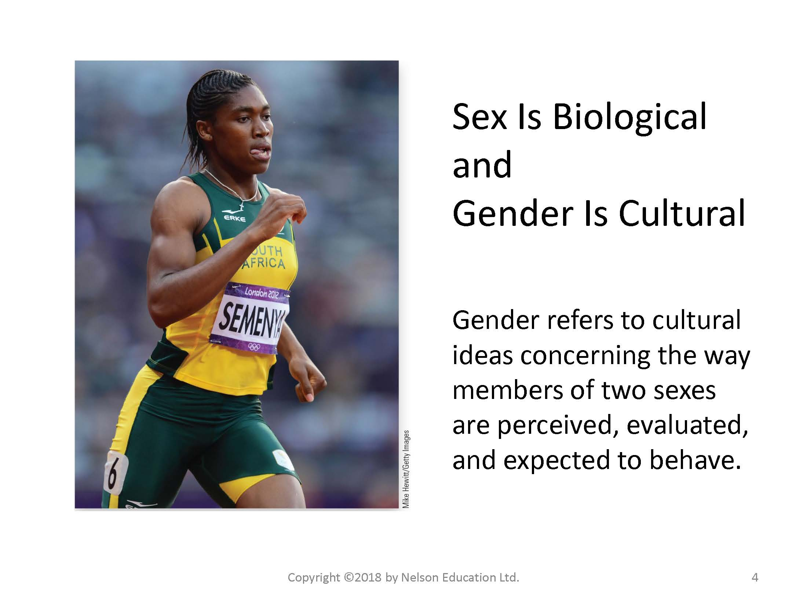
*image of a an athelete running*

<h5>Gender Ideologies, Biology, and Culture</h5>
  - Sex is biological  
  - Gender is a set of culturally-invented expectations  
  - Gender is not a binary model, but fluid and flexible  
  - Third gender roles include *two-spirit* people (Native American) and hijras (India)  

<h5>Emergence of Public (Male) vs. Domestic (Female) Spheres</h5>
  - In large, stratified societies, men dominate the public sphere while women are associated with the domestic sphere  
  - Emphasizes social separation between males and females and males' control over females
    - "Honor killings" -girls or women are killed if suspicions of dishonourable sexual behaviors arise  

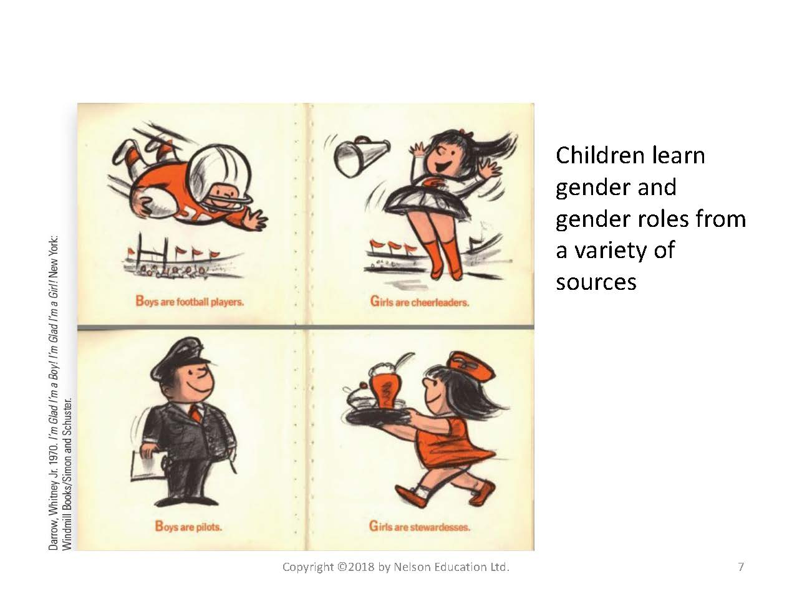
*image of sketches of four different occupations depicting various sources of gender roles *

<h5>Gender Ideology</h5>
  - Gender ideology is a system of thoughts and values that legitimize gender roles, statuses, and customary behaviour.  
  - Gender ideology about masculinity and femininity is culturally expression of preferred attributes and behaviors.  

<h5>Alternate Models of Gender:Complementary and Fluid</h5>
  - In societies other than stratified, large-scale patriarchal ones, gender may be more equal, non-binary, and fluid  
  - Married couples may work in complementary dyads, such as among the Lahu and Na people of SW China and Thailand  

<h5>Family and Marriage: A Cultural Construct and Social Invention</h5>
  - Beyond biological reality of biological mother and father, culture defines the family  
  - Kinship is a set of social roles, legal relationships, meaning and expectations  
  - Societal regulation of relationships and who
"owns" children - main reasons for marriage  
  - Marriages based on free choice and romantic love are relatively recent  

<h5>Cultural construction of gender</h5>
  - Refers to ideas about how the genders are perceived, evaluated, and expected to behave are culturally relative.  
  - The differences in behaviour between men and women are reflected in biological differences because different cultural experiences have wired the brains differently.  

<h5>Gender stereotypes</h5>
  - Refers to oversimplified conceptions about the characteristics of men and women.  
  - These simplifications have impacts; e.g., women are more likely to be diagnosed with depression because they are viewed as being more emotional.  

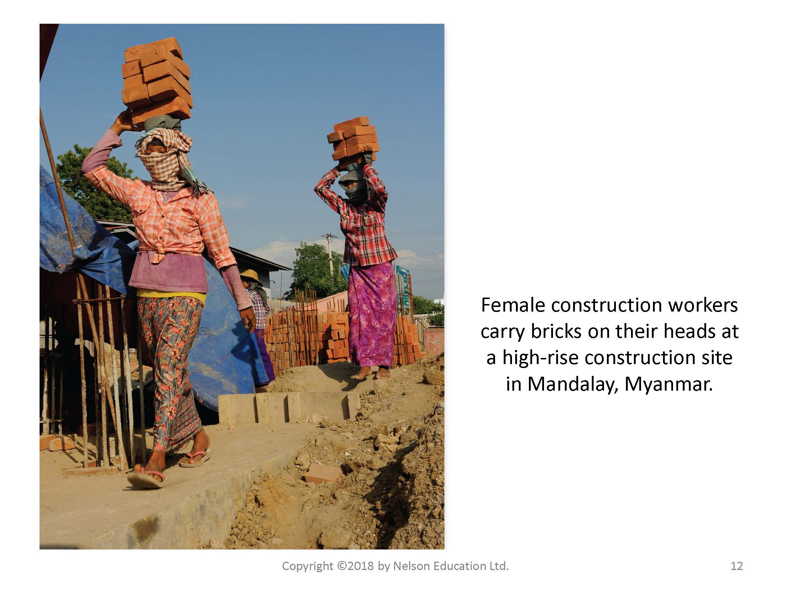
*image of female construction workers carrying bricks on their head at a construction site in Mandalay,Myanmar*

<h5>What Can We Learn From The Na?</h5>
  - Na people (from foothills of the Himalayas) have several family structures  
  - Some live in patrilineal households  
  - Some live in extended family households in which young adults "try out" relationships from other households  
  - They do not live together or marry officially, and children remain in the mother's home, cared for by extended family  

<h5>Transgender Identity</h5>
  - Transgender people are those who experience their gender identity as different from their assigned sex at birth, and who may or may not transition socially or physically  
    - A transgender (or non-binary, gender fluid or genderqueer) identity does not dictate sexuality, only gender identity  

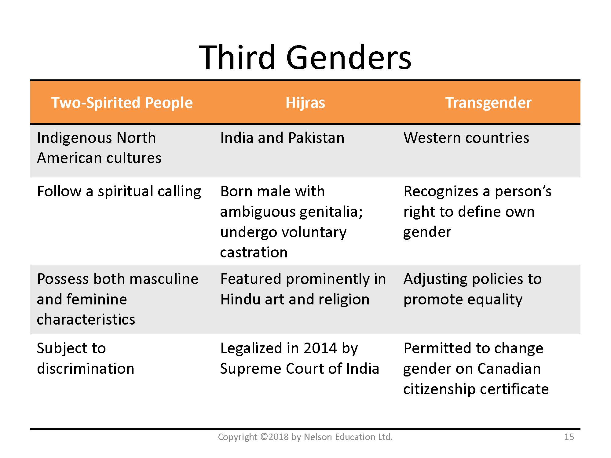
*image of chart defining third genders*

<h5>The Role of Religion on Gender Roles</h5>
  - Five Principle Relationships of Confucianism  
  - Basis for the hierarchical structure of the South Korean society  
    - Ruler and the ruled  
    - Father and son  
    - Husband and wife  
    - Oldest and younger brother  
    - Between friends  
  - It would be traditionally and culturally inappropriate to try to break the hierarchy of relationships.  

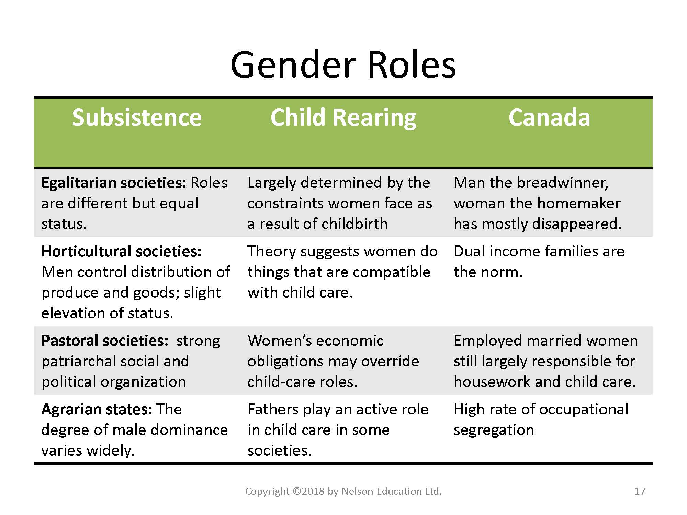
*image of chart defining gender roles*

<h5>Korean Gender Roles</h5>
  - Marital relationship is primarily functional;
  - romance is nice but not critical.  
  - At marriage, a woman permanently joins her husband's family where she ranks at the bottom, below her husband's siblings.  
  - Korean men are expected to provide for their family.Their status is connected to their occupation, employer, company.  
  - They have a strong work ethic and work long hours. They are often absent from home.  
  - At home Korean women have more power than men. They manage the finances, and run the home and family activities very efficiently.  

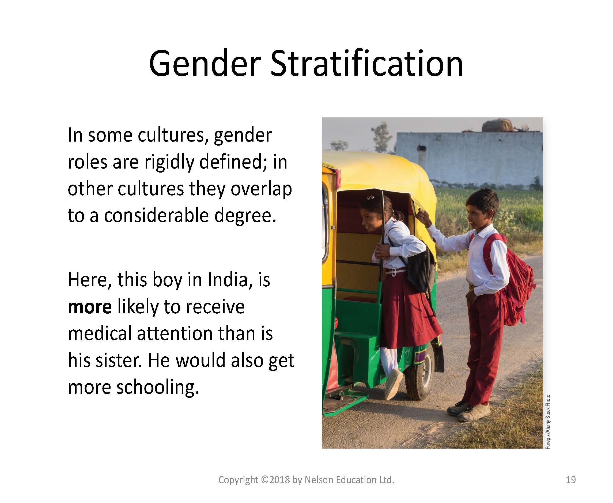
*image of two indian children about to get inside an autorickshaw for school*

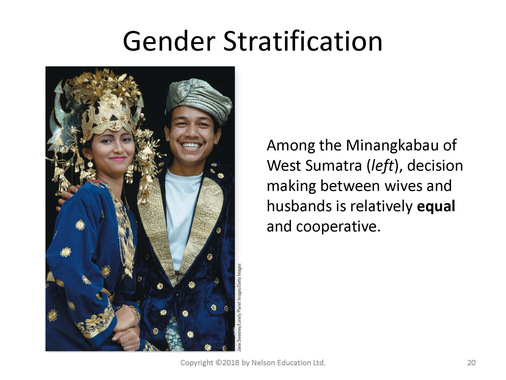
*image of Minangkabau couple from West Sumatrat*

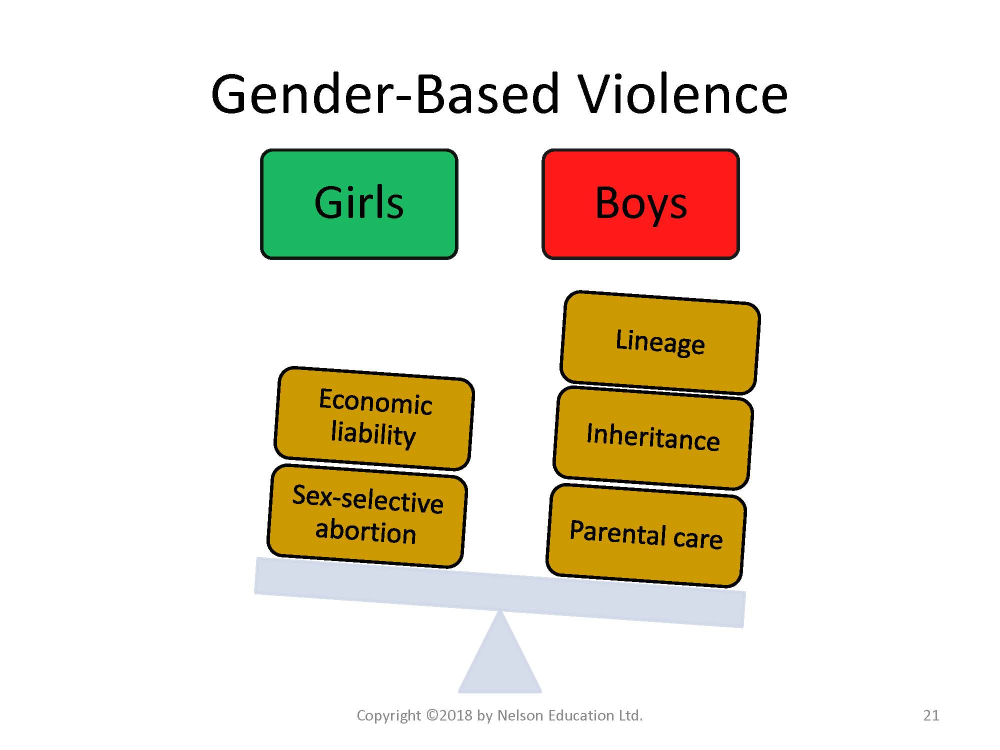
*image of a chart showing gender-based violence*

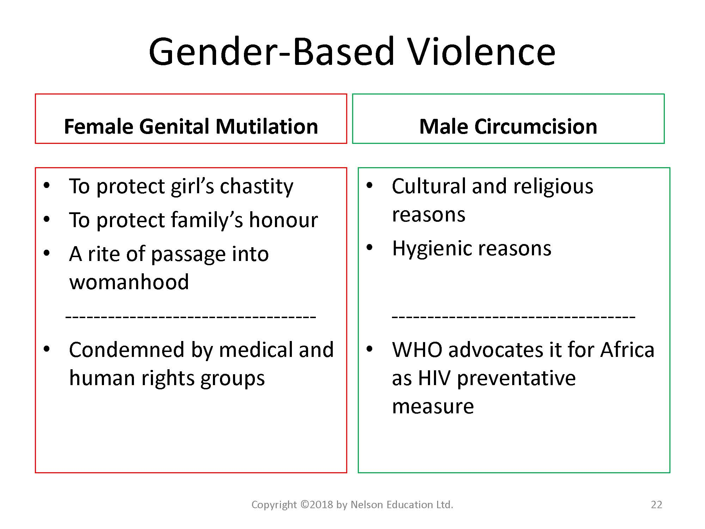
*image of a chart showing gender-based violence in femal genital mutilation and male circumcision*

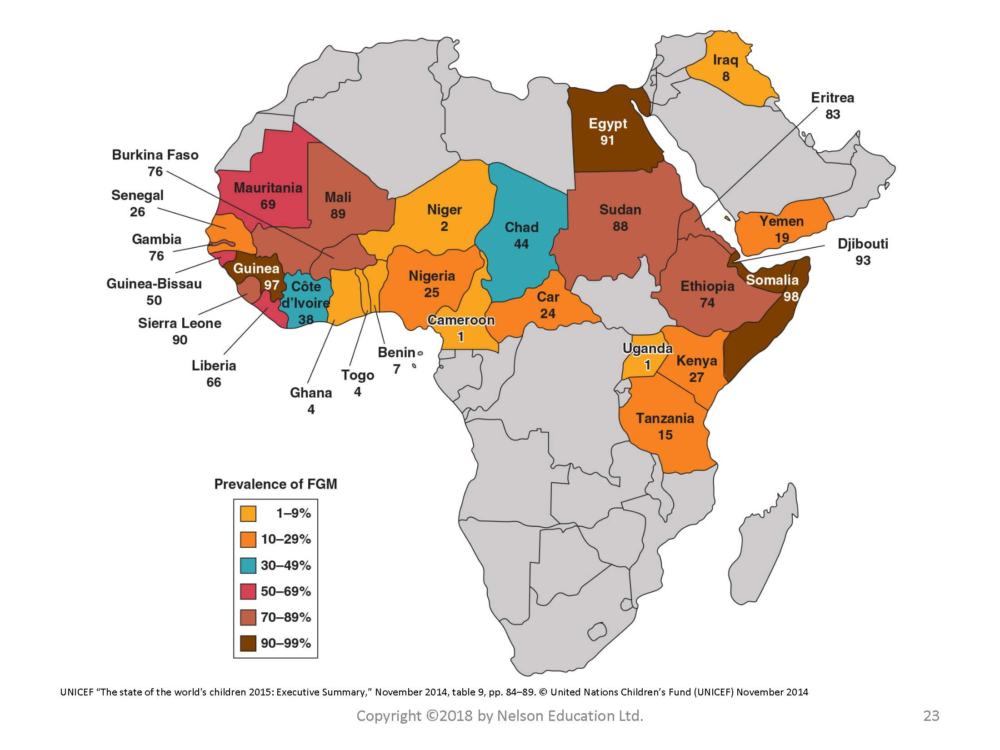
*image of a chart showing prevalance of FGM in Africa*

<h5>Gender-Based Violence</h5>
  - Honour killing  
    - Killing of a family member, usually a young girl or woman, for acting in a way thought to dishonour the family.  
    - Common in Pakistan, Afghanistan, Iraq, Iran, Turkey, Syria, Albania-traditional, male-dominated societies
  - Sex trafficking
    - More likely to be experienced by women, and often because of poverty.

-->

Click to Open

<h5>Learning Objectives</h5>
  - How culture shapes sex, gender, and sexuality  
  - How gender and sexuality organize and structure society  
  - The range of gender and sexual identities across cultures  
  - Cultural "origin" stories
  - How anthropology is affected by gender norms  

<h5>Gender Ideologies, Biology, and Culture</h5>
  - Gender ideologies ... throughout time and ...
  - In ... and to mid-... century U.S., gender ideologies were ...  
     - Males and females were born ...
    - "... attracted to one another  
    - Women's sex drive was ...

*image of a an athelete running*

<h5>Gender Ideologies, Biology, and Culture</h5>
  - ... is biological  
  - Gender is a set of ...  
  - Gender is not a ... model, but ...  
  - Third gender roles include ...

<h5>Emergence of Public (Male) vs. Domestic (Female) Spheres</h5>
  - In large, ... societies, men dominate ... while women ... 
  - Emphasizes social separation between ... and females and males' ...
    - "Honor killings" -girls or women are ...  

*image of sketches of four different occupations depicting various sources of gender roles *

<h5>Gender Ideology</h5>
  - Gender ideology is a system of ... and ... that ...  
  - Gender ideology about ... and femininity is culturally ...

<h5>Alternate Models of Gender:Complementary and Fluid</h5>
  - In societies other than ..., large-scale ... ones, gender may be more ...
  - Married couples may work in complementary ..., such as among the Lahu and Na people of ...

<h5>Family and Marriage: A Cultural Construct and Social Invention</h5>
  - Beyond biological reality of biological mother and father, ... 
  - ... is a set of social roles, ... and expectations  
  - Societal regulation of ... and who
"..." children - main reasons ...
  - Marriages based on ... and romantic love are ... 

<h5>Cultural construction of gender</h5>
  - Refers to ideas about how t..., evaluated, and expected to ...  
  - The differences in behaviour between men and women are reflected in ... because ... differently.  

<h5>Gender stereotypes</h5>
  - Refers to ... about the characteristics of men and women.  
  - These simplifications have impacts; e.g., women are ... because they are viewed as being more ...  

*image of female construction workers carrying bricks on their head at a construction site in Mandalay,Myanmar*

<h5>What Can We Learn From The Na?</h5>
  - Na people (...) have several family structures  
  - Some live in ... 
  - Some live in ... in which young adults "..." relationships from ...  
  - They do not ... or marry ..., and children remain ...

<h5>Transgender Identity</h5>
  - Transgender people are those who experience their ... as different from their ..., and who may or may not ... 
    - A transgender (or ..., gender fluid or ...) identity does ..., only ...  

*image of chart defining third genders*

<h5>The Role of Religion on Gender Roles</h5>
  - ... Principle Relationships of Confucianism  
  - Basis for the ... of the ... society  
    - Ruler and ...
    - Father and ...
    - ... and ...
    - Oldest and ...brother  
    - ... 
  - It would be traditionally and ... to try to break the ...  

*image of chart defining gender roles*

<h5>Korean Gender Roles</h5>
  - ... relationship is ...;
  - romance is ...  
  - At marriage, a ... her husband's family where she ..., below her ...  
  - Korean men are expected to ... Their status is ..., employer, company.  
  - They have a strong ... and ... They are often ...
  - At home Korean women have ... They manage the ..., and ...

*image of two indian children about to get inside an autorickshaw for school*

*image of Minangkabau couple from West Sumatrat*

*image of a chart showing gender-based violence*

*image of a chart showing gender-based violence in femal genital mutilation and male circumcision*

*image of a chart showing prevalance of FGM in Africa*

<h5>Gender-Based Violence</h5>
  - Honour killing  
    - Killing of a ..., usually a ..., for acting in a way ...  
    - Common in ..., Afghanistan, ..., ..., Turkey, ..., ..., male-dominated societies
  - Sex trafficking
    - More likely to be ..., and often because ...

***Download the Chapter and read it as you follow along with the set of slides:***

- [**Gender and Sexuality**](http://perspectives.americananthro.org/Chapters/Gender_and_Sexuality.pdf)

#### Watch and Reflect - The Fifth Estate on Winston Blackmore and Polygamy {-}

This activity will serve as a case study that will be discussed during our Learning Lab. This Case Study introduces us to a community in Canada that practices polygamy. While the practice of polygamy is illegal in Canada, this small community (immigrated from South of the Canada-USA border) has practiced it. Bishop Winston Blackmore is the leader of this community. He is their family head (father), their spiritual leader (bishop), and their socio-political leader in that all decisions about personal life and community life are made by him. He dictates gender expectations, that is, how women should ‘be sweet’. (Notice that concept in the film. It is very important.) He decides who he will sleep with. Yes, he is a polygamist. He controls everyone’s sexual relationship, meaning, he decides who will marry who, at what age, when and where.

Blackmore fought the law on the basis of his rights to ‘freedom of religion’. However, after many years of continuing to practice polygamy, he lost the legal battle and is now in jail. You can follow up on this story through an internet search.

As you watch, take careful notice of the scope of authority and control (religious, economic, and through education).

<iframe width="560" height="315" src="https://www.youtube-nocookie.com/embed/F474fXIyuls" title="YouTube video player" frameborder="0" allow="accelerometer; autoplay; clipboard-write; encrypted-media; gyroscope; picture-in-picture; web-share" allowfullscreen></iframe>

#### Watch and Reflect: The Amish, A People of Preservation {-}

This next case study introduces an American community called the Amish. While this documentary is dated, the lifestyles of many Amish communities remain as you see them portrayed in this film. The film gives a comprehensive picture of life, as lived by an Amish person. One of the features that makes the Amish different than other Americans is their gender and age norms. Notice, what is expected of men, of women, of boys and girls? What expectations pertain to their roles and responsibilities, to how they dress, worship, and get married. Watch this film, noting how men and women behave differently in the home, on the farm, and in church.

In this video, pay careful to attention to how this community uses and controls technology.

<iframe width="560" height="315" src="https://www.youtube-nocookie.com/embed/FuwWf8dhb34" title="YouTube video player" frameborder="0" allow="accelerometer; autoplay; clipboard-write; encrypted-media; gyroscope; picture-in-picture; web-share" allowfullscreen></iframe>

:::

::: {.callout-caution}
**Important:** As part of this Learning Lab, each student will also be presenting their oral report as part of the *UnThing Experiment - Assignment #3.* More information can be found by selecting the "Assessment" tab for Unit 5.

:::

## Learning Lab

In Unit 5, we explored some important concepts about how the groups we belong to affect how others see us. Our Learning Lab for this unit provides the opportunity to share our own experiences to help better understand differing perspectives and understandings of these complexities.

### Discussion - Comparing Cultures {-}

During our Learning Lab for Unit 5, the discussion will focus on comparing the Amish community members with those of Bountiful (Canada) and Colorado (USA) communities. As you prepare for this discussion, think about how the content of this unit (and even of Unit 4) applies, and maybe even challenges our own understandings. Essential to this analysis, is understanding the role status and authority play in both communities. The following questions will guide our discussion:

1. Who makes decisions?
2. What kind of individual freedom of choice is there about marriage and family?

### Discussion - The RACE Illusion {-}

Before arriving to the Learning Lab, take a few moments to watch the following video:

 - [**What is Race?**](http://www.pbs.org/race/001_WhatIsRace/001_00-home.htm)

With the help of your Facilitator, you will connect with someone else to discuss your thoughts about the ideas introduced in this video. After sharing your thoughts with your partner, your Facilitator will ask you to share your thoughts with the rest of the group.

Use the questions and prompts below to guide your discussion. Your Facilitator will be using these, as well, to guide your group discussion:

  - What surprised you?  
  - What helped you understand your own racial background and your relationship to others in the world?  
  - What is something that you learned that had a significant impact on how you "see" the world?  
  - How did your results on the quizzes challenging your own understanding?  
  - How was the accuracy of your performance on the facial sorting activity? Share your thoughts on this.  
  - Prior to these activity, how did you think of yourself from a racial perspective? Has that changed? Why or why not?  
  - Consider your circle of friends. Discuss how you "chose" these friends? What criteria did you use for these individuals versus others (who are not your friends)? Do you think you will be making different friendship choices now that you understand the origin of race?  

::: {.callout-caution}
**Note:** *Students will be assessed, during Learning Lab's, based on the* ***"Participation"*** *criteria. This criteria can be found under the* **Assignment** *tab at the top of the page - it is important to review this information prior to the Learning Lab.*
:::

## Assessment

::: {.callout-tip}

In addition to your participation mark during this unit's Learning Lab, each student is also expected to submit their **UnThing Experiment - Activity #3** assignment and complete their **Unit Test #2.**
<!-- content goes here -->
:::

### Activity: UnThing Experiment - Assignment {-}

::: {.callout-note}
In Unit 3, you were challenged with the ***UnThing Experiment*** (found on the Unit 3 "Learning Lab" tab). As part of this challenge, each student has given something up in the hopes that it has led you to discover something new.

The end of Unit 5 marks the end of this challenge. Each student is expected to submit a reflective, journalistic summary that outlines their thoughts on the challenge of depriving yourself of something meaningful to you.

*The information below provides a framework for your reflection. Carefully consider the following expectations before you begin:*

As discussed during the Learning Lab in Unit 3, this "experiment" should not have been easy - it was intended to be challenging. As such, your reflection will be assessed on the degree to which you challenged yourself with a deprivation and how well you convey this in your reflection.

Recall Wesch's thoughts on reflection - *this process should be guided by asking yourself good questions that bring you to "significant insight."*

To begin:

1. Write down the questions that got the process going for you.
 - Examples might be: Is this (insert deprivation here) a need or a want? Might this change save me money? Will this change make me less competitive, more cooperative, or reduce my need for wanting to be noticed? etc...

2. Outline and discuss the results and consequences of the change.
 - Think through how this has impacted the various aspects of your life: economically, time-wise, emotionally, relationally, spiritually, etc...

Finally, each student will be expected to summarize their thoughts as part of an oral presentation during the Learning Lab in Unit 5. This report should include:

 - The three most significant benefits of the change, and whether or not it is something you intend to carry forward.

Your reflection should be approximately 2 pages double-spaced. You will be evaluated on how deeply you reflect on your experience and on how well you are able to draw value from the activity. For more information, refer to the rubric found on the "Assignment" tab at the top of the page.

The oral presentation should be approximately 3-5 minutes long.
:::

The following criteria will be used to assess your assignment:

| Grade |  %   |                     Assessment Criteria                      |
| :--- | :-- | :---------------------------------------------------------- |
|  A+   |  4   | Above and beyond. Outstanding visual presentation and write-up.  An A+ effort will involve several of the following: risk-taking, innovative  thinking, resolving a difficult contradiction or paradox, and connecting or  synthesizing ideas. |
|   A   | 3.8  | Excellent work. Clear evidence that the core ideas of the topic  or assignment have been understood and implemented. |
|   B   |  3   | Good work, but there is not clear evidence that the core ideas  of the topic or assignment have been understood, or the work could be  improved through better writing, more writing, or better visuals. |
|  C+   | 2.2  | Fair work. Work is complete but it appears rushed and  unpolished, or there is no evidence of understanding and some evidence of  misunderstanding. |
|   D   |  1   | Poor work. Work was submitted but it is incomplete, incorrect,  or off the mark. |
|   F   |  0   | Very poor work. Something was submitted but it is minimal,  incomplete, wrong, or off the mark. |

Once you have completed your reflection, submit your assignment by uploading it to the **UnThing Experiment - Activity #3** dropbox at the bottom of the page.

*This activity will represent 4% of your overall grade for the course.*

## Unit Test #2 {-}

In addition to the UnThing Experiment, each student is required to complete the second unit test at the end of Unit 5.

***Please note*** that this unit test will focus on all content covered in Units 3-5. Be sure to take some time to review the content in each section.

Additional information can be found by selecting the **Unit Test #2** tab at the bottom of the page. Here, you will find instructions for taking the test.

*This test will represent 10% of your overall grade for the course.*

## Checking your Learning {-}

::: {.callout-important}
Before you move on to the next unit, check that you are able to:

  - Identify myths about race and explain why human diversity cannot be justified biologically.
  - Identify ways in which racism is a variable of social stratification and has disproportionately disadvantaged certain groups of society.
  - Describe ways in which gender and sexuality organize and structure the societies in which we live.
  - Assess the range of possible ways of constructing gender and sexuality by sharing examples from different cultures, including small-scale societies.
  - Explain how respect of cultural and personal differences is critical in building a more just and equitable society.

:::
