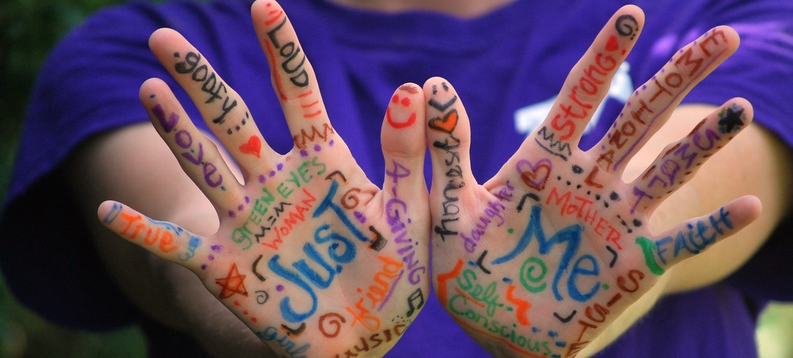
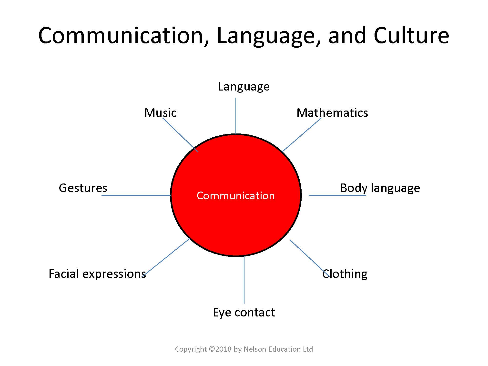
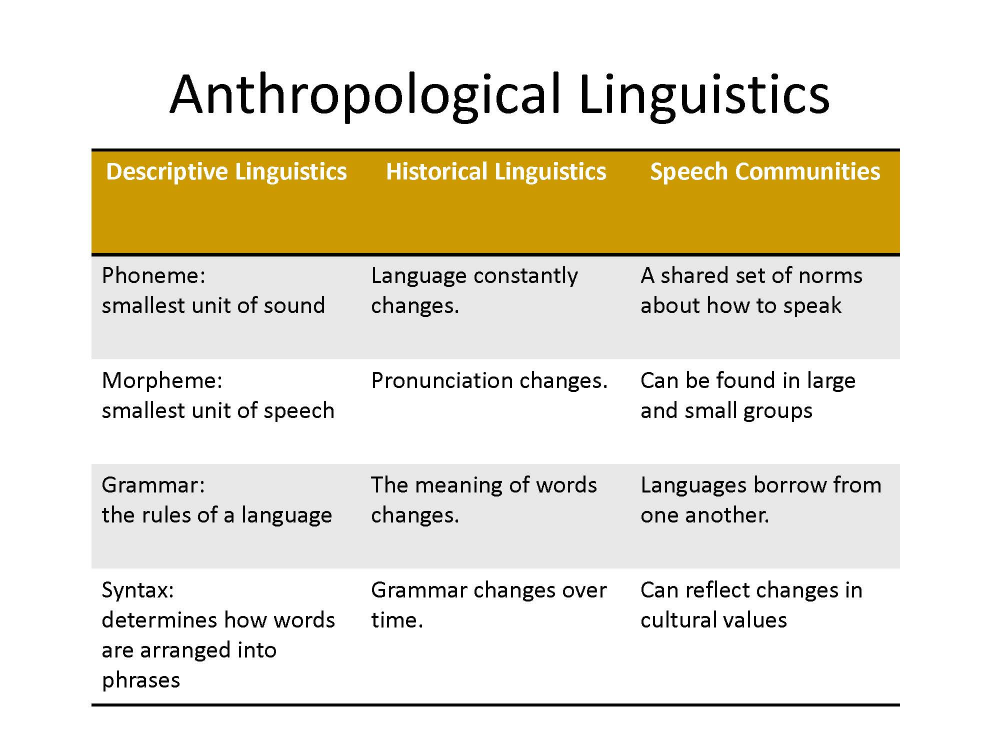
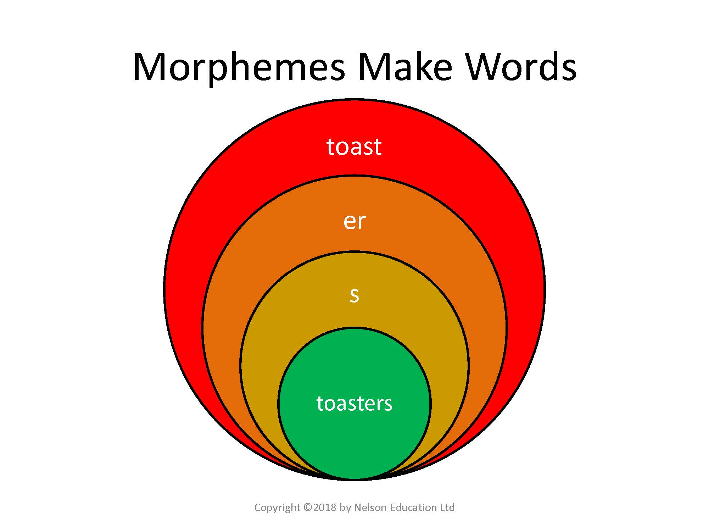
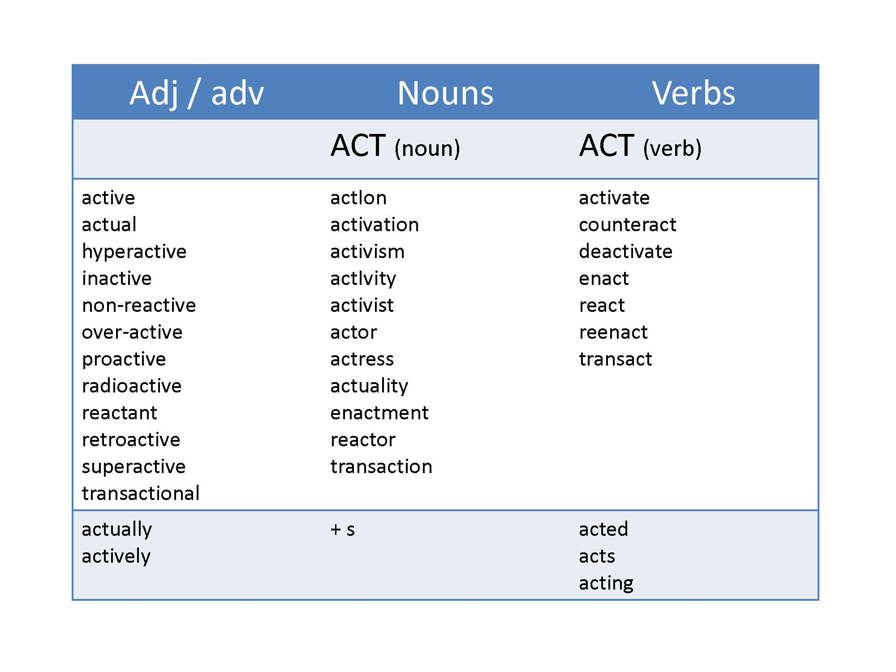
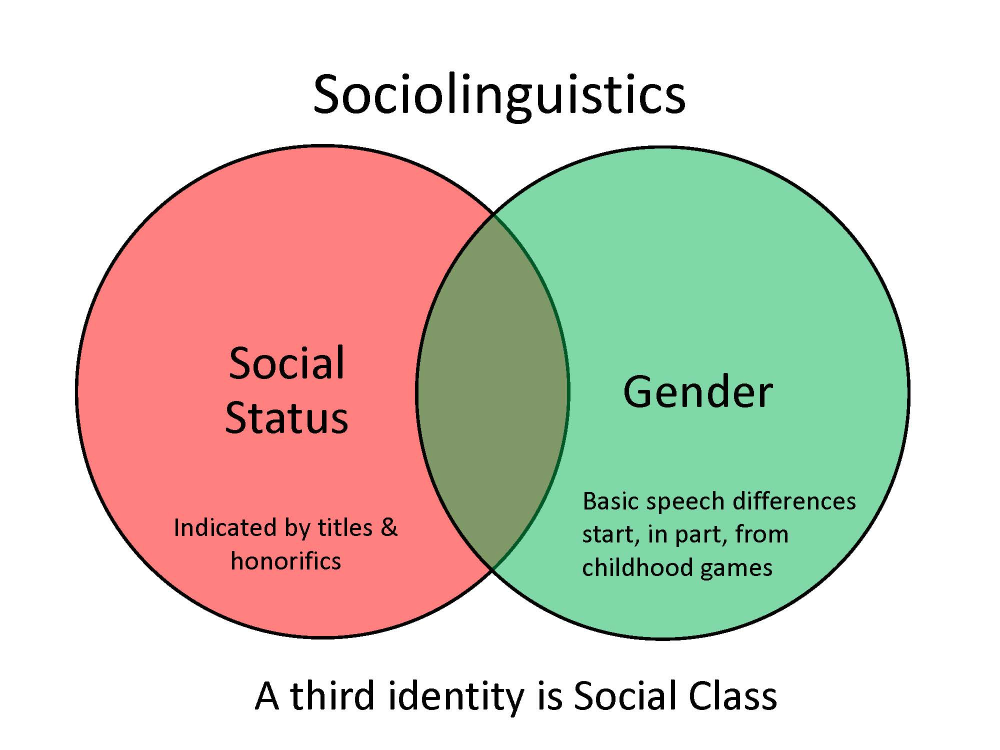
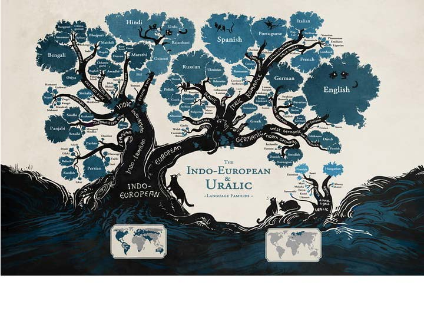
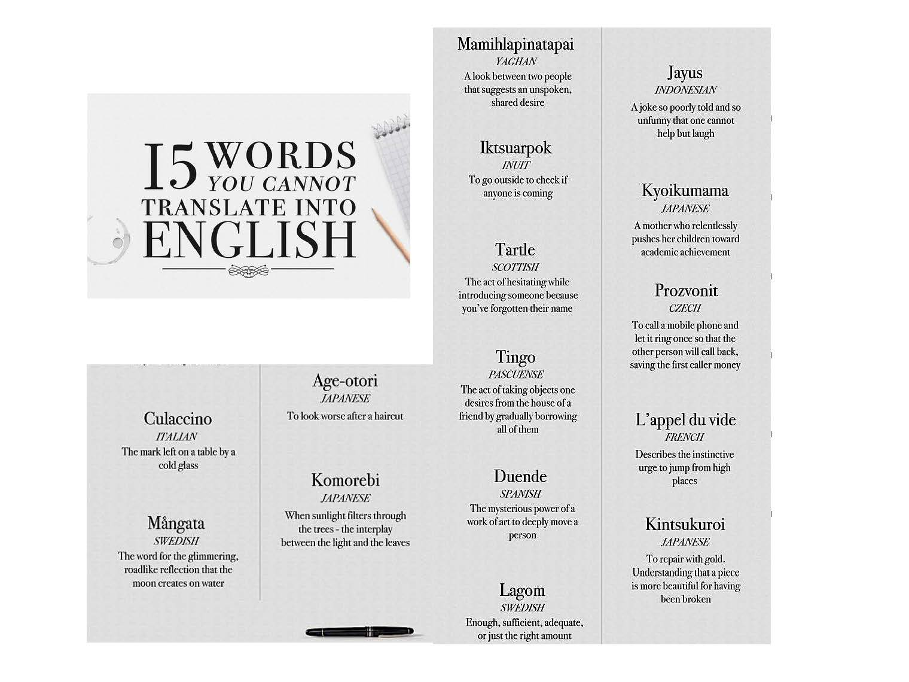
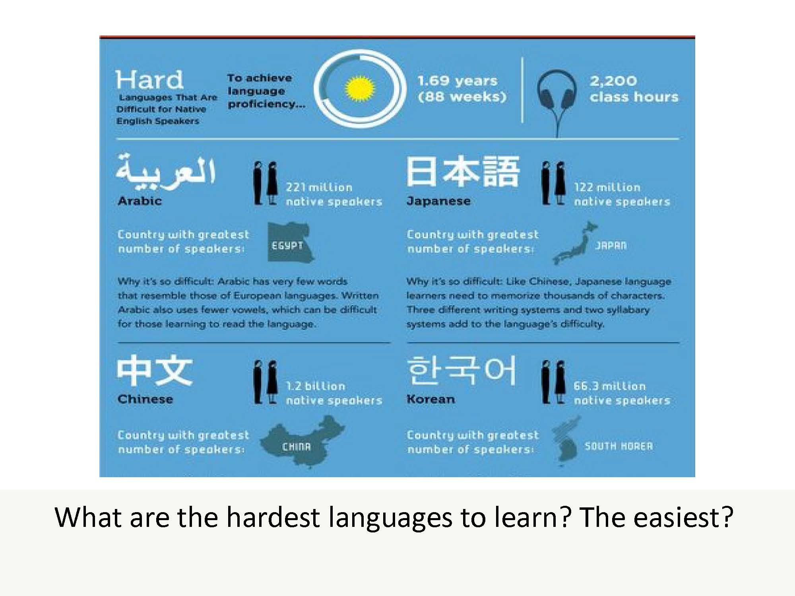
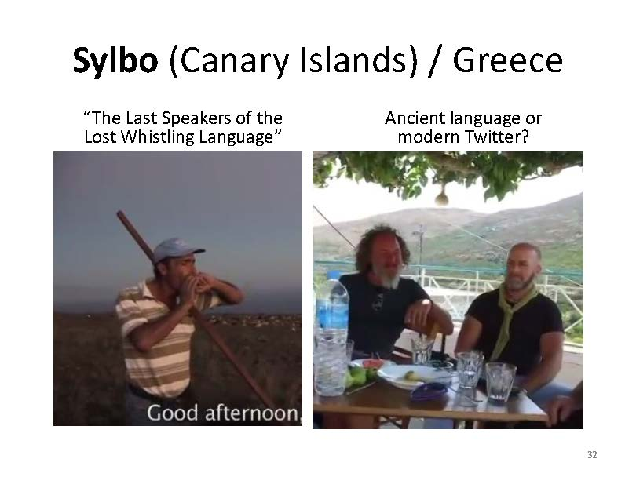

# Language

*Photo by Olya Kobruseva from Pexels*

## Overview {-}

If there were one area that is a mirror of, or mirror to culture, it is language. Both reflect the other and have implications for revealing something about the other. In Unit 6, you will not study language, but rather, you will study linguistics. Descriptive linguistics looks at the structure of language, sociolinguistics looks at the relationship between language and society, and historical linguistics looks at how language changes over time. Some are added (though that is very rare), and many die. Much effort has been put into preserving languages, because in doing so, you preserve both a way of life and a way of thinking about life and the world.

### Topics {-}

This unit is divided into the following topics:

  1. Fundamentals of Language  
  2. Descriptive Linguistics  
  3. Sociolinguistics  
  4. Language Diversity, Learning, Change, and Preservation  

### Learning Outcomes {-}

When you have completed this unit, you should be able to

  - Explain the relationship between language and culture.  
  - Identify the universal features of languages and the design features that make them unique.
  - Describe the structures of language: phonemes, morphemes, syntax, semantics, and pragmatics.  
  - Assess the relationship between language variations and ethnic or cultural identity.  
  - Explain how language is affected by social class, ethnicity, gender and other aspects of identity.  
  - Evaluate the reasons why languages change and efforts that can be made to preserve endangered languages.  

## Activity Checklist {-}

Here is a checklist of learning activities you will benefit from in completing this unit. You may find it useful for planning your work.

::: {.callout-caution}
**Note** that all Learning Lab activities contribute towards your Participation mark for this course.
:::

::: {.callout-note}
#### Resources {-}

  - In this section we will look at language and examine some interesting examples involving colours. Carefully read through these resources and be prepared to share your thoughts during the Learning Lab.
  - At the bottom of the page in Topic 2, students will find some important resources. There are a number of readings and slides for you to review. Additionally, take a few moments to watch through the video.
  - At the bottom of the page in Topic 3, students will find some important resources. There are a number of readings and slides for you to review.
  - In this section of Topic 4, students will be viewing some videos. These videos are intended to challenge your thinking about language. These resources will help you prepare for the discussion that will be taking place in the "Learning Lab" and the "Assessment" sections for Unit 6.

:::

<!-- [plugin:content-inject](../_6-10) -->

During this Learning Lab, your Facilitator will introduce you to the final project in the course: the **Culture Trait Presentation**. While this assignment is not due until the end of Unit 10, students will need to identify a topic for their research. More information about this assignment can be found by clicking on the "Unit 10" tab at the top of the page.

In addition, students will also be participating in a graded discussion during this Learning Lab. Information about this discussion can be found on the "Assessment" tab in Unit 6. Carefully review this assignment and prepare your thoughts before arriving to the Learning Lab.

<!-- [plugin:content-inject](../_6-11) -->

As mentioned above, students will be participating in a graded discussion that focuses on Language - this graded discussion will take place during the Learning Lab for Unit 6.

To help prepare for this discussion, review the questions found on the "Assessment" tab for this unit. Additionally, the videos you viewed in Topic 4 will also help prepare you for this discussion.

### Resources {-}

Here are the resources you will need to complete this unit:

 - Brown, N., de González, L. T., McIlwraith, T. F., & American Anthropological Association. (2018). Perspectives: An Open Invitation to Cultural Anthropology.
   - http://perspectives.americananthro.org/Chapters/Language.pdf
 - Dastrup, R. A. (2019). Introduction to Human Geography.
   - https://humangeography.pressbooks.com/
 - Wesch, M. (2018). The Art of Being Human: A Textbook for Cultural Anthropology. New Prairie Press.
   - The Power of Language
 - Other online resources will be provided in the unit.

## The Fundamentals of Language

The subject of language is one of the most challenging elements of Anthropology to understand. For something that is such a focus of day-to-day life, the impact of language is something that cannot be understated.

Learning a new language is incredibly challenging for many reasons. One of the biggest challenges of learning a language is that people do not necessarily write like they talk - learning how to write a new language can be entirely different from learning how to speak a new language.

Another challenging situation is learning a language among people who do not read and write. As a result, they may conceptualize language in a completely different way - for example, they may not view language as a collection of words.

Both of these scenarios highlight how complex communication can be among humans. Non-verbal cues, symbolism, metaphors, and cultural nuances are important elements that demand awareness and appreciation.

<!-- 
[plugin:content-inject](../_6-2) -->

[The Power of Language](assets/unit6/7-WeschAOBH_Language.pdf)

## Descriptive Linguistics

Descriptive linguistics involves analyzing and describing how language is used by a community or culture. As we saw in the previous section, much of how humans communicate involves no words at all. This allows for many different interpretations depending on how your cultural background has shaped your views.

The reality is that there are many universal features of human language, but there are (arguably) just as many culturally unique features to human language. Each person's social identity will shape their understanding of language and how they use language. This needs to be an important focus of awareness in order to appreciate these intricacies.

<!-- 
[plugin:content-inject](../_6-3)-->

### Resources {-}

The resources below will help you better understand the content explored in this unit. Take some time to explore this material - it will be discussed during the Learning Lab and will play an important role in course assessments.

### Activity {-}

#### Activity Reading #1 {-}

::: {.callout-note}

Take some time to read through the slides below. Follow along with them as you read through the activities below:

<!-- 
[presentation="anth101/presentations/u11"]

Click to Open

<h5>Learning Objectives</h5> 
 - Human language and culture
 - People communicate without words
 - Universal features of human language
 - Unique features of human languages
 - The structures of language
 - Social identity shapes language and is shaped by it
 - Language change (historical linguistics) and preservation

*image of diagram showing various aspects of Communication*

<h5>Language and Meaning</h5> 
  - Aoccdrnig to a rscheearch at an Elingsh uinervtisy, it deosn't mttaer in waht oredr the Itteers in a wrod are, the olny iprmoetnt ting is taht the frist and Isat Itteers are at the rghit pclae. The rset can be a toatl mses and vou can sitll raed it wouthit porbelm. Tihs is buseae we do not raed ervey Iteter by it slef but the wrod as a wlohe.

<h5>The Importance of Human Language to Human Culture</h5>
  - Language can be considered a culture's most important feature  
  - Language and culture are inseparable  
  - Relies on symbols  
    - Arbitrariness  
  - In learning another language, you also learn a new way of looking at the world.  

<h5>Communication Systems</h5>
  - Non-verbal communication includes  
    - Kinesics (body language)  
    - Proxemics (use of space)  
    - Paralanguage (background features of speech or sounds that convey meaning)  

<h5>Human Language Compared with the Communication Systems of Other Species</h5>
  - Hockett's Design Features - describe characteristics of all communication systems  
  - Human language shares all characteristics and includes these features:  
    - Discreteness  
    - Duality of patterning  
    - Displacement  
    - Productivity/Creativity  

*image of chart showing various aspects of Anthropological Linguistics*

<h5>Descriptive Linguistics: Structures of Language</h5>
  - Phoneme - minimal unit of sound that makes a difference in meaning  
  - Morpheme - minimal unit of meaning  
  - Syntax - rules that govern how to put units of speech together  
  - Semantics - meanings of words  
  - Pragmatics - social and cultural context  

<h5>PHONOLOGY</h5>
  - Humans can make about 4,000 different sounds. About 400 of these are used in languages around the world, with most languages using about 40 different sounds. (Wesch, 2018, p.108)  
  - **Phonology/Phonetics**: rules for combining phonemes
    - Includes accent - pronunciation, enunciation, stress, and pitch.  
    - Sounds excluded from vour own phonetic repertoire are difficult to imitate.  
    - Questions:  
      - 1. How many phonemes does English have?  
      - 2. How many sounds are there in the world?  
      - 3. What are some commonly difficult sounds for learners of English as a second language?  

<h5>MORPHOLOGY</h5>
  - **Morphology**: the smallest units of meaning.  
    - Morpheme = combination of phonemes.  
      - prefix + root + suffix  
  - Word = a morpheme used singly or in combination.  
  - Examples: s-u-n  
    - phil - anthrop - ist  
    - non -trans -fer - able  

<h5>**Why the words for "Mom" and "Dad"** are so similar across languages</h5>
  - Have you ever thought about the origins of the words for "mother" and "father"? Isn't it striking that they are so similar across languages? Using recent material, Prof. Handke provides several arguments why this is so and why these similarities are not at all surprising.

<iframe width="560" height="315" src="https://www.youtube-nocookie.com/embed/TZgr-3QBviY" title="YouTube video player" frameborder="0" allow="accelerometer; autoplay; clipboard-write; encrypted-media; gyroscope; picture-in-picture; web-share" allowfullscreen></iframe>

*image of a diagram showing Morphemes Make Words*

*image of a diagram showing Adj/adv, Nouns and Verbs*

<h5>SYNTAX</h5>
  -  **Syntactics** - the relationship of words to one another  
    -  Word order contributes to meaning.  
    -  Example:
      -  The dog bit the man OR The man bit the dog.  

<h5>SEMANTICS</h5>
  - Def: the meaning of words  
  - Denotation - the dictionary meaning  
  - Connotation - the meaning according to the context  
  - Idioms: do not translate well, therefore focus on translating meaning and not of the actual words.  

<h5>Sociolinguistics</h5>
 - What we say and how we say it is culturally influenced  
 - Language - standard variety of speech  
 - Dialect - often used for subordinate variety of a language (result of colonization)  
 - Many reasons for language variation  
 - Registers - formality of speech  
 - Code-switching - use of several varieties of language in a particular interaction 

 <h5>Dialects and Accents</h5>
   - How are you today?  
   - How va doin'?  
   - Me mudder and me fadder  
   - Don't nobody go nowhere.  
   - **Dialect** a regional or class variation of a language  
   - **Standard language** the variety of language spoken in public that receives the most institutional support; is the most prestigious. In Britain, it is sometimes called "the Queen's English."  
   - **Accent** the manner of pronouncing nouns and verbs. It can characterize individuals, regions, countries, social classes, ethnicities, or other social divisions.  

<h5>Diglossia and Code Switching</h5>
  - **Diglossia** : the situation in which two languages or forms of the same language are spoken by people in the same language community at different times and places  
    - Context determines which form is used (e.g., one form is for the business community; another form for conversations between friends). E.g. formal vs informal forms
  - **Code-switching**: when speakers of two or more languages or varieties of one language switch between the two, depending on the social context
    - Found in complex societies made up of a number of special interest groups, each with its own specialized vocabulary

<h5>Language Variation</h5>
  - Linguistic Relativity (the Whorf Hypothesis)  
    - Whorf found no present, past, future tense in the Hopi lexicon  
    - Language shapes the way we see the world  
  - How we see our world, influences how we use language  
    - Gender influences our choice of words and our style of speech  
    - The words we use to categorize our world is a clue to how we see our world  

<h5>Where the Sky is Not Blue</h5>
  - Recall this section of Wesch's chapter (p. 116)which discusses how we see our world, and how we choose our words. If there is no word for blue in a language, does that mean that society does not see the color blue? Read *It's not easy seeing green*  
  - What do you see? Do you detect which one is different?  
  - httos://languagelog.Idc.upenn.edu/nll/?o=17970  

*image of a diagram showing Sociolinguistics elements*

<h5>Historical Linguistics & Language
Change</h5>
  - Language taxonomies - classification systems, create a family tree of languages  
  - Globalization, migration, and urbanization often leads to suppression of local languages  
  - Language extinction/language death  
  - Language shift  

*image of the Indo-European and Uralic language family tree*

*image of 15 words that cannot be translated into English*

<h5>The Future of English</h5>
  - # of speakers of English as a native language is falling  
  - US: nearly 20% of Americans speak a language other than English at home  
  - Multi-lingualism is normative in the world  
  - Globally, the number of native English speakers is expected to drop from the current 9% to 5% by 2050  

<h5>The Future of Other Languages</h5>
  - Chinese is growing in predominance  
  - Hindi-Urdu and Arabic climbing past English  
  - Spanish nearly equal to English  
  - French is the fastest growing language in the world  
  - English? To remain strong as a SECOND language  
  - What is the best language to learn, as a 'second language'?  

*image of hardest languages to learn*

<h5>Endangered Languages</h5>
  - In 2016 there were 7097 living languages  
  - Language diversity is increasing globally  
  - Endangered language: a language at risk of disappearing as it is not being used by the younger generation.  
  - Some cultures are trying to preserve their language.  
  - One language goes extinct every seven or eight days, with no last known speaker.  

*image of two pictures with men from Sylbo (Canary Islands)and Greece*

-->

Click to Open

<h5>Learning Objectives</h5> 
 - Human language and culture
 - People communicate without words
 - Universal features of human language
 - Unique features of human languages
 - The structures of language
 - Social identity shapes language and is shaped by it
 - Language change (historical linguistics) and preservation

*image of diagram showing various aspects of Communication*

<h5>Language and Meaning</h5> 
  - Aoccdrnig to a rscheearch at an Elingsh uinervtisy, it deosn't mttaer in waht oredr the Itteers in a wrod are, the olny iprmoetnt ting is taht the frist and Isat Itteers are at the rghit pclae. The rset can be a toatl mses and vou can sitll raed it wouthit porbelm. Tihs is buseae we do not raed ervey Iteter by it slef but the wrod as a wlohe.

<h5>The Importance of Human Language to Human Culture</h5>
  - Language can be considered ...
  - Language and ... are ...
  - Relies on ...  
    - Arbitrariness  
  - In learning another language, ...  

<h5>Communication Systems</h5>
  - Non-verbal communication includes  
    - ... (body language)  
    - ... (use of space)  
    - Paralanguage (...)  

<h5>Human Language Compared with the Communication Systems of Other Species</h5>
  - Hockett's Design Features - ...
  - ... shares all characteristics and includes these features:  
    - ...  
    - ... of patterning  
    - ...  
    - Productivity/...  

*image of chart showing various aspects of Anthropological Linguistics*

<h5>Descriptive Linguistics: Structures of Language</h5>
  - Phoneme - ... 
  - Morpheme - ... 
  - Syntax - ...
  - Semantics - meanings of words  
  - Pragmatics - ...

<h5>PHONOLOGY</h5>
  - Humans can make about ... different sounds. About... of these are used ..., with most languages using about ... different sounds. (Wesch, 2018, p.108)  
  - **Phonology/Phonetics**: ...
    - Includes accent - ..., ..., stress, and ...  
    - Sounds excluded from vour own ... are difficult to imitate.  
    - Questions:  
      - 1. How many phonemes does English have?  
      - 2. How many sounds are there in the world?  
      - 3. What are some commonly difficult sounds for learners of English as a second language?  

<h5>MORPHOLOGY</h5>
  - **Morphology**: ...  
    - Morpheme = ....  
      - prefix + ... + suffix  
  - Word = a ...  
  - Examples: s-u-n  
    - phil - anthrop - ist  
    - non -trans -fer - able  

<h5>**Why the words for "Mom" and "Dad"** are so similar across languages</h5>
  - Have you ever thought about the origins of the words for "mother" and "father"? Isn't it striking that they are so similar across languages? Using recent material, Prof. Handke provides several arguments why this is so and why these similarities are not at all surprising.

<iframe width="560" height="315" src="https://www.youtube-nocookie.com/embed/TZgr-3QBviY" title="YouTube video player" frameborder="0" allow="accelerometer; autoplay; clipboard-write; encrypted-media; gyroscope; picture-in-picture; web-share" allowfullscreen></iframe>

*image of a diagram showing Morphemes Make Words*

*image of a diagram showing Adj/adv, Nouns and Verbs*

<h5>SYNTAX</h5>
  -  **Syntactics** - ... 
    -  ... to meaning.  
    -  Example:
      -  The dog bit the man OR The man bit the dog.  

<h5>SEMANTICS</h5>
  - Def: ...  
  - Denotation - ... 
  - Connotation - ...  
  - Idioms: ..., therefore focus on ...  

<h5>Sociolinguistics</h5>
 - What we say and how we say it is ... influenced  
 - Language - ...  
 - Dialect - often used for ... (result of colonization)  
 - Many reasons for ... ...
 - Registers - ...
 - ... - use of several varieties of language in a particular interaction 

 <h5>Dialects and Accents</h5>
   - How are you today?  
   - How va doin'?  
   - Me mudder and me fadder  
   - Don't nobody go nowhere.  
   - **Dialect** ... 
   - **Standard language** ...; is the most prestigious. In Britain, it is sometimes called "..."  
   - **Accent** ... It can characterize ..., regions, ..., ..., ..., or other ...  

<h5>Diglossia and Code Switching</h5>
  - **Diglossia** : ...
    - Context determines which ... is used (e.g., one form is for the business community; another form for conversations between friends). E.g. ... vs ... forms
  - **...**: when speakers of two or more languages or varieties of one language switch between the two, depending on the social context
    - Found in ..., each with its own ...

<h5>Language Variation</h5>
  - Linguistic Relativity (the Whorf Hypothesis)  
    - ... found no present, past, future tense in the ... 
    - Language shapes the ...
  - How we see our world, influences ... 
    - ... our choice of words and our ... 
    - The words we use to ... is a clue to ...  

<h5>Where the Sky is Not Blue</h5>
  - Recall this section of Wesch's chapter (p. 116) which discusses how we see our world, and how we choose our words. If there is no word for blue in a language, does that mean that society does not see the color blue? 
  - Read *It's not easy seeing green*  
  - What do you see? Do you detect which one is different?  
  - httos://languagelog.Idc.upenn.edu/nll/?o=17970  

*image of a diagram showing Sociolinguistics elements*

<h5>Historical Linguistics & Language
Change</h5>
  - Language taxonomies - ..., create a ...  
  - Globalization, ..., and urbanization often leads to ...
  - ... extinction/language ...  
  - Language shift  

*image of the Indo-European and Uralic language family tree*

*image of 15 words that cannot be translated into English*

<h5>The Future of English</h5>
  -  Number of speakers of English as a ...  
  - US: nearly ...% of Americans speak a ... at home  
  - Multi-lingualism is ...  
  - Globally, the number of ... is expected to drop from the current ...% to ...% by ...  

<h5>The Future of Other Languages</h5>
  - Chinese is ... 
  - Hindi-Urdu and ...  
  - Spanish nearly ... 
  - French is the ...
  - English? To remain ...
  - What is the best language to learn, as a 'second language'?  

*image of hardest languages to learn*

<h5>Endangered Languages</h5>
  - In ... there were ... living languages  
  - Language diversity is ... 
  - Endangered language: a language at ...
  - Some cultures are trying to ...  
  - One language goes extinct every ... or ... days, with no ...    

*image of two pictures with men from Sylbo (Canary Islands)and Greece*

:::

## Sociolinguistics

In addition to everything we studied in the previous section, it is important that we consider language in relation to social factors. As you might have guessed, what people say and how they say it is largely influenced by culture.

Sociolinguistics helps to provide insight as to how and why people from a similar place can use different expressions or accents, for example, when discussing similar things. For example, the way individuals speak on the Westcoast of Canada can be very different then the way people speak on the East-Coast of Canada in both sound and variation in language choice. Despite being from the same country, cultural anthropologists are interested in better understanding why these varieties exist and how they happened.  

<!-- [plugin:content-inject](../_6-4)-->
### Resources

The resources below will help you better understand the content explored in this unit. Take some time to explore this material - it will be discussed during the Learning Lab and will play an important role in course assessments.

### Activity: Reading {-}

::: {.callout-note}
 - In the slides below, you will find some valuable information that can help you develop a better sense of sociolinguistics. This presentation will also help provide some context and understanding for the next resource below.
[presentation="anth101/presentations/u11"](has already been added in previous section above)
<!-- ### *Reading #2* {-} -->
 - This article uses a tree as a metaphor to illustrate the evolution of language. Spend some time looking at the origins of each of the languages that form the tree. See if you can find your own primary language (or look at the evolution of any other language you may speak).

[**The Tree of Languages**](http://www.openculture.com/2015/06/the-tree-of-languages-illustrated-in-a-big-beautiful-infographic.html)

:::

## Language Diversity, Learning, Change, and Preservation

As we have seen, throughout this Unit, language is not only complex and diverse, but it is also constantly evolving. Not only are cultural anthropologists interested in this evolution, but they are also interested in preserving the past.

In this final section of Unit 6, we learn about an endangered whistling language found on two island - one in the Mediterranean Sea, and the other off the coast of West Africa. As you watch, consider what role an Anthropologist might play in understanding the reasons for change, and also the reasons for preserving these unique languages.

<!--[plugin:content-inject](../_6-5)-->
## Topic 4 Resources

The resources below will help you better understand the content explored in this unit. Take some time to explore this material - it will be discussed during the Learning Lab and will play an important role in course assessments.

### Activity: Watch and Reflect 

::: {.callout-note}
- ***CASE STUDY from one of the Spanish Canary Islands & Discussion*** 

This first video presents an interesting example of a language on the cusp of extinction on the Canary Islands. In the age of mobile phones, the remaining "speakers" of a dying whistling language try to preserve a vital means of communication over vast distances.

*Take a look:*

<iframe width="560" height="315" src="https://www.youtube-nocookie.com/embed/C0CIRCjoICA" title="YouTube video player" frameborder="0" allow="accelerometer; autoplay; clipboard-write; encrypted-media; gyroscope; picture-in-picture; web-share" allowfullscreen></iframe>

  - ***CASE STUDY from Greek Island & Discussion*** 

In the Greek island village of Antio, home to the world's most endangered language, aging residents communicate across hillsides through whistles, a specific system of communication believed to date back to Ancient Greece. Special correspondent Malcolm Brabant reports on how they hope to save their language from extinction and what it has in common with Twitter.

<iframe width="560" height="315" src="https://www.youtube-nocookie.com/embed/Q5ZMGBz8qgI" title="YouTube video player" frameborder="0" allow="accelerometer; autoplay; clipboard-write; encrypted-media; gyroscope; picture-in-picture; web-share" allowfullscreen></iframe>

:::

## Learning Lab {-}

::: {.callout-caution}
**Important:** During this unit's Learning Lab, students will be participating in a discussion that will be part of a formal assessment. For more information, and to prepare for this assessment, please click on the "Assessment" tab for Unit 6.
:::

#### Culture Trait Presentation {-}

In this section, students are introduced to their final assignment for the course: **The Culture Trait Presentation.** While this assignment is not due until Unit 10, students will need to identify a topic and begin their research now.

To learn more about this assignment, click on the ***Assignment - Culture Trait*** tab found in Unit 10.

After reading through the guidelines for the assignment, focus on identifying a topic - **your topic needs to be communicated to the Facilitator.** Once your topic has been approved, it is strongly recommended that you begin your research so you can develop your presentation. 

## Assessment

::: {.callout-tip}
In this Unit, we studied the nuances and complexities of language. The assessment, for Unit 6, will focus on a discussion that requires you to draw upon your understanding of our studies.

As noted in the previous section, this assessment will occur during this unit's Learning Lab.
:::

<!-- 
[plugin:content-inject](../_6-6)Hidden comment -->
#### Group Discussion: *Language*

Take some time to reflect on the content of this unit. During the time allocated to a Learning Lab for this unit, you will be asked to share your thoughts on the following:

1. Can whistling be regarded as a language? (*Be sure to provide reasons to support your position*)
2. Can you use the same rationale for arguing that sign language is (or is not) a language?

***Be sure to include ideas and concepts from throughout the Unit to support your position(s).***

The following criteria will be used to grade your contribution to this discussion:

| Grade |  %   |                     Assessment Criteria                      |
| : | :-- | :- |
|   A   |  4   | Outstanding contribution and follow-up comments  that inspire a rich and fruitful discussion. Demonstrates understanding  of material as well as an ability to tie the material to larger ideas, making  rich connections and evoking deep and interesting questions. Thus, evidence  of thorough preparation, i.e. reading or viewing the required material. |
|   B   |  3   | Evidence of some preparation, and consequently comments lack  understanding or insight. |
|   C   |  2   | Minimal contribution. Or, not having read or viewed the required  material that is the basis of the discussion topic. |
|   D   |  0   | No contribution or a contribution that feels rushed like it was  “just something that had to be done for the grade.” |

The evaluation of this will count towards the 4% awarded for participation. It will be based on the degree of creative thinking demonstrated by each student during the discussion. **Students will be assessed during the discussion.**
<!-- content goes here -->

### Checking Your Learning {-}

::: {.callout-important}

**Before you move on to the next unit, check that you are able to: ** 

- Explain the relationship between language and culture.
- Identify the universal features of languages and the design features that make them unique
- Describe the structures of language: phonemes, morphemes, syntax, semantics, and pragmatics
- Assess the relationship between language variations and ethnic or cultural identity
- Explain how language is affected by social class, ethnicity, gender and other aspects of identity.
- Evaluate the reasons why languages change and efforts that can be made to preserve endangered languages.

:::

