# Art Forms and Cultural Expression

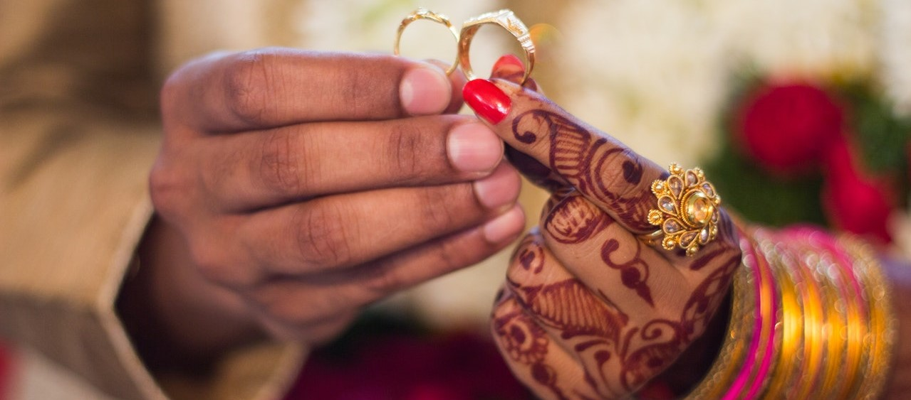

*Indian bride and groom holding their wedding rings.Photo by Kumar Saurabh from Pexels* 

## Overview {-}

Art enriches our lives. Art brings enjoyment, stability and also change to society. In this unit you will access various sources of information. One of the reasons a unit on art was included in this course is to give you exposure, and at this point in the course, enable you to pause and enjoy aesthetically pleasing and culturally intriguing activities.

This unit will acquaint you with historical First Nations art particularly in the region where Trinity Western University is located. If you came to campus, you could take a weekend field trip to some of the sites that have petroglyphs. You could also visit numerous places and participate in activities of several nations.

Vancouver, Canada is a multi-cultural metropolitan city, and Greater Vancouver has some of the largest diaspora communities from Europe (especially German and Dutch, Ukrainian and Greek), from the Punjab India, from Iran, and from many Asian countries such as the Philippines, Hong Kong and China. These named ethnic groups are among the largest cultural groups, but there are many more. Each has festivals that makes visible and tangible cultural themes and expresses identity and values. Online activities – to new places of thought – will serve as your virtual field trips.

### Topics {-}

This unit is divided into the following topics:

  - Art as an Anthropological Study
  - Art Forms:
   - Graphic and Plastic Arts
   - Music and Dance
 - Expressive Culture:
   - Sports and Games
   - Beauty and Fashion

### Learning Outcomes {-}

When you have completed this unit, you should be able to:

 - Explain different types of individual and collective expression and art forms.
 - Identify cultural performances and performances of culture.
 - Describe the basic elements of art.
 - Explain the functions of art.
 - Explain how art is a personal expression and cultural identity.
 - Interact with different art forms – real and virtual

## Activity Checklist {-}

::: {.callout-note}
Here is a checklist of learning activities you will benefit from in completing this unit. You may find it useful for planning your work. Note that all Learning Lab activities contribute towards your Participation mark for this course.
:::

### Topic 1 Resources {-}
At the bottom of the page in Topic 1, students will find some important resources. There are a number of readings and slides for you to review.

### Learning Activity {-}

::: {.callout-note}

  - In Topic 2, you will find Learning Activity 7.1. Each student will review the resources provided in this section. During the Learning Lab for Unit 7, students will share their thoughts with one another - your Facilitator will provide additional information.  
  - In Topic 3, students will find a number of Learning Activities at the bottom of the page. These activities focus on expressive culture. Carefully review each of the videos and consider how it connects with the themes of Topic 3. Students will be expected to share their thoughts during the Learning Lab.  

:::

### Learning Lab {-}

Once again, students will be participating in a graded discussion during this Learning Lab. Information about this discussion can be found by clicking on the "Assessment" tab for Unit 7.

## Assessment {-}

::: {.callout-tip}
Students will be assessed on their engagement in a group discussion that will take place during the Learning Lab for Unit 7. On the "Assessment" tab, you will find important information regarding this discussion. It is important to review all the resources provided here. Additionally, it will be helpful to review the videos from Topic 3.
Before arriving to the Learning Lab, carefully consider the question posed (regarding Rock Art). Your Facilitator will provide additional information.
At the end of Unit 7, students will also need to complete Unit Test #3. This test will cover content from Units 6 and 7. The test can be found on the bottom of the page.
:::

## Resources {-}

Here are the resources you will need to complete this unit:

 - Walker, T. (2019). Chapter 11: Expressive Culture. TeamStudy.  
 - [**Art and Culture**](https://www.teamstudy.com/resources/chapter-11-expressive-culture-je6MqWlT)
 - Lumen Learning. (n.d.) Open Learning. Cultural Anthropology. Lumen Learning.  
 - [**Cultural Anthropology**](https://courses.lumenlearning.com/culturalanthropology/)
 - Other online resources will be provided in the unit.  

## Art as an Anthropological Study

One cannot understand culture without appreciating the role of art - there is no known to exist that does not have art. As such, Cultural Anthropologists need to focus on investigating art and its relationship to the culture of study.

In the last unit, we studied language and learned how complex it actually is. In many ways, the art is a form of non-verbal communication as art is an aesthetic reflection of what is important to a group of people and their culture.

### Topic 1 Resources {-}

The resources below will help you better understand the content explored in this unit. Take some time to explore this material - it will be discussed during the Learning Lab and will play an important role in course assessments.

### Activity: Reading{-}

::: {.callout-note}

Use the slides below to support your understanding of the readings. If there are sections of the notes that you are struggling to understand, follow up by reading the relevant section in the textbook.

<!-- Hidden comment 
[presentation="anth101/presentations/u12"] 

Click to Open

<h5>Learning Objectives</h5> 
  -  The primary objective of this topic is to increase exposure to cultural art forms and learn to appreciate different types of individual and collective expression  
    -  dance, mime, theatre, musicals, choirs/concerts,literature, sports, even fashion and sculpture,weaving, carvings, etc  
  -  Identify cultural performances and performances of culture  
  -  Know the basic elements of art  
  -  Explain the functions of art  
  -  Articulate how art is a personal expression and cultural identity  
  -  Engage with different art forms - real and virtual  

<h5>Art and Expressive Culture</h5> 
  - Art is the application of imagination, skill, and style to matter, movement, and sound that goes beyond what is purely practical.  
  - Expressive culture involves behaviours and beliefs related to art,leisure, and play.  
  - There is no known culture without art, beauty, leisure and play.  
  - In most societies, art is inseparable from other activities
    - In non-industrial societies, art is embedded in all aspects of culture.  
    - The separate of art from daily social behavior is characteristic of modern society.  
  - Change in artistic style and techniques appears to increase when art is not primarily associated with religion.  

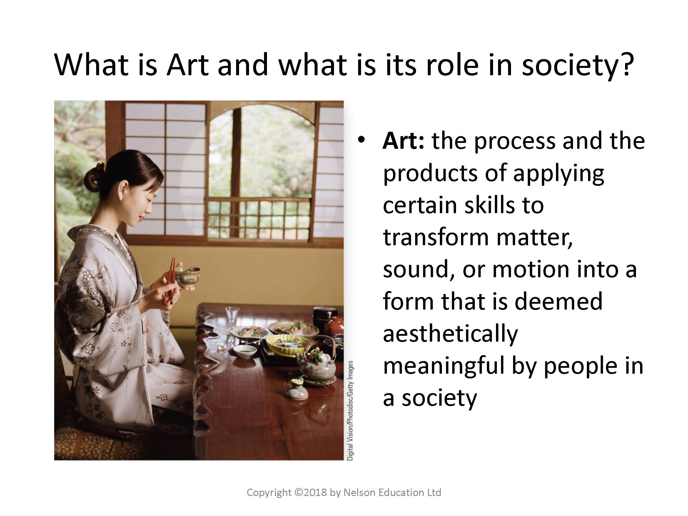

<h5>Symbolic Communication</h5> 
  - Symbolic elements in art are culturally specific:  
    - In Western culture, the phrase "once upon a time" indicates the story is a fairy tale  
    - Totem poles in First Nations cultures, reflect the social hierarchy of their society  

<h5>Basic Elements of Art</h5>
  - It must be:  
    - 1. Be creative, playful, enjoyable  
    - 2. Should produce an emotional response  
    - 3. Should be transformational  
    - 4. Should communicate information  
    - 5. Be the product of an artist who has developed a certain level of technical skill.  

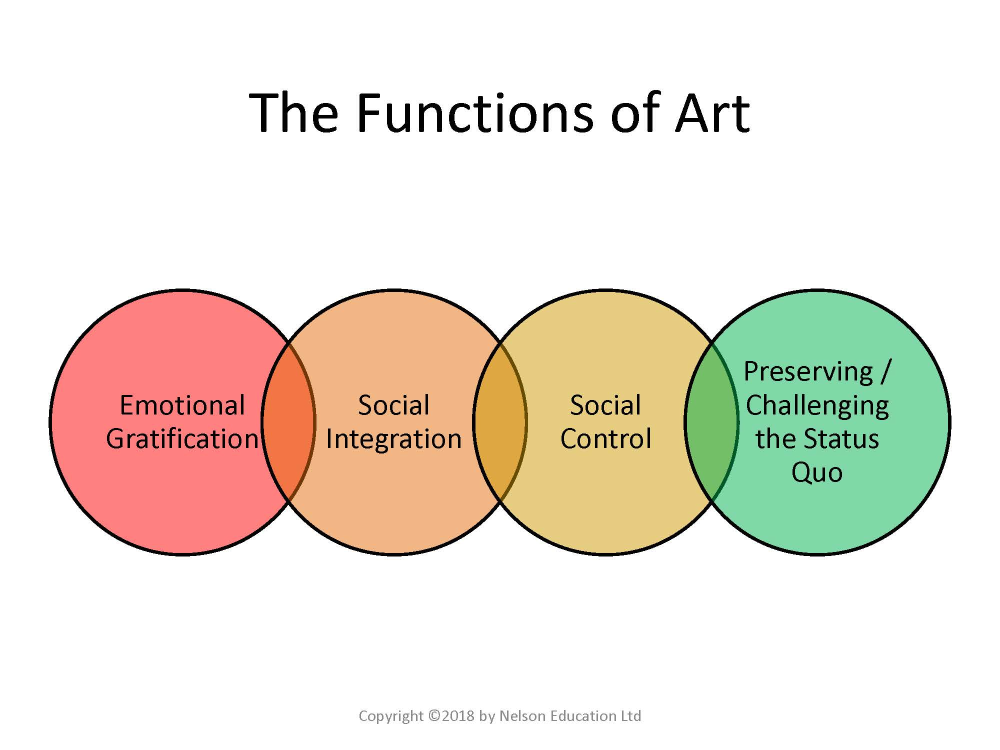

<h5>Personal & Social Functions of Art</h5>
  - Display cultural themes, making dominant cultural themes visible, tangible, and more real  
  - Cultural and social integration  
  - Express cultural identity and history  
  - Communicate with and control over nature and the supernatural  
  - Reinforces or resists cultural values  
  - Gives voice to tension, disunity, and conflict in society  

<h5>Social Control</h5>
  - Reinforce the existing sociocultural system  
  - Serve as a mechanism of social control  
  - Instill obedience and maintain status quo  
  - Represent the astonishing power of both the gods and the rulers  

<h5>Preserving or Challenging the Status Quo</h5>
  - Accumulation of art objects indicates high prestige.  
  - Art preserves the status quo.  
  - Art acts as a vehicle for protest, resistance, and even revolution;  
    - e.g., Arab Spring: artists mobilized popular support.  

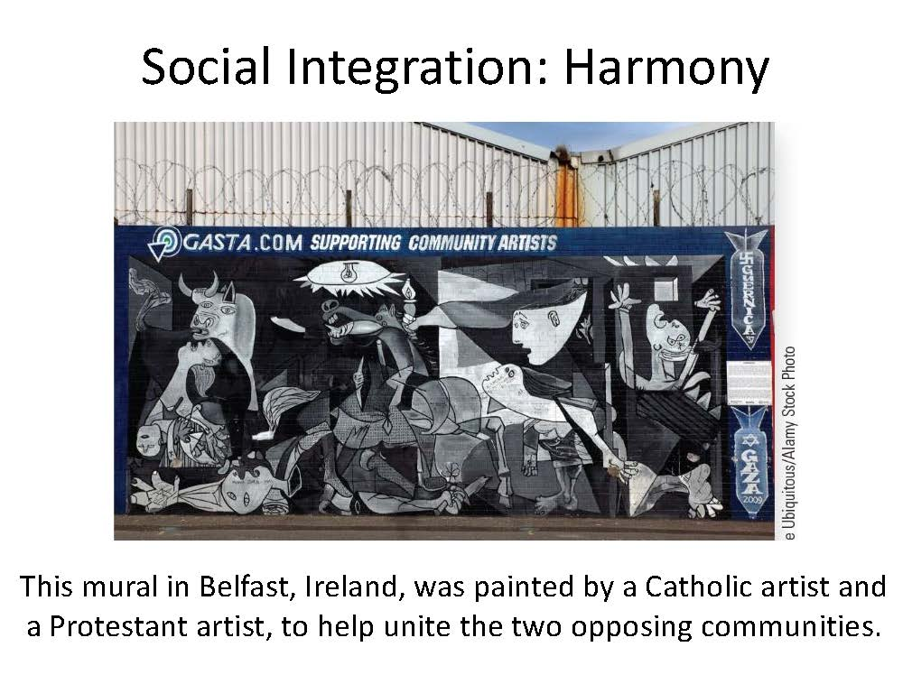

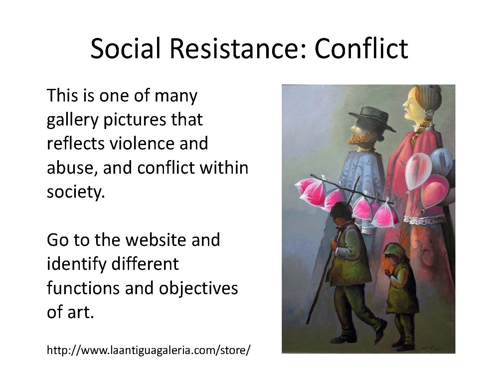

<h5>Cultural Performance vs. Performing Culture</h5>
  - Cultural performance is a performance  
    - an authoritative version of culture  
    - taking place at specific times and places  
    - high level of excellence demonstrated by performers  
    - E.g. opera, ballet, concerts, musicals, plays  
  - Performing culture  
    - the ways in which our everyday words and actions are reflections of enculturation, which may be studied as a performance  
    - Singing a national anthem, a cultural dance, storytelling of cultural heroes or fairy tales  

<h5>Five Types of Art / Creative Expression</h5>
  - Graphic and plastic arts  
    - body art such as tattooing  
    - petroglyphs  
    - tribal arts  
  - Music - ethnomusicology  
  - Dance  
  - Folklore  
  - Sports and games  

<h5>Graphic and Plastic Arts</h5>
  - Graphic arts  
    - forms of art that include painting and drawing on various surfaces  
  - Plastic arts  
    - artistic expression that involves moulding certain forms, such as sculpture  

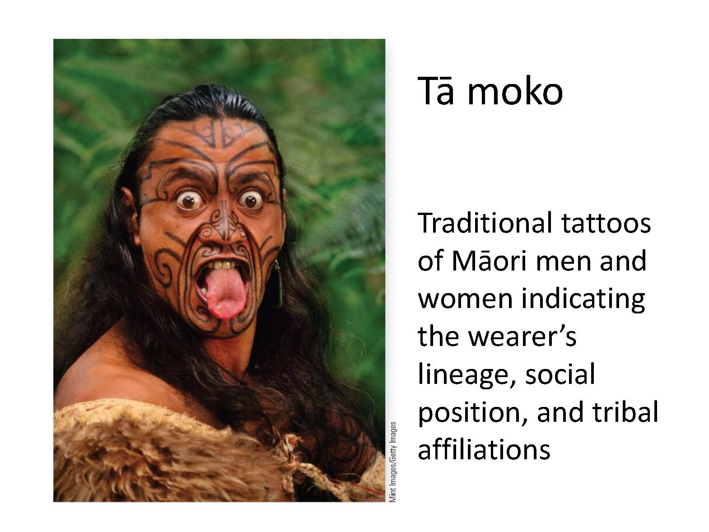

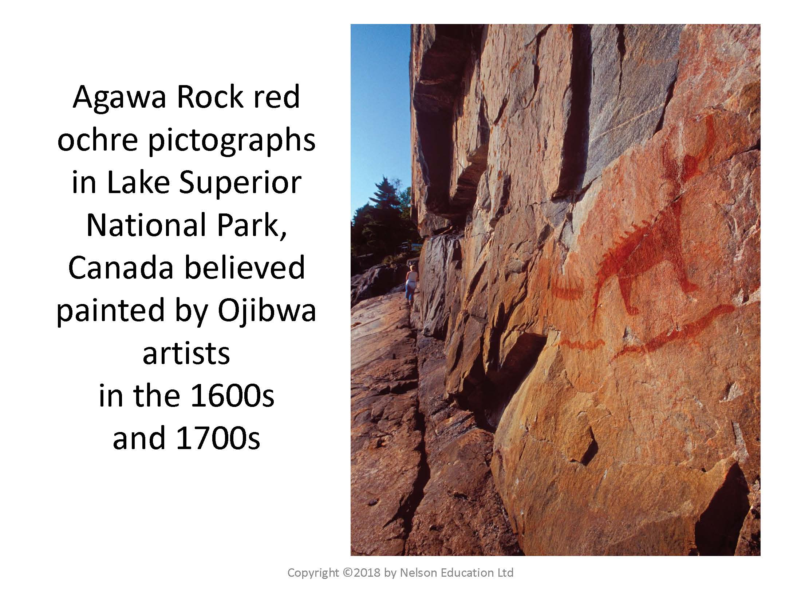

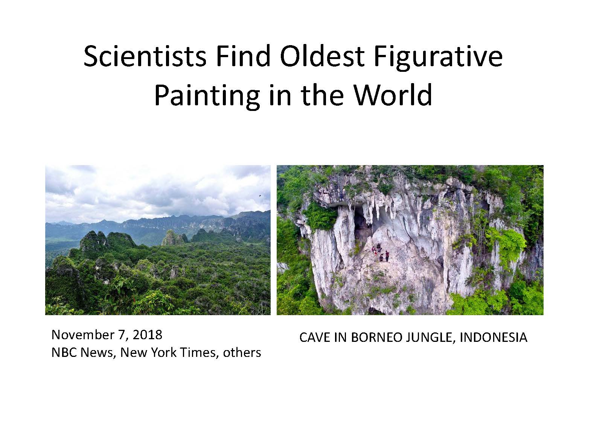

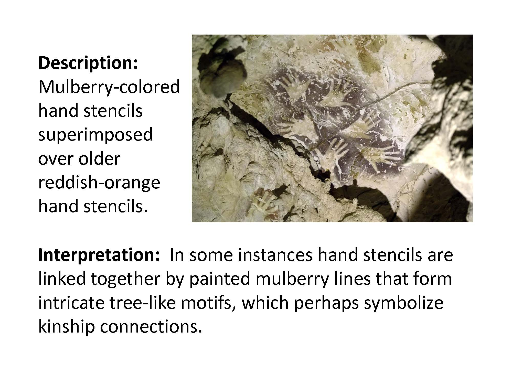

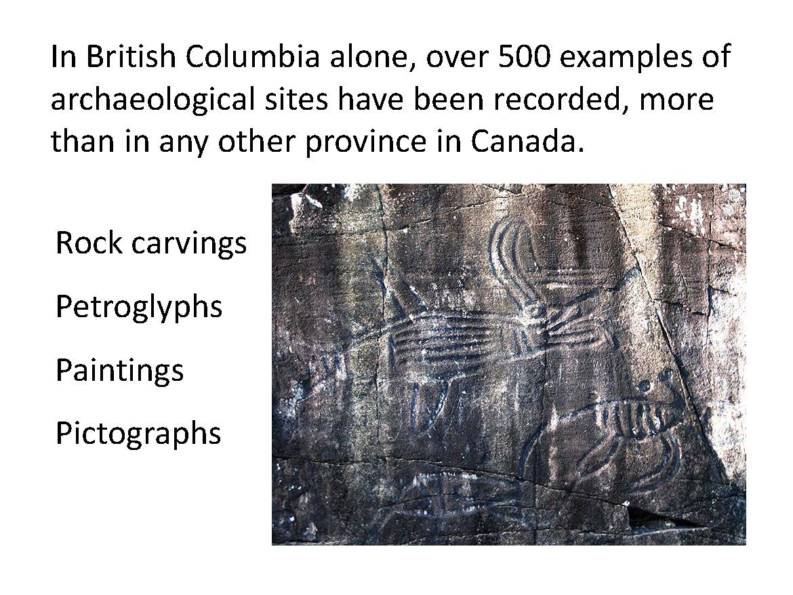

<h5>Music</h5>
  - Characteristics  
    - How the style of music in different cultures varies (scale, melody, harmony, timing)  
    - The different genres found in a society (lullaby, sea chantey, hard rock, etc.)  
    - The nature of musical texts (words)  
    - How music is composed  
    - How music is learned and transmitted  
  - Material Culture  
    - What kind of musical instruments are found in a culture  
    - Who makes musical instruments and how are they distributed  
    - How are musical tastes reflected in the instruments used  

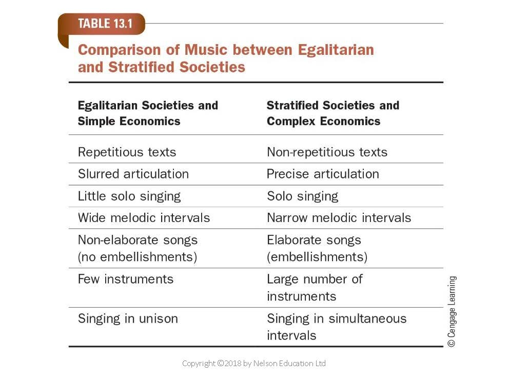

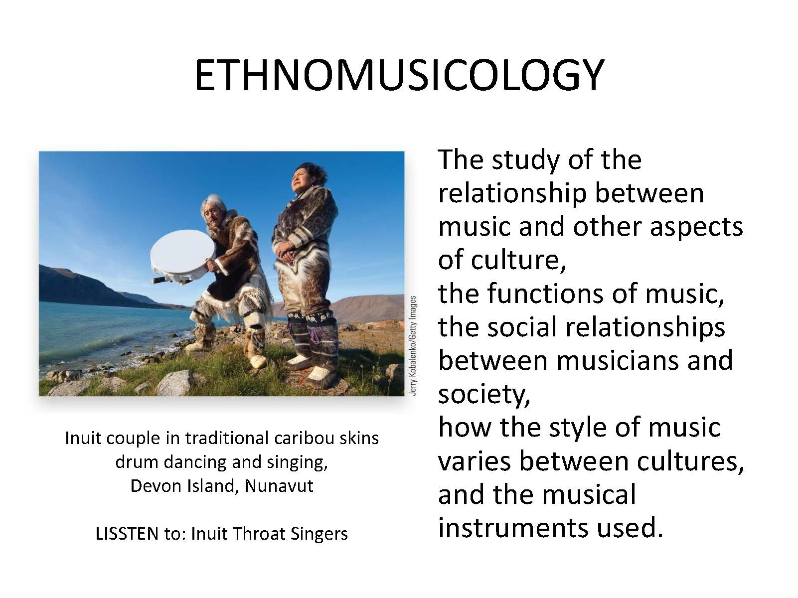

<h5>Listen to different types of music and identify their purpose/function</h5>

  - Inuit Throat Singing
    - https://www.youtube.com/watch?v=qnGMOB1A95I
  - Australian Aboriginal Music with the Didgeridoo 
    - https://www.youtube.com/watch?v=N80of5uNGAk
  - Symphony Philharmonica (Chicago and Cologne, Germany)
    - https://www.youtube.com/watch?v=auRUXPPqDcQ
  - Fiesta Mexicana
    - https://www.youtube.com/watch?v=inVipLks7EY&start r jo=1&list=RDinVipLks7EY&t=81

<h5>Dance</h5>
  - Helps people cope with aggressive feelings  
  - Expresses political values and attitudes by showing allegiance and controlling behaviour  
  - Communicates with supernatural forces  
  - Articulates and reinforces relationships  
  - Educates by passing on cultural traditions and values  

<h5>Sun Dance</h5>
  - The Sun Dance is a ceremony practiced by some indigenous people of United States of America and Canada, primarily those of the Plains cultures.  
  - The community, of independent bands, gathers together to:  
    - reaffirm their basic beliefs about the universe and the supernatural through rituals.  
    - pray for healing.  
  - Individuals make personal sacrifices on behalf of the community; participants prove bravery by overcoming pain.  
  - Other: Pow Wow Dance  

<h5>What is the purpose/function of these dances?</h5>
  // todo #12
  - Haka dance  
    - https://www.youtube.com/watch?v=yiKFYTFJkw
  - Native American Sun Dance

<iframe width="560" height="315" src="https://www.youtube-nocookie.com/embed/Vioh7ML75Cg" title="YouTube video player" frameborder="0" allow="accelerometer; autoplay; clipboard-write; encrypted-media; gyroscope; picture-in-picture; web-share" allowfullscreen></iframe>

 

<h5>Expressive Culture</h5>
  // todo #13
  - Sports and Games  
    - Play, Games and Expressive Culture
    - https://www.youtube.com/watch?v=61E3faQmUll
  - Beauty and Fashion
    -  Fashioning Faith  
    -  
<iframe src="https://player.vimeo.com/video/170091321?h=5160ae4fdb&color=ff0179&byline=0&portrait=0" style="position:absolute;top:0;left:0;width:100%;height:100%;" frameborder="0" allow="autoplay; fullscreen; picture-in-picture" allowfullscreen></iframe>

<a href="https://vimeo.com/170091321">Fashioning Faith</a> from <a href="https://vimeo.com/womensvoicesnow">Women&#039;s Voices Now</a> on <a href="https://vimeo.com">Vimeo</a>.

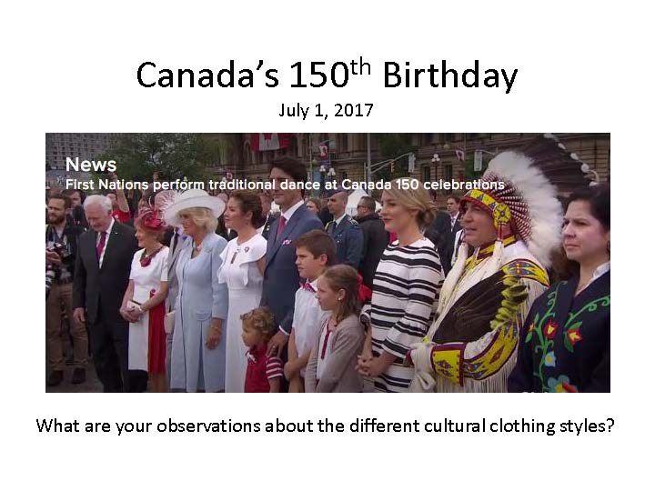  

<h5>Appreciative Exposure</h5>
  - Look up a range of different types of individual and collective expressive forms. Some could include:
    - dance, ballet, mime, theatre  
    - musicals, choirs/concerts, bands  
    - literature: legends, fables, folktales  
    - sports and games: cricket, golf  
    - fashion: architecture, clothing, jewelry  
  

-->

Click to Open

<h5>Learning Objectives</h5> 
  -  The primary objective of this topic is to increase exposure to cultural art forms and learn to appreciate different types of individual and collective expression  
    -  dance, mime, theatre, musicals, choirs/concerts,literature, sports, even fashion and sculpture,weaving, carvings, etc  
  -  Identify cultural performances and performances of culture  
  -  Know the basic elements of art  
  -  Explain the functions of art  
  -  Articulate how art is a personal expression and cultural identity  
  -  Engage with different art forms - real and virtual  

<h5>Art and Expressive Culture</h5> 
  - Art is the ..., skill, and ..., movement, and ....  
  - Expressive culture ... and ...,..., and play.  
  - There is no known ... without ..., beauty, ... and ...  
  - In most societies, art is ...
    - In non-industrial societies, art is ...  
    - The separate of art from daily ... is characteristic ...   
  - Change in ... style and ... appears to increase when ...

*image of traditional japanese women having a meal*

<h5>Symbolic Communication</h5> 
  - Symbolic elements in art are culturally specific:  
    - In ... culture, the phrase "..." indicates the story is ...
    - ... poles in First Nations cultures, reflect the ...  

<h5>Basic Elements of Art</h5>
  - It must be:  
    - 1. Be ..., ..., ...  
    - 2. Should produce an ...  
    - 3. Should be ...  
    - 4. Should ...  
    - 5. Be the product of an ... who has developed ...  

*image of diagram showing the funtions of art*

<h5>Personal & Social Functions of Art</h5>
  - Display ..., making dominant ..., tangible, and more real  
  - Cultural and ...  
  - Express cultural ...  
  - Communicate with and control ...  
  - Reinforces or ...   
  - Gives voice to tension, ..., and ...   

<h5>Social Control</h5>
  - Reinforce the ...  
  - Serve as a ...  
  - Instill ... and maintain ...  
  - Represent the ... of both the ...   

<h5>Preserving or Challenging the Status Quo</h5>
  - ... of art objects indicates ...  
  - Art ...  
  - Art acts as a ..., ..., and ...;  
    - e.g., Arab Spring: artists mobilized popular support.  

*image of street mural by Catholic and Protestant artist in Belfast*

*image of an art depicting Social Resistance: Conflict*

<h5>Cultural Performance vs. Performing Culture</h5>
  - Cultural performance is ...  
    - an ... of culture  
    - taking place at ... and ...  
    - high level ... by performers  
    - E.g. opera, ballet, concerts, musicals, plays  
  - Performing culture  
    - ... and actions are reflections of ..., which may be studied as a performance  
    - Singing a national anthem, a cultural dance, ... or ...  

<h5>Five Types of Art / Creative Expression</h5>
  - Graphic and plastic arts  
    - body art such as ...
    - petroglyphs  
    - ...  
  - Music - ...  
  - Dance  
  - ...
  - Sports and games  

<h5>Graphic and Plastic Arts</h5>
  - Graphic arts  
    - forms of art that include ...   
  - Plastic arts  
    - artistic expression that involves ..., such as ...  

*image of a Tā moko man with traditional Māori face tattoo*

*image of a Ojibwa artist's pictograph from 1600s and 1700s*

*image of locations of the world's oldest figurative paintings*

*image of primitive hand stencil found in rocks*

*image of primitive rock carving found in British Columbia*

<h5>Music</h5>
  - Characteristics  
    - How the style of music in different cultures varies (..., ..., ..., ...)  
    - The different ... found in a society (lullaby, ..., ..., etc.)  
    - The ... of musical texts (words)  
    - How music is composed  
    - How music is learned and ...  
  - Material Culture  
    - What kind of ... are found in a culture  
    - Who makes musical instruments and how ... 
    - How are ... reflected in the instruments used  

*image of a table showing comparision between Egalitarian and Stratified Societies*

*image of an Inuit couple in traditional attire playing caribou skin drums, Devon Island, Nunavut*

<h5>Listen to different types of music and identify their purpose/function</h5>
// todo
  - Inuit Throat Singing
    - https://www.youtube.com/watch?v=qnGMOB1A95I
  - Australian Aboriginal Music with the Didgeridoo 
    - https://www.youtube.com/watch?v=N80of5uNGAk
  - Symphony Philharmonica (Chicago and Cologne, Germany)
    - https://www.youtube.com/watch?v=auRUXPPqDcQ
  - Fiesta Mexicana
    - https://www.youtube.com/watch?v=inVipLks7EY&start r jo=1&list=RDinVipLks7EY&t=81

<h5>Dance</h5>
  - Helps people ...  
  - Expresses ... values and attitudes by ...  
  - Communicates with ...  
  - Articulates and ...  
  - Educates by passing on ...  

<h5>Sun Dance</h5>
  - The Sun Dance is a ceremony practiced by ... and ..., primarily those of the ...  
  - The community, of independent bands, gathers together to:  
    - ... and the supernatural through rituals.  
    - pray for ...  
  - Individuals make ... on behalf of the community; participants prove ...  
  - Other: Pow Wow Dance  

<h5>What is the purpose/function of these dances?</h5>
  // todo #12
  - Haka dance  
    - https://www.youtube.com/watch?v=yiKFYTFJkw
  - Native American Sun Dance

<iframe width="560" height="315" src="https://www.youtube-nocookie.com/embed/Vioh7ML75Cg" title="YouTube video player" frameborder="0" allow="accelerometer; autoplay; clipboard-write; encrypted-media; gyroscope; picture-in-picture; web-share" allowfullscreen></iframe>

 

<h5>Expressive Culture</h5>
  // todo #13
  - Sports and Games  
    - Play, Games and Expressive Culture
    - https://www.youtube.com/watch?v=61E3faQmUll
  - Beauty and Fashion
    -  Fashioning Faith  
    -  
<iframe src="https://player.vimeo.com/video/170091321?h=5160ae4fdb&color=ff0179&byline=0&portrait=0" style="position:absolute;top:0;left:0;width:100%;height:100%;" frameborder="0" allow="autoplay; fullscreen; picture-in-picture" allowfullscreen></iframe>

<a href="https://vimeo.com/170091321">Fashioning Faith</a> from <a href="https://vimeo.com/womensvoicesnow">Women&#039;s Voices Now</a> on <a href="https://vimeo.com">Vimeo</a>.

  
*image of Canada's 150th Birthday celebration with dignitaries*

<h5>Appreciative Exposure</h5>
  - Look up a range of different types of individual and collective expressive forms. Some could include:
    - dance, ballet, ..., ...  
    - musicals, choirs/concerts, ...
    - literature: ..., ..., ...
    - sports and games: ..., ... 
    - fashion: ..., clothing, ...

To support your understanding of the notes, take some time to read through the following:

 - [**Expressive Culture**](https://www.teamstudy.com/resources/chapter-11-expressive-culture-je6MqWlT)

In addition to the above, the following resources will support your understanding of art and why it is important to an Anthropologist.

 - [**Cultural Anthropology**](https://courses.lumenlearning.com/culturalanthropology/)

Continue now with reading Chapter 13. Omit the last section on graves protection.

 - [**Art**](https://courses.lumenlearning.com/culturalanthropology/part/unit-11-art/)

:::

## Art Forms - Art, Music, and Dance

Art can be expressed in a countless number of methods. Unfortunately, an introductory course like ANTH 101 does not even begin to cover the wide range of art forms that exist around the world. Instead, the focus is on understanding that art occurs in many different forms. Not only that, but each art form can take on different expressions in one culture.

As we learned in the last section, art (in all its forms) is an important focus of study for an anthropologist because art is a reflection of culture. Understanding culture requires anthropologists to carefully consider all expressions of art within the cultural scope of their research.

Below is an activity that gives you an opportunity to explore and experience art for yourself. As you explore, carefully consider *what* is being expressed by the artist - what is being reflected (from a cultural perspective)?

### Learning Activity : Explore Art (Part 1) - La Antigua Galeria de Arte {-}

::: {.callout-note}

Browse the entire website. Different artists have different themes. Pay special attention to Alfredo Gracia Gil. Read about him as an artist, and take time to view his collection of paintings that portray pain and poverty of spirit and relationship. His art is a social commentary on consumerism, historical colonialism, politics, power, and other themes which are for you to discover. Use these images to decode Guatemalan society. Notice the religious and colonial cues. What do you think are the major problems that people face?

- All artists listed here: [**La Antigua Galeria de Arte**](http://www.laantiguagaleria.com/)  

- Alfredo Gracia Gil [**HERE**](http://www.laantiguagaleria.com/store/Alfredo-Garcia-Gil-c22721469)  

These will be discussed during your Learning Lab so come prepared to share your thoughts - your Facilitator will provide additional information.

:::

## Expressive Culture

Expressive culture refers to any behaviours and beliefs related to art, leisure, and play. Art, in all of its forms, embodies culture and expresses culture through sensory experiences. Whether it be dance, music, literature, visual media, or theatre (*and there are more!*), these forms of art portray the processes, emotions, and ideas in a manner that captures "every day" life within a culture. For this reason, it is critical that anthropologists observe and study art to better understand a culture.

### Learning Activity

::: {.callout-note}

#### Watch a lecture on Play, Games, and Expressive Culture {-}

Refresh, if you need to, the last sections on Play, Leisure, and Culture:

 - [**Art and Culture**](https://www.teamstudy.com/resources/chapter-11-expressive-culture-je6MqWlT)

Then listen to Mark Peterson explain the features and forms of play. Play delivers different forms of pleasure. Notice how gaming is explained as an art form that transcends social norms, at the time of play. He argues that sometimes these activities can offer new perspective on self and society.

<iframe width="560" height="315" src="https://www.youtube-nocookie.com/embed/61E3faQmU1I" title="YouTube video player" frameborder="0" allow="accelerometer; autoplay; clipboard-write; encrypted-media; gyroscope; picture-in-picture; web-share" allowfullscreen></iframe>

#### Watch *Fashioning Faith* {-}

When most Americans think of the Islamic veil, the image of Afghan women in blue burkas or the black chador of the Islamic Republic of Iran may come to mind. But what about the Muslim-American woman who easily combines her headscarf with jeans or haute couture gowns? Fashioning Faith takes a behind the scenes look at the emerging world of Islamic fashion and US-based clothing designers who make it possible. The film interweaves interviews and verité footage from a diverse array of Muslim women with one goal in common – to express their faith through fashion.

***Discuss what you learned. Present it in the format of Wow and Wonder.*** (This will be done during the Learning Lab for Unit 7)
 - **WOW!** *This is about something specific and significant that you learned.*
 - **WONDER** *This is about deeper thinking and asks what was not answered. It prompts you to go further in pursuing learning about this topic.*

<iframe src="https://player.vimeo.com/video/170091321?color=ff0179&byline=0&portrait=0" width="640" height="360" frameborder="0" allow="autoplay; fullscreen" allowfullscreen></iframe>

#### Watch Cultural Expressions from Around the World {-}

The next videos illustrate cultural forms of expression from around the globe. As you watch, consider what is being expressed in the artform. What does it say about this culture? Can you imagine what this culture looks like? What cues make you come to that conclusion?

### Watch LISTEN to MUSIC, Part I: Canada’s Inuit {-}

 - Inuit Throat Singing: Kathy Keknek and Janet Aglukkaq 

This is Kathy and Janet's application for singing in the 2008 Arctic Winter Games.

<iframe width="560" height="315" src="https://www.youtube-nocookie.com/embed/qnGM0BlA95I" title="YouTube video player" frameborder="0" allow="accelerometer; autoplay; clipboard-write; encrypted-media; gyroscope; picture-in-picture; web-share" allowfullscreen></iframe>

### Watch LISTEN to MUSIC, Part II: Australia’s Aborigines {-}

 - Australian Aboriginal Music: Song with Didgeridoo
 - Here is a sample of the traditional music of the native people of Australia, the so-called Aboriginals (actually several peoples, each with its own language), who possess a most original and beautiful culture and are the heirs of the most ancient wisdom of the world.

<iframe width="560" height="315" src="https://www.youtube-nocookie.com/embed/N8Oof5uNGAk" title="YouTube video player" frameborder="0" allow="accelerometer; autoplay; clipboard-write; encrypted-media; gyroscope; picture-in-picture; web-share" allowfullscreen></iframe>

### Watch LISTEN to MUSIC, Part III: Classical German {-}
 - Barenboim - "El amor brujo" meaning “Love, the magician”  
 - Daniel Barenboim conducts a dramatic philharmonic orchestra performance.  

<iframe width="560" height="315" src="https://www.youtube-nocookie.com/embed/auRUxPPqDcQ" title="YouTube video player" frameborder="0" allow="accelerometer; autoplay; clipboard-write; encrypted-media; gyroscope; picture-in-picture; web-share" allowfullscreen></iframe>

### Watch LISTEN to MUSIC, Part IV: Mexican Festival {-}

  - Cielito Lindo - André Rieu - Fiesta Mexicana

<iframe width="560" height="315" src="https://www.youtube-nocookie.com/embed/R5L1UAGow3k" title="YouTube video player" frameborder="0" allow="accelerometer; autoplay; clipboard-write; encrypted-media; gyroscope; picture-in-picture; web-share" allowfullscreen></iframe>

### Watch DANCE, A Maori Dance Associated with Sports {-}

 - The Greatest HAKA EVER?
   - Ahead of the final of Rugby World Cup 2011 in New Zealand, the French team formed an arrow as the All Blacks performed their pre-match tradition - THE HAKA.

<iframe width="560" height="315" src="https://www.youtube-nocookie.com/embed/yiKFYTFJ_kw" title="YouTube video player" frameborder="0" allow="accelerometer; autoplay; clipboard-write; encrypted-media; gyroscope; picture-in-picture; web-share" allowfullscreen></iframe>

:::

## Learning Lab {-}

**Important:** During this unit's Learning Lab, students will be participating in a discussion that will be part of a formal assessment. For more information, and to prepare for this assessment, please click on the "Assessment" tab for Unit 7. 

## Assessment {-}

::: {.callout-tip}

During Unit 7, each student will complete two graded assessments. Like Unit 6, each student will participate in a group discussion that focuses on rock art. Before moving on to Unit 8, each student will also complete the **Unit Test #3** - this will focus on content from Units 6 and 7.

####  Discussion - Rock Art {-}

In Unit 7, we took some time to consider the ways in which art enriches are lives. Art is an important element of culture as it expresses important messages that give us insight to culture.

During your Learning Lab, for this unit, you will be engaging in a group discussion as you connect some of the ideas of this unit together.

The graded discussion will focus on the following:

Before beginning your discussion, take some time to read through the following resources:

  - 1. Read the first article on cave art drawings in Borneo, Indonesia:
  - [**Ancient Paintings Found in Borneo**](https://www.nbcnews.com/science/science-news/oldest-cave-art-yet-ancient-paintings-found-borneo-n933576)
  - 2. Read on the same topic, a second article on the petroglyphs in British Columbia, Canada:
  - [**Petroglyphs**](http://britishcolumbia.com/things-to-do-and-see/attractions/petroglyphs/)
  - 3. Finally, view a PPT on Aboriginal Rock Painting (Australia). (*This was researched and presented by one of my anthropology students in 2019*):

<!-- Hidden comment 
[presentation="anth101/presentations/u13"]

Click to Open

<h5>The Intro to Aboriginal Rock Art, Main Types of Rock Painting and Characteristics of Rock Art</h5> 

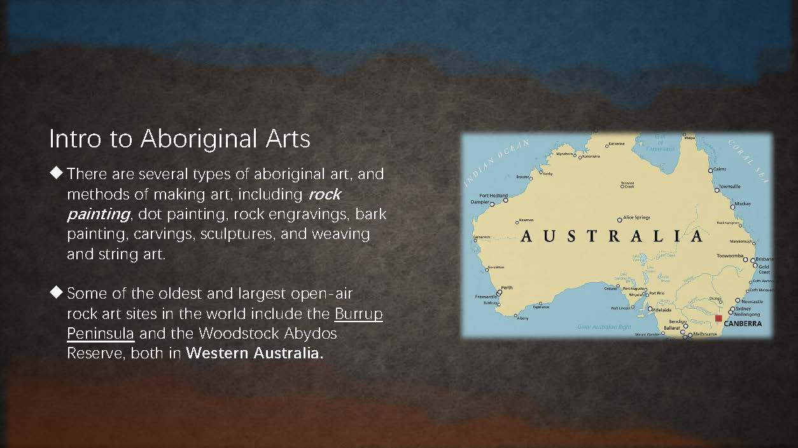

  - Researchers assume that there are ***more than 100,000*** significant rock art sites in Australia.
  - Only a third of Australia's Aboriginal rock art has been recorded.

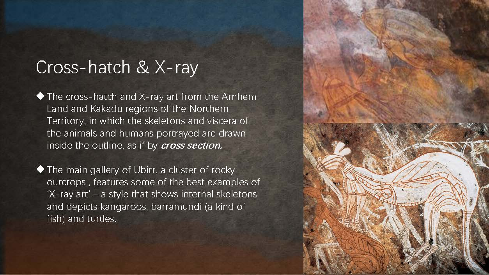

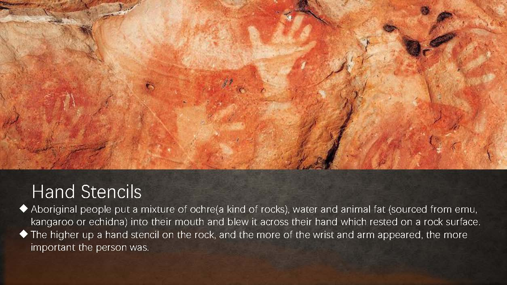

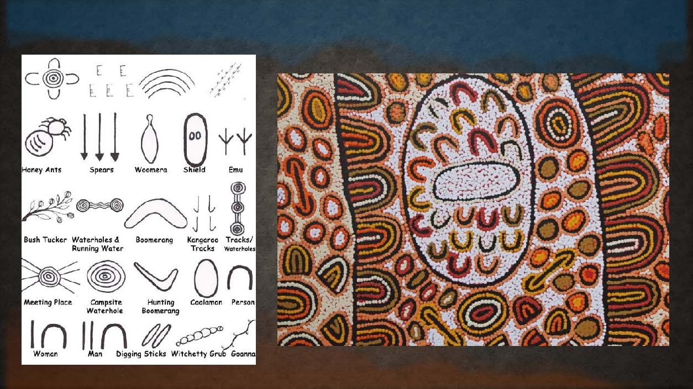

<h5>Characteristics</h5> 
  - Traditional Indigenous Australian art almost always has a mythological undertone relating to the Dreamtime of Indigenous Australian artists.  
  - Story-telling and totem representation feature prominently in all forms of Aboriginal artwork.  

<h5>References</h5>
  - http://www.wikiwand.com/en/Indigenous Australian art
  - https://japingkaaboriginalart.com/articles/aboriginal-art-symbols/
  - https://www.creativespirits.info/aboriginalculture/arts/aboriginal-rock-art#ixzz5VwilokQe
  - https://www.australiangeographic.com.au/topics/history-culture/2016/03/top-7-aboriginal-rock-art-sites/
  - http://www.visual-arts-cork.com/ancient-art/aboricinal.htm
  - https://imour.com/gallery/V99by
  - http://www.visitnarrabri.com.au/event/narrabri-adfas-2017-ancient-mayan-art-and-architecture/
  - https://www.gostudyaus.es/blog/canberra-capital-australia/

-->

Click to Open

<h5>The Intro to Aboriginal Rock Art, Main Types of Rock Painting and Characteristics of Rock Art</h5> 

*image of the Australian map*
  - Researchers assume that there are ... significant rock art sites in ...  
  - Only ...'s Aboriginal rock art ...  

*image of Cross-hatch and X-ray art from Arnhem Land And Kakadu region*

*image of Aboriginal hand stencil art found on rocks*

*image of Aboriginal Dot Painting*

*image of Dot Painting depecting various meanings and forms* 

<h5>Characteristics</h5> 
  - Traditional ... almost always has a ...  
  - ... and ... representation feature prominently in all forms ...  

<h5>References</h5>
  - http://www.wikiwand.com/en/Indigenous Australian art
  - https://japingkaaboriginalart.com/articles/aboriginal-art-symbols/
  - https://www.creativespirits.info/aboriginalculture/arts/aboriginal-rock-art#ixzz5VwilokQe
  - https://www.australiangeographic.com.au/topics/history-culture/2016/03/top-7-aboriginal-rock-art-sites/
  - http://www.visual-arts-cork.com/ancient-art/aboricinal.htm
  - https://imour.com/gallery/V99by
  - http://www.visitnarrabri.com.au/event/narrabri-adfas-2017-ancient-mayan-art-and-architecture/
  - https://www.gostudyaus.es/blog/canberra-capital-australia/

After reading through these three resources, consider the following question:

 - **Can rock art can be regarded as a language?**

As you discuss this with your partner, provide reasons for your point of view. Make sure you comment on each of the three global examples you read about (rock paintings, rock carvings).

As part of your discussion, also consider your position from the ***"whistling"*** conversation in the previous unit - do you believe whistling falls into the same category as rock art? Why or why not?

The following criteria will be used to grade your contribution to this discussion:

| Grade |% | Assessment Criteria|
| : | :-- | :- |
| A |4 | Outstanding contribution and follow-up commentsthat inspire a rich and fruitful discussion. Demonstrates understandingof material as well as an ability to tie the material to larger ideas, makingrich connections and evoking deep and interesting questions. Thus, evidenceof thorough preparation, i.e. reading or viewing the required material. |
| B |3 | Evidence of some preparation, and consequently comments lackunderstanding or insight. |
| C |2 | Minimal contribution. Or, not having read or viewed the requiredmaterial that is the basis of the discussion topic. |
| D |0 | No contribution or a contribution that feels rushed like it was“just something that had to be done for the grade.” |

The evaluation of this will count towards the 4% awarded for participation. It will be based on the degree of creative thinking demonstrated by each student during the discussion. **Students will be assessed during the discussion.**

:::

## Unit Test #3 

In addition to the graded discussion, each student is required to complete the third unit test at the end of Unit 7.

::: {.callout-caution}

***Please note*** that this unit test will focus on all content covered in Units 6 and 7. Be sure to take some time to review the content in each section.
Additional information can be found by selecting the **Unit Test #3** tab at the bottom of the page. Here, you will find instructions for taking the test.

*This test will represent 10% of your overall grade for the course.*

:::

### Checking Your Learning {-}

::: {.callout-important}

Before you move on to the next unit, check that you are able to:

  Explain different types of individual and collective expression and art forms.

  Identify cultural performances and performances of culture.

  Describe the basic elements of art.

  Explain the functions of art.

  Explain how art is a personal expression and cultural identity.

  Interact with different art forms – real and virtual.

:::

