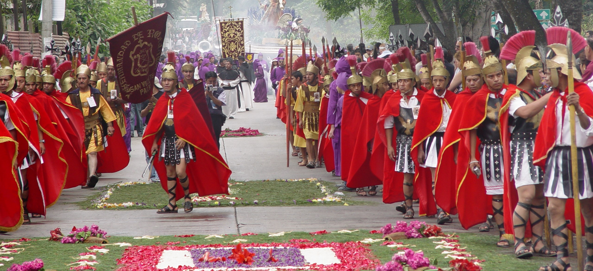
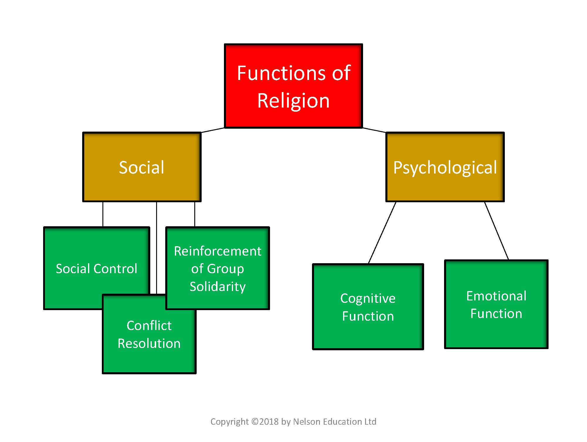
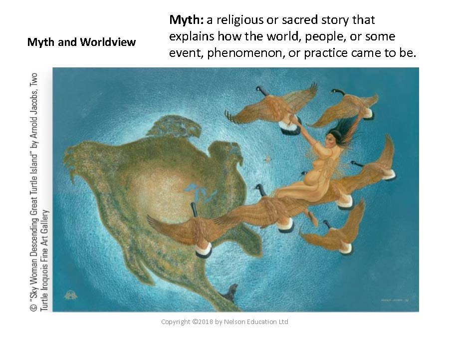
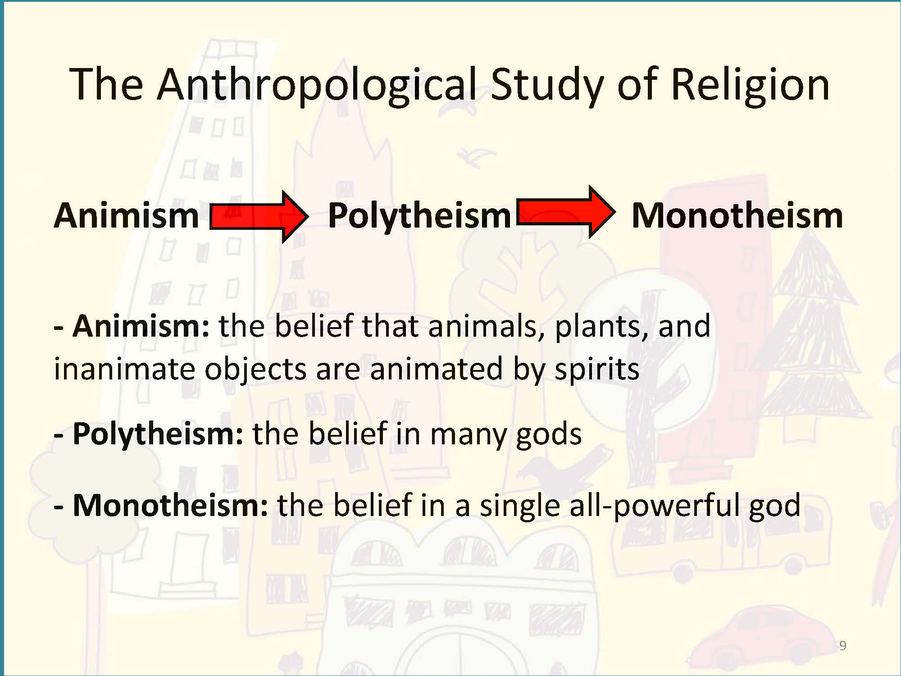
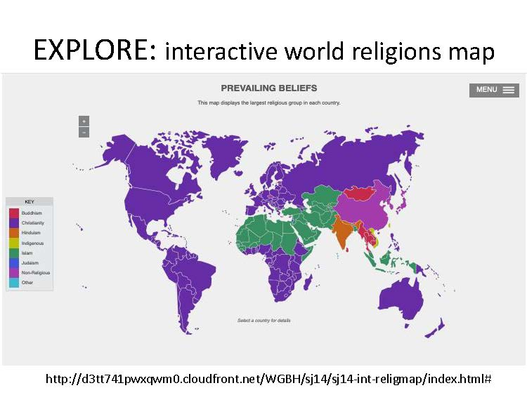
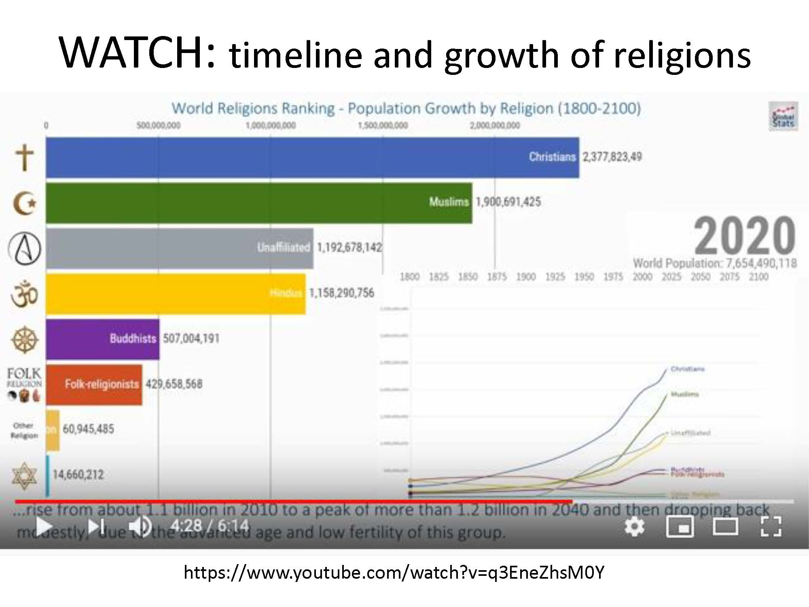
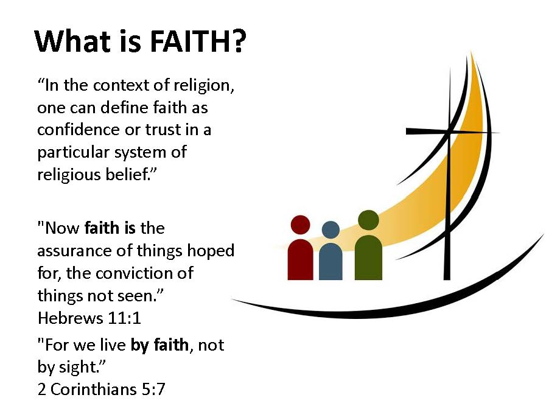
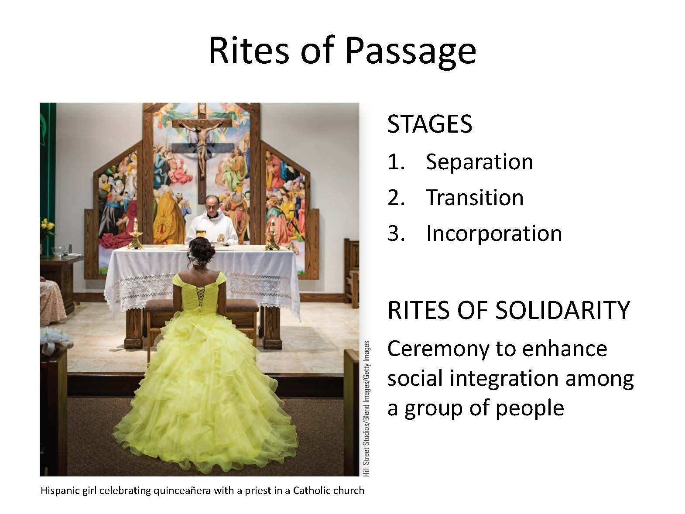
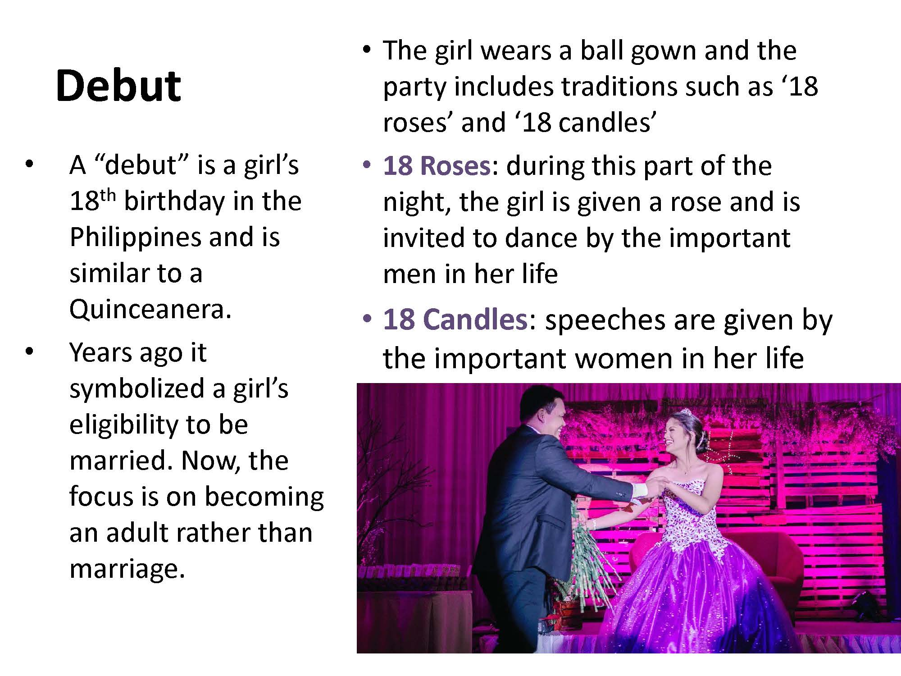

# Religion and Rites

*Semana Santa, a Catholic festival at the end of Lent (before Easter) in Antigua, Guatemala. Photo by Ruth Anaya*

### Overview {-}

This is not a study of world religions. While you will get a snapshot view of that, you will learn broader and more fundamental concepts about religion. Your study in this unit will define and explain concepts from an anthropological point of view, and not a theological perspective. Anthropologists do not study god, but study how societies understand the intangible world through different belief systems. Those systems have functions and elements, beliefs and practices. We conclude the unit by exploring rites that often have a sacred element. These rites of our lives are often happy occasions; they are always significant.

### Topics {-}

This unit is divided into the following topics:

 1.	Aspects and Functions of Religion  
 2.	Belief Systems: From Magic and to Religions  
 3.	Rituals: Form vs Faith  

#### Learning Outcomes {-}

When you have completed this unit, you should be able to:

 - Define religion and explain its significance in human cultures.  
 - Explain the importance of and the functions of belief systems/religions in society.  
 - Identify the four elements of religion (cosmology, belief in the supernatural, rules of behavior, and rituals) and explain how each element contributes to religious practices.  
 - Identify the world’s main religions by category and type.  
 - Describe the global dispersion and growth of Christianity and major world religions.  
 - Define rites of passage, and rites of intensification, and explain the purpose of the type of ritual.  

### Activity Checklist {-}

::: {.callout-note}

Here is a checklist of learning activities you will benefit from in completing this unit. You may find it useful for planning your work.

:::

### Topic Resources {-}

- At the bottom of the page in Topic 1, students will find some important resources. There are a number of readings and slides for you to review.  
- At the bottom of the page in Topic 2, students will find some important resources. There are a number of readings and slides for you to review. Additionally, the videos and Learning Activities will also help support your understanding belief systems all over the world.  

## Learning Lab {-}

As part of the Learning Lab for Unit 8, students will be engaging in two discussions. The first discussion will focus on the Aborigines and the Maori. Students are expected to view the videos and thoughtfully consider the questions - this can be found on the "Learning Lab" tab. Each student should watch these videos prior to the Learning Lab - come prepared to share your thoughts.
During this Learning Lab, students will also participate in a formally graded discussion. More information about this assessment, as well as an outline, can be found by clicking on the "Assessment" tab for Unit 8.

## Assessment 

::: {.callout-tip}
As mentioned above, students will engage in a formally assessed discussion. The first component of this discussion will involve a discussion that focuses on the questions provided (these can be found by clicking on the "Assessment" tab). Come prepared to share your thoughts - your Facilitator will guide the discussion.

In addition, each student will make a brief presentation on a Rite of Passage topic that they have researched. This research needs to take place prior to the Learning Lab. Each student will need to arrive to the Learning Lab prepared to present their PowerPoint presentation. An outline of expectations is also provided on the "Assessment" tab for Unit 8. Before arriving to the Learning Lab, each student will also need to upload and submit their presentation to the **Rite of Passage Research Activity** dropbox found at the bottom of the page.
:::

### Resources {-}

Here are the resources you will need to complete this unit:

 - Brown, N., de González, L. T., McIlwraith, T. F., & American Anthropological Association. (2018). *Perspectives: An Open Invitation to Cultural Anthropology.*  
   - [**Chapter 11: Religion**](http://perspectives.americananthro.org/Chapters/Religion.pdf)  
 - Dastrup, R. A. (2019). *Introduction to Human Geography.*
   - [**Introduction to Human Geography**](https://humangeography.pressbooks.com/)  
 - Lumen Learning. (n.d.) Open Learning. *Cultural Anthropology. Lumen Learning.*  
   - [**Chapter 12**](https://courses.lumenlearning.com/culturalanthropology/)  
 - Other online resources will be provided in the unit.  

## Aspects and Elements of Religion  

Religion plays a central role in cultures around the world. As such, it is impossible to really understand a culture without appreciating their beliefs in the supernatural. Cultures across the globe hold supernatural beliefs as a central focus of their communities. The practice and celebration of rites and rituals are important sources of study and observation for an Anthropologist as they provide great insights in better understanding cultural values.

::: {.callout-caution}
**Remember** - *Not all cultures practice "traditional" religion so an Anthropologist focuses on supernatural practices and celebrations in order to better study culture.*
:::

### Topic 1 Resources {-}

The resources below will help you better understand the content explored in this unit. Take some time to explore this material - it will be discussed during the Learning Lab and will play an important role in course assessments.

### Activity {-}

::: {.callout-note}

#### Reading {-}
<!-- #### *Reading #1* {-}Hidden comment -->

  - Use the slides below to support your understanding of the readings. If there are sections of the notes that you are struggling to understand, follow up by reading the relevant section in the textbook.
    - [**Religion**](http://perspectives.americananthro.org/Chapters/Religion.pdf)

<!-- Hidden comment 
[presentation="anth101/presentations/u14"]

Click to Open

<h5>Learning Objectives</h5>
  - The significance of religion  
  - The importance of supernatural beliefs in human communities  
  - Four elements of religion  
  - Rites and rituals  

<h5>Defining Religion</h5>
  - Difficult to define because so many forms exist
    - Many societies do not make a distinction between
"religious" and daily cultural practices  
  - A broad definition of religion is "the means by which human society and culture is extended to include the nonhuman"
  - A system of beliefs and practices involving supernatural beings and forces that functions to provide meaning, peace of mind, and a sense of control over unexplainable phenomena

*Diagram depecting funtions of Religion*

<h5>SOCIAL</h5>
  - 1. **Social control**: When social sanctions are backed with supernatural authority, they become more compelling, e.g., the Ten Commandments.
    - Creates fear of divine retribution
    - It is the belief in the power of the supernatural sanctions that determines the level of conformity to socially prescribed behaviour.
  - 2. **Conflict resolution**: Religion diffuses the stress and frustrations that lead to social conflict.
  - 3. **Reinforcement of group solidarity**:
    - enables people to express their common identity in an emotionally charged environment.

<h5>PSYCHOLOGICAL</h5>
  - 1. **Cognitive function**: helps to explain the unexplainable.  
    - Religion provides a framework for giving meaning to events and experiences that cannot be explained in any other way.  
    - **Worldview**: a society's knowledge, beliefs, and perspective on the world.  
  - 2. **Emotional function**: helps individuals cope with the anxieties that often accompany illnesses, accidents, deaths, and other misfortunes.  
    - People use supernatural forces to try to control the circumstances of their lives.  

<h5>Elements of Religion</h5>
  - Cosmology - an explanation for the origin or history of the world  
    - Ancient Greeks; Book of Genesis  
  - Belief in the supernatural - a realm beyond direct human experience  
  - Rules governing behavior - proper conduct, what is right and wrong  
  - Ritual - practices or ceremonies that serve a religious purpose  

*image of painting depecting Myth*

<h5>Belief in the Supernatural</h5>
  - Animatism - belief in an impersonal supernatural force (Ex: mana)
  - Animism - belief in supernatural beings, spirits, or aspects of humans (the soul)
    - Spirits generally make demands on the living
    - Ex: filial piety in China; Japanese Shintoism
  - Gods - powerful non-human spirits
    - monotheistic (single deity) or polytheistic (multiple deities)

<h5>Mana</h5>
  - An impersonal and powerful supernatural force that can reside in people, animals, plants, and objects

<h5>Magic</h5>
  - The manipulation of nature using supernatural methods such as spells and rituals
    - a. Imitative magic
    - b. Contagious magic

<h5>Types of Magic</h5>
  - Imitative magic  
    - Based on the idea that the procedure performed resembles the desired result  
    - Performing a magical ritual on the likeness of someone or event to influence the real person or event.  
  - Contagious magic  
    - Based on the premise that things, once in contact with a person, continue to influence that person after separation  
    - Performing a magical ritual on something that has been in contact with someone to influence that person  

*image of a slide showing the Antropological study of religion*

<h5>Beliefs Illustrated</h5>
  - The Aborigines of Australia

   
<iframe width="560" height="315" src="https://www.youtube-nocookie.com/embed/NrgYGMv5dYw" title="YouTube video player" frameborder="0" allow="accelerometer; autoplay; clipboard-write; encrypted-media; gyroscope; picture-in-picture; web-share" allowfullscreen></iframe>

  - The Maori of New Zealand:
  - https://www.youtube.com/watch?v=uwN3TcsLXsU

  <iframe width="560" height="315" src="https://www.youtube.com/embed/uwN3TcsLXsU" title="YouTube video player" frameborder="0" allow="accelerometer; autoplay; clipboard-write; encrypted-media; gyroscope; picture-in-picture; web-share" allowfullscreen></iframe>

// todo #15
  - https://www.youtube.com/watch?v=7911 eXKoWo

<h5>Types of Religion</h5>
  - Categories of religion:(well-known anthropologist Anthony Wallace)  
    - 1. Individualistic  
    - 2. Shamanistic  
    - 3. Communal  
    - 4. Ecclesiastical  
  - Types of religion:  
    - 1. Polytheism  
    - 2. Monotheism  
    - 3. Atheism  
    - 4. Animism  
    - 5. Totemism  

*image of interactive world religions map*

*image of timeline and growth of religions*

<h5>Religious Practitioners</h5>
  - Priest - full-time religious practitioners
    - May be of any gender, has authority to set rules and control access to religious rites
  - Shaman - part-time independent religious practitioner
    - Often with traits that seem "abnormal" in the context of the community
  - Prophet - person who claims to have direct communication with the supernatural realm
    - Give examples

<h5>Rituals</h5>
  -  Ritual - a set of behaviours using words, gestures, and objects, performed in a prescribed sequence and manner
  -  Rites of Passage - a ceremony designed to transition individuals between life stages
  -  Rites of Intensification - actions designed to bring a community together (communitas)
  - *What Christian practices illustrate the above?
  - What are some rituals we practice in our homes and families?*
  - Revitalization rituals - solving serious problems through supernatural intervention (omit)

*image of a slide defining faith*

*image of a girl celebrating quinceañera in a Catholic church*

<h5>Rites of Passage</h5>
  - STAGES
    - 1. Separation: 
    - removal of old status  
    - 2. Transition: 
    - Initiate is separated from the old status but has not yet achieved a new status.  
      - May endure certain unpleasant ordeals while removed from normal, everyday life for a certain period of time  
      - Will experience communitas, or community, because all the initiates go through the ritual together  
      - Receives the skills and knowledge to be successful in the next state. This can last from a few minutes to years, e.g., students in university: 4 years in communitas where they acquire the skills and knowledge required for life after graduation.  
    - 3. Incorporation: a ceremony to mark the new status; usually marked with a new set of clothes or by some physical change.  

*image of a father and daughter dancing on her Debut*

<h5>RITES OF PASSAGE</h5>
  -  We conclude this topic with research and discovery about a rite of passage.See the course unit for instructions.
  -  Some examples of what can be researched are provided by this list.
    -  Bar Mitzvah (Jewish)
    -  Bacha Posh (Afghanistan)
    -  Bull Jumping (Hamer of Ethiopia)
    -  Bullet Ant Initiation (Amazon, Brazil)
    -  Dipo (Ghana)
    -  Khatam Al Koran (Malaysia)
    -  Land diving (Vanuatu)
    -  Potong gigi or mesangih or mepandes (Indonesia, Bali)
    -  Sikhebo (Bukusu in Kenya)
    -  Tamil Puberty Ceremony (Sri Lanka)
    -  Tchooodi (Mali)

-->

Click to Open

<h5>Learning Objectives</h5>
  - The significance of religion  
  - The importance of supernatural beliefs in human communities  
  - Four elements of religion  
  - Rites and rituals  

<h5>Defining Religion</h5>
  - Difficult to define because ...
    - Many societies do not make a distinction between "..." and ...    
  - A broad definition of religion is "..."  
  - A system of beliefs and ... involving ... and forces that ..., ..., and a sense of ...  

*Diagram depecting funtions of Religion*

<h5>SOCIAL</h5>
  - 1. **Social control** : When social ..., they become more ..., e.g., the Ten Commandments.  
    - Creates fear ...  
    - It is the belief in the ...  
  - 2. **Conflict resolution**: Religion diffuses ... and frustrations ...  
  - 3. **Reinforcement of group solidarity** :
    - enables people to ...  

<h5>PSYCHOLOGICAL</h5>
  - 1. **Cognitive function**: helps to ...  
    - Religion provides a framework for ...  
    - **Worldview**: a society's knowledge, ..., and ...  
  - 2. **Emotional function** : helps individuals cope with t..., ..., ..., and other misfortunes.  
    - People use ... forces to try to ...  

<h5>Elements of Religion</h5>
  - Cosmology - ...  
    - Ancient Greeks; Book of Genesis  
  - Belief in the supernatural - ...  
  - Rules governing behavior - ...  
  - Ritual - ...

*image of painting depecting Myth*

<h5>Belief in the Supernatural</h5>
  - Animatism - ... (Ex: mana)  
  - Animism - ..., ..., or aspects of humans (the soul)  
    - Spirits generally ...  
    - Ex: filial piety in China; Japanese Shintoism
  - Gods - ...  
    - monotheistic (single deity) or polytheistic (multiple deities)

<h5>Mana</h5>
  - ..., animals, ..., and ...  

<h5>Magic</h5>
  - The manipulation of ...
    - a. ... magic
    - b. ... magic

<h5>Types of Magic</h5>
  - Imitative magic  
    - Based on the idea that ...  
    - Performing a magical ritual on the ... or event to ...  
  - Contagious magic  
    - Based on the ... that things, once in contact with a person, ...  
    - Performing a magical ... on something that has been in ... to influence that person  

*image of a slide showing the Antropological study of religion*

<h5>Beliefs Illustrated</h5>
  - The Aborigines of Australia

   
<iframe width="560" height="315" src="https://www.youtube-nocookie.com/embed/NrgYGMv5dYw" title="YouTube video player" frameborder="0" allow="accelerometer; autoplay; clipboard-write; encrypted-media; gyroscope; picture-in-picture; web-share" allowfullscreen></iframe>

  - The Maori of New Zealand:
  - https://www.youtube.com/watch?v=uwN3TcsLXsU

  

  <iframe width="560" height="315" src="https://www.youtube.com/embed/uwN3TcsLXsU" title="YouTube video player" frameborder="0" allow="accelerometer; autoplay; clipboard-write; encrypted-media; gyroscope; picture-in-picture; web-share" allowfullscreen></iframe>

// todo #15
  - https://www.youtube.com/watch?v=7911 eXKoWo

<h5>Types of Religion</h5>
  - Categories of religion:(well-known anthropologist Anthony Wallace)  
    - 1. ... 
    - 2. Shamanistic  
    - 3. ...
    - 4. Ecclesiastical  
  - Types of religion:  
    - 1. Polytheism  
    - 2. ... 
    - 3. Atheism  
    - 4. Animism  
    - 5. ...

*image of interactive world religions map*

*image of timeline and growth of religions*

<h5>Religious Practitioners</h5>
  - Priest - ...  
    - May be of any gender, has authority to ... and control ...  
  - Shaman - ...  
    - Often with traits that seem "..." in the context ...  
  - Prophet - person who claims to ...  
    - Give examples

<h5>Rituals</h5>
  -  Ritual - a set of ..., gestures, and ..., performed in a ... and ...  
  -  Rites of Passage - a ceremony designed to ...  
  -  Rites of Intensification - ... designed to bring ... (communitas)
  - *What Christian practices illustrate the above?
  - What are some rituals we practice in our homes and families?*
  - Revitalization rituals - solving serious ... (omit)

*image of a slide defining faith*

*image of a girl celebrating quinceañera in a Catholic church*

<h5>Rites of Passage</h5>
  - STAGES
    - 1. ... : 
    - removal of old status  
    - 2. Transition: 
    - Initiate is separated from ... but has ...    
      - May endure ... while removed from normal, ...  
      - Will experience communitas, or community, because ...  
      - Receives the ... and ... to be successful in the next state. This can last ..., e.g., students in university: 4 years in communitas where they acquire the skills and knowledge required for life after graduation.  
    - 3. Incorporation: a ceremony to ...; usually marked with ... or by some ...  

*image of a father and daughter dancing on her Debut*

<h5>RITES OF PASSAGE</h5>
  -  We conclude this topic with research and discovery about a rite of passage. See the course unit for instructions.
  -  Some examples of what can be researched are provided by this list.
    -  Bar Mitzvah (Jewish)
    -  Bacha Posh (Afghanistan)
    -  Bull Jumping (Hamer of Ethiopia)
    -  Bullet Ant Initiation (Amazon, Brazil)
    -  Dipo (Ghana)
    -  Khatam Al Koran (Malaysia)
    -  Land diving (Vanuatu)
    -  Potong gigi or mesangih or mepandes (Indonesia, Bali)
    -  Sikhebo (Bukusu in Kenya)
    -  Tamil Puberty Ceremony (Sri Lanka)
    -  Tchooodi (Mali)

<!-- ### *Reading #2* {-}Hidden comment -->

  - Take some time to read through the following section on supernatural beliefs. This will serve as a foundation as we explore this topic in greater detail.
    - [**Supernatural Belief Systems**](https://courses.lumenlearning.com/culturalanthropology/part/unit-12-supernatural-belief-systems/)

:::

### Topic 2 Resources {-}

The resources below will help you better understand the content explored in this unit. Take some time to explore this material - it will be discussed during the Learning Lab and will play an important role in course assessments.

### Activity {-}

::: {.callout-note}

As we continue, take some time to read about the different types of religion around the world. This begins our study of understanding the similarities, and differences, of beliefs around the globe.

 - 
**Types of Religion**

#### Watch and Reflect {-}

This webpage has 7 videos. View the videos but you may exclude the second TEDEd one by John Bellaimney called “The five major world religions” – this is optional.

 - [**Geography of World Religions**](https://humangeography.pressbooks.com/chapter/geography-of-languages-2/)

#### Learning {-}

**Explore the World Through an Interactive World Map **

Explore religious beliefs around the world through an interactive map that displays the religions that are the most prevalent in each country around the world. You may click on one of eight religious groupings listed in the menu to examine its relative prevalence in each country. The map features brief descriptions of each religious grouping and bar graphs that reflect the percentage of a country’s population associated with each grouping.

Take time to explore the world. Get a clear mental picture of your region of the world.

**Important:** *Read the explanatory sections under the heading “More Information About This Resource”. Read about “The Prevailing Group map …” which explains the color coding used for countries. Read “Each Religious Group map...” and “All maps display...”*

 - [**World Religions Map**](https://www.pbslearningmedia.org/resource/sj14-soc-religmap/world-religions-map/#.XtUux8Z7kWo)

**Watch Interactive Timeline of the World Religions **

This visualization shows the world’s most followed religions, and their growth between the years 1800 and 2100. Note the points when a particular religion jumps into a different position – if it goes up or down in its rank in the world.

WATCH one round of the timeline with an eye on Christianity and what the future of Christianity could look like.

As you watch, consider the following question:

  1. What implications does this have for freedom of religion globally?
  2. Will religious freedom increase or decrease, and for what reason do you think so?

<iframe width="560" height="315" src="https://www.youtube-nocookie.com/embed/q3EneZhsM0Y" title="YouTube video player" frameborder="0" allow="accelerometer; autoplay; clipboard-write; encrypted-media; gyroscope; picture-in-picture; web-share" allowfullscreen></iframe>

:::

### Discussion - Religion and Beliefs {-}

Prior to beginning this activity, come up with illustrations of rites of passage that you and/or a family member has gone through. These rites can begin right from the moment of birth. For some cultures, a personal rite of passage might be the events pertaining to death. In some cultures, even that is not the final rite. In some cultures, deceased ancestors continue to influence daily life for their living relatives.

*To help prepare for the discussion, consider the following questions:*

 1. What is the most recent rite you have experienced by participating in the event or ceremony?
 2. What is the next upcoming rite you are looking forward to?
 3. Establish, in your own mind, a sequence of rites that are likely to be part of your life experience.
 4. What are examples of rites that are practiced by individuals who identify as Christians, who are Jesus followers?
 5. Notice how important life events are often celebrated in a religious manner.

::: {.callout-caution}
***Next,*** take a look outward....*Are there rites and rituals neighbors practice that you do not practice?* Learn about them. Go further, and discover what rites of passage are practiced either in other parts of the world, or by people originally from other parts of the world.
:::

Follow the outline below prior to your Learning Lab:

#### ***Next...*** {-}

After listening to the conversations and hearing some of the examples and perspectives from other members of the class, choose a rite of passage that is not practiced by you and one that is not familiar to you - the purpose is to learn something new.

After identifying a topic, spend some time researching it. For this component, identify the participant’s gender, age or age range, if it is a private or public rite, is it religious or not, what is the nature of the ceremony (dance, music, etc), does it require anything special like special clothing or foods, etc...

Next, find 2-4 good pictures that portray something significant about the rite. With these images, create a *PowerPoint* presentation. This presentation  should be **two or three slides, no more.** Do not use more than 4 pictures. Note that you do not need a title or reference slides - put your references into the "Notes" section underneath the slide.

As part of your slides, be sure to explain the three stages: separation, transition, and incorporation. Make sure this is clear in your slide and in your notes. This information will also be verbally presented to the rest of the class. These notes **will need to be part of the "Notes" section on your PowerPoint as well.**

### Belief Systems: *From Magic and to Religions* {-}

In this section, we turn our study to people’s beliefs. This can range from what is commonly, but inaccurately called *superstitions,* to orthodox doctrines of the world’s major religions. There is a continuum of beliefs from animatism and animism to mana and magic. From polytheism to monotheism; from individualistic and atheistic to communal polytheistic religions and ecclesiastical organizations. These categories do not represent the full scope and variety of belief systems but they provide some perspective on the broad spectrum of belief systems around the globe.

### Topic 2 Resources {-}

 The resources below will help you better understand the content explored in this unit. Take some time to explore this material - it will be discussed during the Learning Lab and will play an important role in course assessments.

### Activity {-}

::: {.callout-note}

#### *Reading #1* {-}

As we continue, take some time to read about the different types of religion around the world. This begins our study of understanding the similarities, and differences, of beliefs around the globe.

 - 
**Types of Religion**

#### Watch and Reflect {-}

This webpage has 7 videos. View the videos but you may exclude the second TEDEd one by John Bellaimney called “The five major world religions” – this is optional.

 - 
**Geography of World Religions**

#### Learning: Explore the World Through an Interactive World Map {-}

Explore religious beliefs around the world through an interactive map that displays the religions that are the most prevalent in each country around the world. You may click on one of eight religious groupings listed in the menu to examine its relative prevalence in each country. The map features brief descriptions of each religious grouping and bar graphs that reflect the percentage of a country’s population associated with each grouping.

Take time to explore the world. Get a clear mental picture of your region of the world.

:::

::: {.callout-caution}

**Important:** *Read the explanatory sections under the heading “More Information About This Resource”. Read about “The Prevailing Group map …” which explains the color coding used for countries. Read “Each Religious Group map...” and “All maps display...”*

 - 
**World Religions Map**

#### Learning : Watch Interactive Timeline of the World Religions {-}

This visualization shows the world’s most followed religions, and their growth between the years 1800 and 2100. Note the points when a particular religion jumps into a different position – if it goes up or down in its rank in the world.

WATCH one round of the timeline with an eye on Christianity and what the future of Christianity could look like.

As you watch, consider the following question:

1. What implications does this have for freedom of religion globally?
2. Will religious freedom increase or decrease, and for what reason do you think so?

<iframe width="560" height="315" src="https://www.youtube-nocookie.com/embed/q3EneZhsM0Y" title="YouTube video player" frameborder="0" allow="accelerometer; autoplay; clipboard-write; encrypted-media; gyroscope; picture-in-picture; web-share" allowfullscreen></iframe>

<iframe width="560" height="315" src="https://www.youtube-nocookie.com/embed/q3EneZhsM0Y" title="YouTube video player" frameborder="0" allow="accelerometer; autoplay; clipboard-write; encrypted-media; gyroscope; picture-in-picture; web-share" allowfullscreen></iframe>

:::

### Rituals: *Form vs Faith* {-}

Rituals and rites are closely related concepts. You could think of a ritual as a common or customary way of doing something that has meaning to a particular individual, community or group of people.  It is meaningful and performed regularly. It is a general term. The word rite is more specifically applied to specific kinds of rituals that have a ceremonial or religious meaning and context. Both terms refer to actions or behaviors and are a “form” that carries meaning. They are passed on, down through generations. You could think of this as traditions that are characteristic of different groups such as families, clubs, or institutions. The form can be observed and described.

Religion is a form of practice. Some people will perform actions without it offering any meaning to them. It is merely a “form” an action. It can be observed when people speak certain words, dress in particular ways, or manipulate specific objects.  Faith, however, is not seen.  *Hebrews 11:1* says that faith pertains to “things not seen”. Therefore, rituals, even religious rituals or rites, are not the same thing as *“faith”.* However, rituals may be an expression of faith if that action or behavior carries deep meaning for the person. Many rites are considered to be sacred because they are used exclusively for a specific purpose that transcends daily, ordinary life. In this unit, you will explore cultural rituals and rites, that is, behaviors characteristic of a particular ethnic people group.

::: {.callout-caution}

 **Important:** In addition to the information below, students will also be responsible for a discussion and submission on Rites of Passage. This information can be found on the "Assessment" page.

:::

## Learning Lab {-}

The Learning Lab for Unit 8 will be a graded assessment that focuses on your participation in a group discussion. Students are expected to engage in a conversation that describes and compares the cultures of the Maori and the Aborigines.

Below, you will find some videos. Each student will watch these videos ***before attending this Learning Lab.*** You will also find some guidelines and questions below - these will serve as the basis for this discussion. Students are encouraged to take notes and highlight key information in preparation for this discussion - you are welcome to refer to these notes throughout the conversation.

### Activity: Watch and Reflect {-}

::: {.callout-note}

#### The Aborigines of Australia  {-}

In this video, we meet Marilyn, a Kuku Nyungkal Aboriginal woman, who, with her family, lives on the eastern shore of Australia’s tropical north. She has been living here the ancestral way far removed from the services and conveniences of modern life as part of the sublime performance of nature. Like her ancestors before her, Marilyn walks through the Nyungkal bubu, the Nyungkals country, acknowledging and conversing with the Spirit beings around her.

#### PROCEDURE FOR WATCHING: {-}

You will need to watch this short video several times to capture the sounds of birds and water, and to listen in on her conversation with her brother, who stands along the shoreline with her, and her ancestors, who are in the visible mountain off in the distance. The first time, simply watch and listen. The second time, right down your observations. The third time, notice and note more details in what you see and what you hear.

As you watch, consider the following questions:

 1.	Describe Marilyn’s identity and relationships relative to her living and deceased family and community members.
 2.	Describe how Marilyn sees her intangible yet real world. Be very attentive to her choice of words, especially adjectives like good and bad. What kind of relationships does she talk about?
 3.	Explain how she perceives the environment, and describe how she sees change happening around her. What aspects of her physical environment does she talk about? Why are those topics important?

<iframe width="560" height="315" src="https://www.youtube-nocookie.com/embed/NrgYGMv5dYw" title="YouTube video player" frameborder="0" allow="accelerometer; autoplay; clipboard-write; encrypted-media; gyroscope; picture-in-picture; web-share" allowfullscreen></iframe>

#### The Maori of New Zealand  {-}

Next, we watch two very short videos that have the same commentator, Dr. Rangimarie Turuki Rose Peri, an elder, healer and leader in the Maori community. She talks to you from her home just north of Tuai, a small town in the mountains of the North Island of Aotearoa New Zealand. She talks about ancient Maori ways and values.

Follow the same procedure for watching these videos as was just explained. Every sentence, and every word Rangimarie Peri says is important.

In the first clip, Rangimarie Peri talks about the importance of learning to understand and respect different peoples, cultures, traditions and the environment around us.

<iframe width="560" height="315" src="https://www.youtube-nocookie.com/embed/uwN3TcsLXsU" title="YouTube video player" frameborder="0" allow="accelerometer; autoplay; clipboard-write; encrypted-media; gyroscope; picture-in-picture; web-share" allowfullscreen></iframe>

In this next video, Rangimarie Peri tells her story and shows us the true meaning of self-acceptance:

<iframe width="560" height="315" src="https://www.youtube-nocookie.com/embed/79II_eXKoWo" title="YouTube video player" frameborder="0" allow="accelerometer; autoplay; clipboard-write; encrypted-media; gyroscope; picture-in-picture; web-share" allowfullscreen></iframe>

As you watch both video clips, consider the following questions:

 1.	Explain the Maori greeting in terms of the symbolism of your face.
 2.	Describe Rangimarie Peri in terms of her self-image regarding beauty, self-worth, confidence, and comparison to others.
 3.	Summarize and share with a partner or small group what you learned about yourself and how you view yourself and others. If viewing these videos has changed how you think, then, please comment on how you thought before viewing these videos and how you think now.

:::

The following criteria will be used to assess your contribution to this discussion:

| Grade |  %   |                     Assessment Criteria                      |
| : | :-- | :- |
|  A+   |  5   | Above and beyond. Outstanding visual presentation and write-up.  An A+ effort will involve several of the following: risk-taking, innovative  thinking, resolving a difficult contradiction or paradox, and connecting or  synthesizing ideas. |
|   A   | 4.5  | Excellent work. Clear evidence that instructions were followed,  and the core ideas of the topic or assignment have been understood and  implemented. |
|   B   | 3.5  | Good work, but there is not clear evidence that the core ideas  of the topic or assignment have been understood, or the work could be  improved through better writing, more writing, or better visuals. |
|  C+   | 2.5  | Fair work. Work is complete but it appears rushed and  unpolished, or there is no evidence of understanding and some evidence of  misunderstanding. |
|   D   |  1   | Poor work. Work was submitted but it is incomplete, wrong,  incorrect or off the mark. |
|   F   |  0   | Very poor work. Something was submitted but it is minimal,  incomplete, wrong, or off the mark. |

The evaluation of this will count towards the 5% awarded for participation. It will be based on the degree of creative thinking demonstrated by each student during the discussion. **Students will be assessed during the discussion.**

## Assessment {-}

::: {.callout-tip}

Unit 8 explored religion and supernatural beliefs. These beliefs reflect important elements of cultures around the world. This assessment focuses on thinking about your own experience with your beliefs as well as appreciating the similarities and differences of beliefs of other members of the class.

:::

During your Learning Lab, for this unit, you will be engaging in some research and a group discussion as you connect some of the ideas of this unit together.

Additionally, students will be expected to submit their research. To begin, follow the directions below:

::: {.callout-caution}

***Next,*** take a look outward....*Are there rites and rituals neighbors practice that you do not practice?* Learn about them. Go further, and discover what rites of passage are practiced either in other parts of the world, or by people originally from other parts of the world.

Follow the outline below prior to your Learning Lab:

:::

#### ***Next...*** {-}

After listening to the conversations and hearing some of the examples and perspectives from other members of the class, choose a rite of passage that is not practiced by you and one that is not familiar to you - the purpose is to learn something new.

After identifying a topic, spend some time researching it. For this component, identify the participant’s gender, age or age range, if it is a private or public rite, is it religious or not, what is the nature of the ceremony (dance, music, etc), does it require anything special like special clothing or foods, etc...

Next, find 2-4 good pictures that portray something significant about the rite. With these images, create a *PowerPoint* presentation. This presentation  should be **two or three slides, no more.** Do not use more than 4 pictures. Note that you do not need a title or reference slides - put your references into the "Notes" section underneath the slide.

As part of your slides, be sure to explain the three stages: separation, transition, and incorporation. Make sure this is clear in your slide and in your notes. This information will also be verbally presented to the rest of the class. These notes **will need to be part of the "Notes" section on your PowerPoint as well.**

Once you have completed your *PowerPoint* presentation, submit it for grading by uploading it to the **Rite of Passage Research Activity** dropbox at the bottom of the page.

The following criteria will be used to assess your assignment:

| Grade |  %   |                     Assessment Criteria                      |
| : | :-- | :- |
|  A+   |  5   | Above and beyond. Outstanding visual presentation and write-up.  An A+ effort will involve several of the following: risk-taking, innovative  thinking, resolving a difficult contradiction or paradox, and connecting or  synthesizing ideas. |
|   A   | 4.5  | Excellent work. Clear evidence that instructions were followed,  and the core ideas of the topic or assignment have been understood and  implemented. |
|   B   | 3.5  | Good work, but there is not clear evidence that the core ideas  of the topic or assignment have been understood, or the work could be  improved through better writing, more writing, or better visuals. |
|  C+   | 2.5  | Fair work. Work is complete but it appears rushed and  unpolished, or there is no evidence of understanding and some evidence of  misunderstanding. |
|   D   |  1   | Poor work. Work was submitted but it is incomplete, wrong,  incorrect or off the mark. |
|   F   |  0   | Very poor work. Something was submitted but it is minimal,  incomplete, wrong, or off the mark. |

This submission will count for 5% towards your final grade.

## Checking Your Learning {-}

::: {.callout-important}

Before you move on to the next unit, check that you are able to:  

  Define religion and explain its significance in human cultures.

  Explain the importance of and the functions of belief systems/religions in society.

  Identify the four elements of religion (cosmology, belief in the supernatural, rules of behavior, and rituals) and explain how each element contributes to religious practices.

  Identify the world’s main religions by category and type.

  Describe the global dispersion and growth of Christianity and major world religions.

  Define rites of passage, and rites of intensification, and explain the purpose of the type of ritual.

:::

