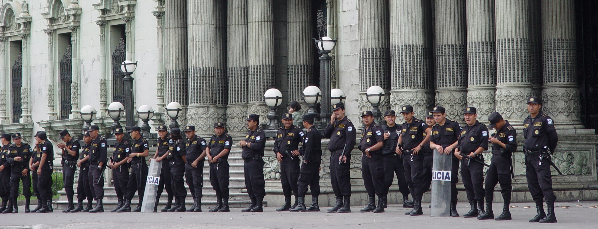
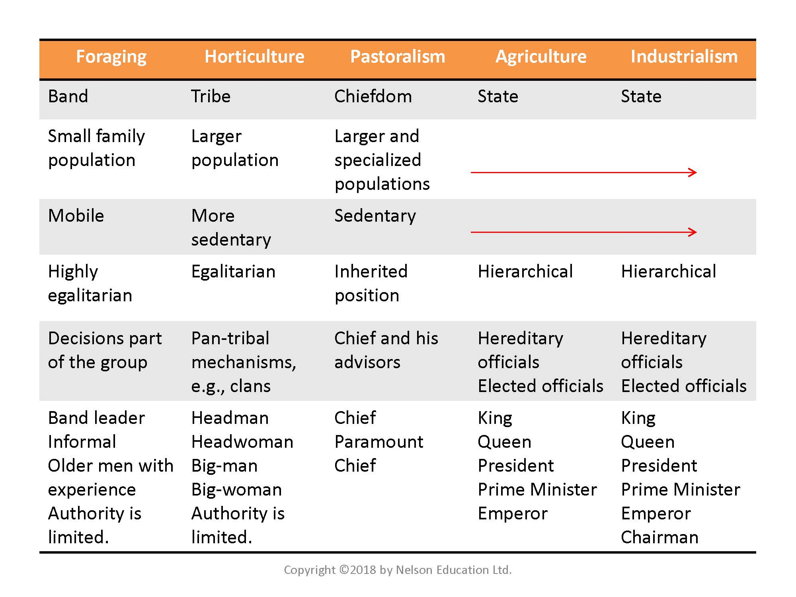
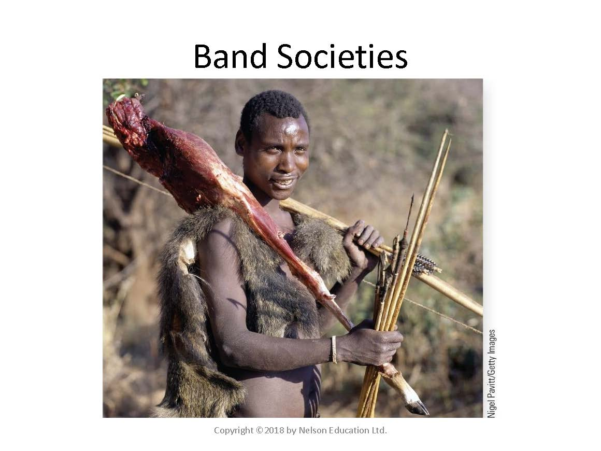
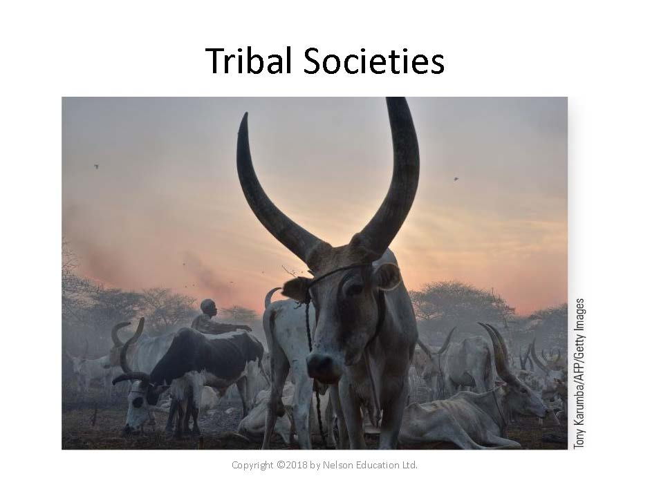
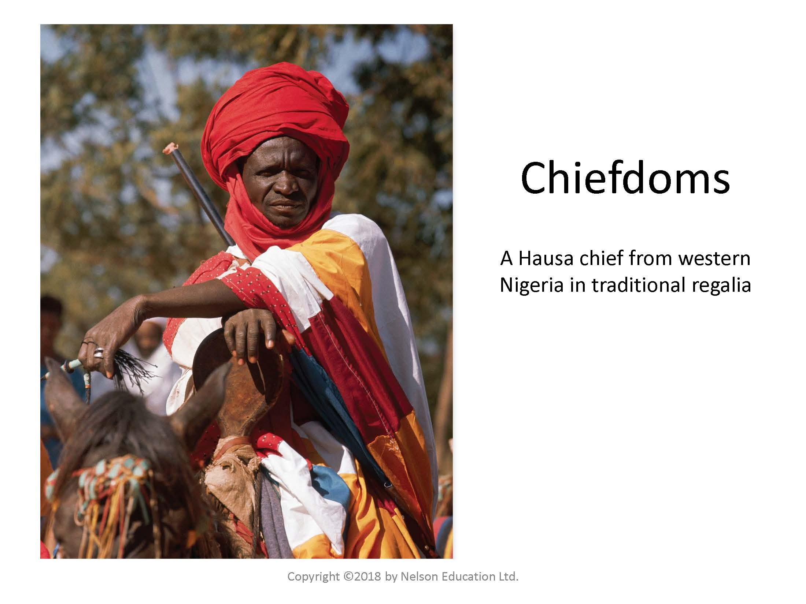
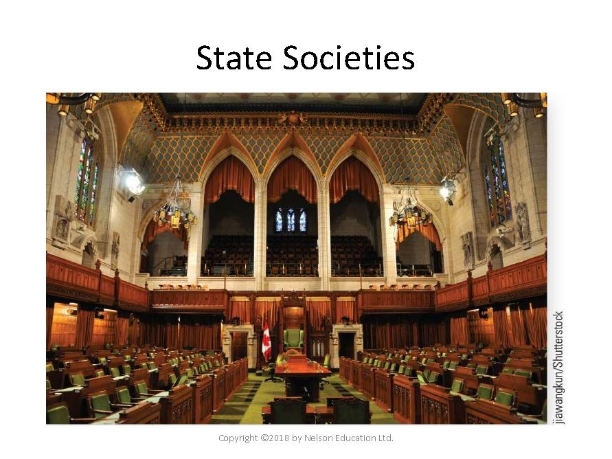
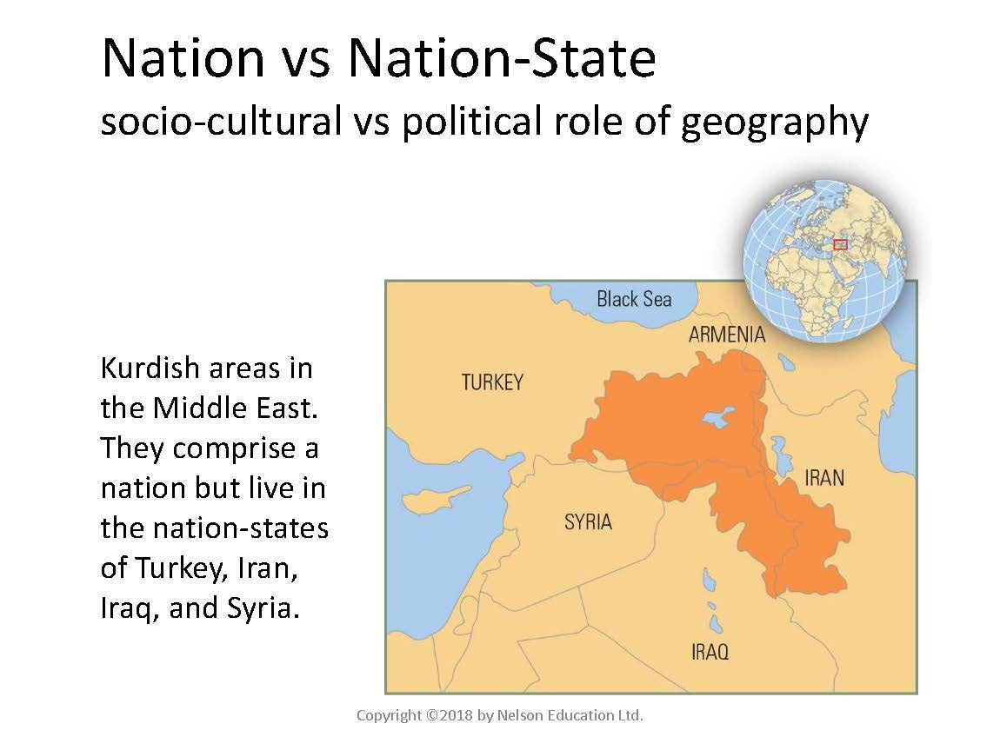

# Authority – Political Anthropology

*Palace army in front of the Parliament Building in Guatemala City. Photo by Ruth Anaya*

### Overview {-}

This unit introduces you to the last topic for a systematic study of anthropology, by way of a comparative approach. Every society has some way of controlling its members and of dealing with conflict. Norms, religion, and political structures all guide behavior. This unit covers socio-cultural integration of small-scale band societies, to tribes and chiefdoms, and lastly the state.

### Topics {-}

This unit is divided into the following topics:

  1. Levels and Types of Social Integration  
  2. Nations and Nation-States  

### Learning Outcomes {-}

When you have completed this unit, you should be able to:

 - Identify the four levels of socio-cultural integration (band, tribe, chiefdom, and state) and describe their characteristics.  
 - Compare systems of leadership in egalitarian and non-egalitarian societies.  
 - Describe systems used in tribes and chiefdoms to achieve social integration and encourage connections between people.  
 - Assess the benefits and problems associated with state-level political organizations.  
 - Explain the difference between nations and nation-states.  

## Activity Checklist {-}

::: {.callout-note}

Here is a checklist of learning activities you will benefit from in completing this unit. You may find it useful for planning your work.

:::

### Topic 1 Resources {-}

At the bottom of the page in Topic 1, students will find some important resources. There are a number of readings and slides for you to review.  

### Learning Lab {-}

During this Learning Lab, students will engage in a conversation about resolving conflict in a "traditional" manner. To prepare for this discussion, students have been provided with some questions to consider. Below these questions, you will find a video. As you watch the video, consider how those questions apply to the content in the video. Your Facilitator will lead the discussion so arrive to the Learning Lab prepared to share your thoughts.

### Assessment {-}

::: {.callout-tip}

At the end of Unit 9, students will complete their final **Unit Test #4 assessment**. This test will examine content studied in Units 8 and 9. More information, as well as the test, can be found at the bottom of the page.  

:::

### Resources {-}

Here are the resources you will need to complete this unit:

 - Brown, N., de González, L. T., McIlwraith, T. F., & American Anthropological Association. (2018). *Perspectives: An Open Invitation to Cultural Anthropology.*
    - [**Perspectives**](http://perspectives.americananthro.org/Chapters/Political_Anthropology.pdf)
 - Other online resources will be provided in the unit.

## Levels of Social Integration {-}

It is difficult to understand culture without appreciating how political structures can influence culture. Political organization can be egalitarian and non-egalitarian in practice. Most of what we understand about political structures we know from the perspective of our own complex systems. Understanding this evolution, and appreciating simpler political systems is important as they impact culture in different, but similar ways.

### Topic 1 Resources {-}

The resources below will help you better understand the content explored in this unit. Take some time to explore this material - it will be discussed during the Learning Lab and will play an important role in course assessments.

### Activity: Reading{-}

::: {.callout-note}

#### *Reading #1* {-}

Read the chapter alongside the PowerPoint notes

 - [**Political Anthropology: A Cross-Cultural Comparison**](http://perspectives.americananthro.org/Chapters/Political_Anthropology.pdf)

*Use the notes below to help guide your reading:*

<!-- Hidden comment 
[presentation="anth101/presentations/u15"]

Click to Open

<h5>Learning Objectives</h5> 
  - Identify 4 levels of socio-cultural integration  
  - Compare systems of leadership in egalitarian and non-egalitarian societies  
  - Describe systems used in tribes and chiefdoms  
  - Assess the benefits and problems associated with state-level political organizations  
  - Explain the difference between nations and nation-states.  

<h5>Basic Concepts in Political Anthropology</h5> 
  - How societies exercise political control  
  - Power - the ability to induce behavior of others in specified ways by means of coercion or physical force  
  - Authority - the ability to induce behavior of others by persuasion  
  - Legitimacy - the perception that an individual has a valid right to leadership  

<h5>Levels of Socio-Cultural Integration</h5> 
  - Four Levels
    - Band
    - Tribe
    - Chiefdom
    - State
  -  Three Types
    -  Egalitarian
    -  Ranked
    -  Stratified
  

image of a chart describing various aspects of Foraging, Horticulture, Pastoralism, Agriculture and Industrialism

image of native African man with his hunt meat

<h5>Egalitarian Societies: Bands</h5>
  - Few differences between members in wealth, status, and power  
  - Bands  
    - Foragers  
    - Nomadic  
    - Lack formal leadership or adjudication  
    - Modesty is valued  
    - Interpersonal arguments create conflict  

<h5>Band Societies</h5>
  - It is the basic social unit found in many hunting-and-gathering (foraging) societies.  
  - These societies are characterized by being kinship based and having no permanent political structure.  
  - Most bands number between 30 and 50 people.  
    - associated with low population densities, distribution systems based on reciprocity, and egalitarian social relations.  
  - Conflicts within bands are minimal and'are solved informally.
  - Bands are integrated by kinship and marriage, and not by politics.
    - have the least political integration and role specialization.
  - Leadership roles in band societies are informal.

image of cattle herd

<h5>Example Tribal Societies</h5>
  - Cattle are traditionally a source of *enmity between the main tribes* of Dinka and Nuer, who for generations have **raided each other's lands**, and fought and killed for possession due to the respect and prestige that owning numerous head of cattle is perceived to carry.  

<h5>Egalitarian Societies: Tribes</h5>
  - Tribes
    - Defined groups linked together  
    - 100 - 5,000 people  
    - No centralized government  
    - Leadership roles open, not hereditary  
    - Social integration through sodalities, men's houses, formal gift exchanges, and marriage  

<h5>Tribal Societies</h5>
  - Most commonly found among horticulturalists (among food producers) and pastoralists.  
  - Larger and more sedentary populations.  
  - Composed of a number of autonomous political units sharing common linguistic and cultural features.  
  - Have certain pan-tribal mechanisms that cut across a number of local segments and integrate them into a larger whole.  
  - Leadership is informal and not vested in a centralized authority.  

<h5>Law in Tribal Societies</h5>
  - Use negotiation, mediation, or divine events to resolve conflict  
  - Warfare consists of raids or feuds both internally and externally  
  - Example: video on the Pokot's traditional way of resolving conflict  

image of a Hausa cheif of western Nigeria

<h5>Ranked Societies: Chiefdoms</h5>
  - Greater differentiation between individuals and their kin groups, hierarchy of prestige  
  - Chiefdoms  
    - Permanent political office of chief, may be hereditary  
    - Economic redistribution  
    - Social integration through marriage and secret societies  

<h5>CHIEFDOM</h5>
  - Political authority is likely to reside with a single individual or chief and his or her advisors  
  - Involves a larger and more specialized population  
  - More formal and permanent political structure  
  - Tend to have quite distinct social ranks  
  - Chiefdoms integrate a number of local communities in a formal and permanent way  
  - Made up of local communities that differ from one another in terms of rank and status  

<h5>CHIEF</h5>
  - Hereditary, and the chief and immediate kin are a social and political elite  
  - Involves a system of economic redistribution headed by the chief  
  - Usually supported by alleged supernatural powers  
  - Internal social disruptions are minimal  

<h5>Stratified Societies</h5>
  - Elites (a numerical minority) control strategic resources that sustain life  
  - Ex: Caste systems  
    - Membership is determined by birth, no movement from one to another (such as in class systems);  
    - endogamous marriage  

image of Canadian Parliament

<h5>Stratified Societies: State</h5>
  - State  
    - Political power is centralized in a government that has a monopoly over the legitimate use of force  
    - Large, diverse populations  
    - Complex economies (often market economy)  
    - Social stratification  
    - Intensive agriculture or industrial subsistence  
    - Defined geographical territory  
  - Heads of state, often with councilors  
  - Administrative bureaucracy handles public functions  
  - Taxation or tribute  
  - Ideologies maintain the elites' power  
  - Nation is not synonymous with state  
    - Nation is a group connected by language, territorial base, history, political organization  
  - How do states form?  
    - Elite minority controls resources of majority  
    - Increased agricultural productivity  
    - Peasant farmers were the original subjects of state society formation, i.e. state controls peasant resources  
    - Loss of land and self-sufficiency  
  - Law is formal and codified, adjudication
  - Warfare is widespread
    - led to acquisition of resources by taking control of adjacent populations
  - Tendency toward instability
    - Extreme disparities in wealth, use of force, stripping of peoples' resources, harshness of laws  

<h5>Types of State Societies (A)</h5>
  - **Autocratic state**: controlled by à leader who holds absolute power and denies popular participation in decision making  
  - **Totalitarian state**: the state recognizes no limits to its authority and strives to regulate every aspect of public and private life  
  - **Dictatorship**: one individual holds power  

<h5>Types of State Societies (B)</h5>
  - Monarchy: the power rests with a single individual or family .. inherited  
  - Theocracy: ultimate power rests with a deity or God  
  - Representative democracy: a form of government in which power rests with the citizens, who periodically elect members of their society to represent them in decision-making through some structural form  

image of Kurdish areas in the Middle-East

<h5>Nation vs Nation-State</h5>
  - 1. What is the difference between a nation and a nation-state?  
  - 2. What is the one factor that confuses the issue? (Poly ethnicity)  
  - 3. In a polyethnic nation-state, how do you create a sense of allegiance to the larger political and geographic entity that overrides the importance of ethnic identity?  
  - **Nation**: people who share a common identity, history, and culture (ethnic group)  
  - **Nation-state**: a **socio-cultural** entity as well as a political community that has legitimacy over a defined territory  
  - **Polyethnic**: people from many ethnic backgrounds living within the same nation-state or geographic area  
    - Few of the 200 nation-states in the world have populations with homogeneous cultural identities.  
  - Issues began in the 19th and 20th centuries when European colonizers divided the world into political and geographic nation-states with little regard for ethnic groups.  
  - A major challenge (for many nation-states) contain within their boundaries distinct ethnic populations that seek independence or greater autonomy, as illustrated by the French in Canada and the Kurds in Turkey.  

-->

Click to Open

<h5>Learning Objectives</h5> 
  - Identify 4 levels of socio-cultural integration  
  - Compare systems of leadership in egalitarian and non-egalitarian societies  
  - Describe systems used in tribes and chiefdoms  
  - Assess the benefits and problems associated with state-level political organizations  
  - Explain the difference between nations and nation-states.  

<h5>Basic Concepts in Political Anthropology</h5> 
  - How societies ...  
  - Power - the ability to ... by means of ... or ...  
  - Authority - the ability to ...  
  - Legitimacy - the perception that ...  

<h5>Levels of Socio-Cultural Integration</h5> 
  - Four Levels
    - Band
    - ...  
    - ...  
    - State
  -  Three Types
    -  ...  
    -  ...  
    -  ...  
  

*image of a chart describing various aspects of Foraging, Horticulture, Pastoralism, Agriculture and Industrialism*

*image of native African man with his hunt meat*

<h5>Egalitarian Societies: Bands</h5>
  - Few differences between members in wealth, ..., and ... 
  - Bands  
    - ...  
    - Nomadic  
    - Lack formal ... or ... 
    - Modesty is ... 
    - Interpersonal arguments ...    

<h5>Band Societies</h5>
  - It is the basic social unit found in ...(foraging) ...    
  - These societies are characterized by ... and having no ...    
  - Most bands number between ... and ...  
    - associated with ..., distribution systems based ..., and ...  
  - Conflicts within bands are ... and ...
  - Bands are integrated by ... and ..., and not ...  
    - have the least ... and ...  
  - Leadership roles in ...  

*image of cattle herd*

<h5>Example Tribal Societies</h5>
  - Cattle are traditionally a source of *...* of ... and ..., who for generations have **r...**, and fought and killed for ... and prestige that ... is perceived to carry.  

<h5>Egalitarian Societies: Tribes</h5>
  - Tribes
    - ...  
    - 100 - ... people  
    - ... government  
    - Leadership roles open, ...  
    - Social integration through ..., men's ..., formal ..., and ...   

<h5>Tribal Societies</h5>
  - Most commonly found among ... (among food producers) and ...  
  - Larger and more ...  
  - Composed of a number of ... and ...  
  - Have certain ... that cut across a number of local segments and ...  
  - Leadership is ... and not vested ...  

<h5>Law in Tribal Societies</h5>
  - Use ..., ..., or divine ...  
  - ... consists of raids or feuds both ... and ...  
  - Example: video on the Pokot's traditional way of resolving conflict  

*image of a Hausa cheif of western Nigeria*

<h5>Ranked Societies: Chiefdoms</h5>
  - Greater differentiation between ... and ..., ... 
  - Chiefdoms  
    - ..., may be hereditary  
    - Economic redistribution  
    - Social integration through ... and ...  

<h5>CHIEFDOM</h5>
  - ... authority is likely to reside with a single individual or chief and ...  
  - Involves a larger and ...   
  - More formal and ...  
  - Tend to have quite ...  
  - ... integrate a number of local communities in a ...  
  - Made up of ... that differ from one another in ...  

<h5>CHIEF</h5>
  - ..., and the chief and ... and ... elite  
  - Involves a system of ...  
  - Usually supported by ...  
  - Internal ... are ...  

<h5>Stratified Societies</h5>
  - Elites (...) control ... that sustain life  
  - Ex: Caste systems  
    - Membership is determined by birth, no movement from one to another (such as in class systems);  
    - endogamous marriage  

*image of Canadian Parliament*

<h5>Stratified Societies: State</h5>
  - State  
    - Political power is ... that has a monopoly over ...  
    - Large, ...  
    - Complex economies (often market economy)  
    - ...  
    - Intensive agriculture or ...  
    - Defined geographical ...  
  - Heads of state, ...  
  - ... bureaucracy handles ...  
  - Taxation or ...  
  - Ideologies ...  
  - Nation is not ... with ...  
    - Nation is ..., ..., history, ...
  - How do states form?  
    - ... minority controls ...  
    - Increased agricultural ....  
    - ... were the original subjects of state ..., i.e. state controls ...  
    - Loss of ... and ...  
  - Law is ... and ..., ...  
  - Warfare is ...  
    - led to acquisition of ...  
  - Tendency toward instability
    - Extreme ... in wealth, use of ..., stripping of ..., ...  

<h5>Types of State Societies (A)</h5>
  - **Autocratic state**: ... and denies popular ...  
  - **Totalitarian state**: the state recognizes ... and ... and ...  
  - **Dictatorship**: ...  

<h5>Types of State Societies (B)</h5>
  - Monarchy: the power rests ... inherited  
  - Theocracy: ... or God  
  - Representative democracy: a form of government in which power ..., who ... members of their society to ... through some ...  

*image of Kurdish areas in the Middle-East*

<h5>Nation vs Nation-State</h5>
  - 1. What is the difference between a nation and a nation-state?  
  - 2. What is the one factor that confuses the issue? (Poly ethnicity)  
  - 3. In a polyethnic nation-state, how do you create a sense of allegiance to the larger political and geographic entity that overrides the importance of ethnic identity?  
  
  - **Nation**: ... (...)  
  
  - **Nation-state**: a **...** entity as well as a ... that has ...
 
  - **Polyethnic**: people from many ... living within the ...   
    - Few of the ... nation-states in the world have populations with ...  
  - Issues began in the ...th and ...th centuries when ... divided the world into ... and ... with little regard ...  
  - A major challenge (for many nation-states) contain within their ... that seek independence or ..., as illustrated by the ... in Canada and the ... in Turkey.  

:::

## Nations and Nation-States 

Of the four levels of political organization we have looked at, the state is the most formal. In this system, political power is centralized in a government who oversees most functions of society. States will develop in societies with large, ethnically diverse populations and are characterized by complex economies that can be driven by command or by the market.

Throughout your life you may have heard the terms **state** and **nation** used interchangeably. It is important to note that they are *NOT* the same thing. A ***state*** is a coercive political institution; whereas a ***nation*** is an ethnic population. Also of important note, however, is that the vast majority of states in the world, including the United States, are multi-national.

## Learning Lab {-}

In this Learning Lab, students will engage in a group discussion that focuses on a different perspective for resolving conflict. To begin, watch the video below - as you watch the video, consider the following questions (*these will serve as the focus for the discussion*):

#### *Questions for Consideration:* {-}

As you watch, consider:

1. How effective you think the approach is?
2. Would this approach work among a tribe that are farmers?
3. Can you see any parallel approach in urban contemporary societies? Could that approach work? *Why or why not?*

### Activity: Watch and Reflect {-}

::: {.callout-note}

 - *Resolving Conflicts the Traditional Way* {-}

In this video, we examine an example of conflict resolution that comes from the pastoralist Pokot tribe in Kenya.

<iframe width="560" height="315" src="https://www.youtube-nocookie.com/embed/R39RWdwCmGw" title="YouTube video player" frameborder="0" allow="accelerometer; autoplay; clipboard-write; encrypted-media; gyroscope; picture-in-picture; web-share" allowfullscreen></iframe>

:::

::: {.callout-caution}

**Note:** *Students will be assessed, during Learning Lab's, based on the* ***"Participation"*** *criteria. This criteria can be found under the* **Assignment** *tab at the top of the page - it is important to review this information prior to the Learning Lab.*

:::
## Assessment

#### Unit Test #4 {-}

::: {.callout-tip}

Each student is required to complete the final unit test at the end of Unit 9.

Additional information can be found by selecting the **Unit Test #4** tab at the bottom of the page. Here, you will find instructions for taking the test.

*This test will represent 10% of your overall grade for the course.*

:::

::: {.callout-caution}

***Please note*** that this unit test will focus on all content covered in Units 8 and 9. Be sure to take some time to review the content in each section.

:::

## Checking Your Learning {-}

::: {.callout-important}

Before you move on to the next unit, check that you are able to:  

  Identify the four levels of socio-cultural integration (band, tribe, chiefdom, and state) and describe their characteristics.

  Compare systems of leadership in egalitarian and non-egalitarian societies.

  Describe systems used in tribes and chiefdoms to achieve social integration and encourage connections between people.

  Assess the benefits and problems associated with state-level political organizations.

  Explain the difference between nations and nation-states.

:::
