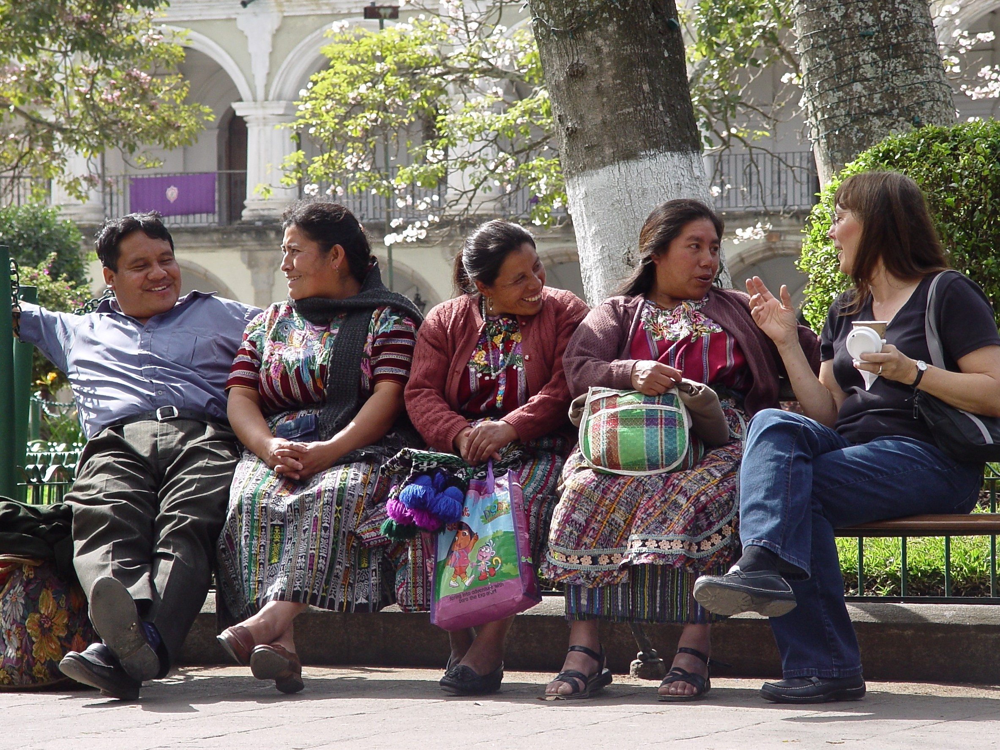

# Engaging with the World Around You

*Tourist with local Guatemalans in Central Park in Antigua, Guatemala. Photo by Ruth Anaya*

## Overview {-}

All the domains of life can be studied under the topic of anthropology. While you have been exposed to many interesting topics, much more remains to be studied, explored, and experienced. For that reason this unit will provide a collective experience when each student will present their culture trait presentation.  

This is also the unit and the week when you can revisit a topic you wished you could have studied more, or pick up on a topic that wasn’t covered. The unit is intentionally unstructured to give you freedom and time to conclude with something that is compelling.

::: {.callout-caution}

***Note:*** This unit will be structured differently then other units. Be sure to carefully follow the directions provided by your instructor.

:::

### Topics {-}

This concluding unit is divided into the following topic:

 1. Culture Trait Presentations

### Learning Outcomes {-}

When you have completed this unit, you should be able to:

 - Appreciate different cultures and the unique features that define or describe a culture group.  
 - Discover and express your view or learning about something you take pride in because you have understood something new, and found a voice to express it.  

## Learning Lab {-}

During this Learning Lab, each student will be presenting their **Culture Trait Presentation**. More information and directions for this assignment can be found on the "Assignment - Culture Trait" tab on the side of the page in Unit 10.  

In addition, your Facilitator will also be leading a discussion, during this Learning Lab, that will focus on exploring reviewing or exploring ideas you learned throughout the course. During this discussion, consider:

 - What did you learn, in this course, that took you by surprise?  
 - What ideas/concepts puzzled you before this course, that you now better understand?  
 - What would you like to learn more about?  

::: {.callout-caution}

**Note:** *Students will be assessed, during Learning Lab's, based on the ***"Participation"*** criteria. This criteria can be found under the **Assignment** *tab at the top of the page - it is important to review this information prior to the Learning Lab.*

:::

## Assessment {-}

During your Learning Lab for Unit 10, each student will be expected to present their Culture Trait project. This will be an oral presentation supported with visual media.

Expectations and instructions are outlined below...

### Culture Trait Presentation {-}

::: {.callout-caution}

***Note:*** The selection of a topic will take place during Unit 6. This will provide students with time to complete their research and develop their presentation.

:::

To begin this assignment, each student will select a cultural topic. A list of topics has been provided below:

 - [Culture Trait Presentation - Topics](assets/unit10/Culture_Trait_Topics.pdf)

Please note that this is not an exhaustive list. Students are encouraged to present on other cultural topics that have not been included on the handout above.

::: {.callout-caution}

**IMPORTANT:** Once you have selected your topic, you will need to seek out approval from the Facilitator. Each student will need to present on a separate topic and the Facilitator will keep track of who is presenting each topic. The Facilitator can also help focus and clarify topics if you are struggling.

:::

Once you have chosen a topic, ***and had it approved by the Facilitator,*** it is time to begin your research (*this will have been approved during Unit 6*).

#### Preparing Your Presentation {-}

Below, you will find some important information about what is expected for this assignment and presentation. Carefully read through each of the criteria and ensure you connect with the Facilitator if you have any questions.

### Guidelines {-}

Once you have identified your topic, each student will begin their research. It is expected that each student use *at least* **3 resources** as part of this process. As you involve yourself in the research, consider using:

 - Maps
 - Diagrams
 - Images
 - Other visuals

These will help engage an audience and support their understanding of the subject matter. Additionally, ensure that you *source each image.*

Presentations should be well-organized. Be sure to incorporate effective use of headings and subheadings to highlight/emphasize important information.

#### Content {-}

It is expected that all relevant content for the presentation be included in the ***"Notes"*** section at the bottom the slides (*this section is found at the bottom of each slide when using PowerPoint*). This section should include the main themes/ideas/information you will be conveying as part of your presentation.

#### The "Re-Cap" Slide {-}

Each student **must include a "Re-Cap" slide** as part of their presentation. The purpose of this slide is to highlight one important point you want to ensure each member of the audience understands about your topic. This should be specific and concise.

#### The "Question" Slide {-}

It is expected that each presentation also include one "Question" slide. The question slide should provide a prompt "to think." It should not be a question straight forward question of a fact. Instead, end with a question that requires an explanation, a perspective or reflection. Why questions are a good approach as they focus on understanding. I also recommend that you personalize the question (e.g. Why do you think that..?).

If you are planning on using any video clips as part of your presentation, please let the Facilitator know the day before your presentation - this will allow them time to set up the necessary technical equipment. 

The following criteria will be used to assess your assignment:

|  Grade   |    15%    |                     Assessment Criteria                      |
| : | :- | :- |
|    A+    |   14.4    | Superior work that exceeds requirements in research and  technical accuracy. Demonstrates creativity and insight of anthropological  concepts. Excellent and engaging speech qualities. |
|    A     |   13.3    | Excellent work. Uses relevant course terminology. Consideration  is given to amount and quality of research, including APA citations and  reference; quality of written content writing on the slides and the Notes  section; quality of slide visuals. Guidelines for preparing presentations are  given on the Assignments page. Fluent oral delivery. |
|    A-    |   12.2    | Very good work. Meets all criteria. Consideration is given to  amount and quality of research, including APA citations and reference;  quality of written content writing on the slides and the Notes section;  quality of slide visuals. Guidelines for preparing presentations are given on  the Assignments page. Good, clear speech qualities. |
| B- to B+ | 10.5-11.8 | Good work in that criteria were met but could be improved up.  Consideration is given to amount and quality of research, including APA  citations and reference; quality of written content writing on the slides and  the Notes section; quality of slide visuals. Guidelines for preparing  presentations are given on the Assignments page. |
|    C+    |   10.2    | Fair work. Work is complete but it appears rushed and  unpolished, or there is no evidence of understanding and some evidence of  misunderstanding. |
|    C     |    9.5    | Unacceptable work. Work is incomplete and appears rushed and  unpolished, or has significant errors demonstrating insufficient effort and  lack of understanding. |
|    D     |    7.5    | Poor work. Work was submitted but it is incomplete, wrong,  incorrect or off the mark. |
|    F     |     7     | Very poor work. Something was submitted but it is minimal,  incomplete, wrong, or off the mark. |

Once you have completed your *PowerPoint,* and before presenting, upload your presentation to the **Culture Trait Presentation Assignment** dropbox at the bottom of the page.

Please note that this assessment will count towards 15% of your final grade for this course.

## Assessment {-}

::: {.callout-tip}

For this, final assessment in the course, each student will develop an ***UnEssay.*** The information below provides an overview of what is expected. Additionally, you will also find instructions for this activity.

:::

### UnEssay Project {-}

The purpose of this assignment, is to produce a creative cultural item: *an UnEssay.* Throughout this course, and during the Learning Lab for Unit 10, you have been exposed to a wide range of aspects that cultural anthropologists investigate in their study. This activity, provides an opportunity to focus on a topic of your interest. Each student will design and deliver a creative piece of work on their chosen topic.

#### *What is an UnEssay?* {-}

It is a type of assignment in which students identify a topic that interests them (related to the course content), conduct research, and then demonstrate their understanding of the topic in any manner that is meaningful to them. The final form of the projects can vary greatly.

#### *Why an UnEssay?* {-}

Much of what you learn is decided by others. The purpose of the UnEssay is to allow a student freedom and flexibility for engaging with a topic intellectually and creatively.

### How do I Proceed? {-}

As mentioned above, this assignment is intended to allow for flexibility and creativity - each submission will look different. To begin, follow the steps below - they will guide you through the process and help you develop out your final submission for this activity:

**Step 1** {-}

*Reflect on what you learned - choose your own topic:*

 1. Each student needs to choose a topic for their UnEssay. The topic you choose, however, ***must*** be associated with the subject matter examined in this course. To help develop out a topic of interest, or to help identify a topic of interest, take some time to review the resources below:

### UnEssay Resources {-}

The resources for this unit depend on your interests. Therefore, nothing is given as required reading or viewing. However to spark interest and extend your awareness, I ask you to view these three sites. Thereafter, explore on your own.

- “The Good Life” is a short talk about the meaning of happiness, and the difference between happiness and the good life.  Watch and listen to “What is the good life?” (3:09).

   - [**The Good Life**](https://anth101.com/lesson9/)

- Browse the Survival International website and watch There you go(2:21), a short, satirical film that tells the story of how ‘development’ robs “tribal people of their land, self-sufficiency and pride and leaving them with nothing.”

   - [**Survival International**](https://www.survivalinternational.org/tribes)

- Honor-based Violence Awareness Network has an interactive art exhibition that portrays gender-based violence in Pakistan “where the concepts of honour and shame are fundamentally bound up with the expected behaviours of families and individuals, particularly those of women.”

   - [**HBVA**](http://hbv-awareness.com/)

After reviewing the resources above, take some time to brainstorm some possible topics - use these ideas to identify your *final* topic that will serve as the basis for your UnEssay.

If you are still struggling to identify a topic, consider doing your Unessay on the topic, “the Good Life”, as this topic can have meaning, and value, to you personally. As part of this, the following questions may serve as useful guides:

 - What does having a good life mean to people of a different culture (e.g. a young newly married bride in India, versus someone graduating with a law degree)?
 - How does age? Geography? Culture? influence what people call "the good life?"

Ultimately, this question has to do with your own values - present what *"the good life"* means to you.

You can also discuss your idea with your course facilitator so that you get feedback and input, and have clarity about what it is you hope to do.

**Step 2** {-}

*Create and present:*

This assignment provides an opportunity for each student to be creative. Your final submission should be accurate, interesting, and as complete and/or convincing as the topic allows. Consider the following suggestions:

 1. Written Work - some students may choose to submit written work for this assignment. If you choose to submit written work, please note that it should be ***informal.*** Your submission should be written as one might write a blog or magazine article; additionally, some students in the past have also written it as a speech.  
 2. Non-Written Work - some students may choose to submit something other than a written piece of work. This might include drawings, photography, or videography. Additionally, students have also submitted an infographic, such as a poster for this assignment.  

**Step 3** {-}

*Submit a statement about your work:*

 1. Regardless of how create and present your UnEssay, each student will accompany their creative product with a 1-2 page written explanation. This should include the following:

  - Why was your topic important and compelling to you?  
  - Why did you choose your presentation style?  
  - How did you go about creating your UnEssay?  
  - What did you learn throughout the process of creating your UnEssay?  
      - Does it reflect new thinking, or solidify values?  
      - How will you think differently now?  
      - What will you do differently now?  

### Additional Support {-}

The success and assessment of this project is based on you being creative, compelling, and effective. Creativity here refers to evidence that you have put thought into it, and that it is something clearly produced by you. I will define compelling and effective according to this post by Ryan Cordell (http://s17tot.ryancordell.org/assignments/unessays/).

An UnEssay is compelling when it shows some combination of the following:

 - it is as interesting as its topic and approach allows.
 - it is as complete as its topic and approach allows (it doesn’t leave the audience thinking that important points are being skipped over or ignored).
 - it is truthful (any questions, evidence, conclusions, or arguments you raise are honestly and accurately presented).

In terms of presentation, an UnEssay is effective when it shows some combination of these attributes:

 - it is readable/watchable/listenable (i.e. the production values are appropriately high and the audience is not distracted by avoidable lapses in presentation).
 - it is appropriate (i.e. it uses a format and medium that suits its topic and approach).
 - it is attractive (i.e. it is presented in a way that leads the audience to trust the author and his or her arguments, examples, and conclusions).

The following criteria will be used to assess your assignment:

| Grade |  %   |                     Assessment Criteria                      |
| : | :-- | :- |
|  A+   |  5   | Above and beyond. Outstanding visual presentation and write-up.  An A+ effort will involve several of the following: risk-taking, innovative  thinking, resolving a difficult contradiction or paradox, and connecting or  synthesizing ideas. |
|   A   | 4.5  | Excellent work. Clear evidence that instructions were followed,  and the core ideas of the topic or assignment have been understood and  implemented. |
|   B   | 3.5  | Good work, but there is not clear evidence that the core ideas  of the topic or assignment have been understood, or the work could be  improved through better writing, more writing, or better visuals. |
|  C+   | 2.5  | Fair work. Work is complete but it appears rushed and  unpolished, or there is no evidence of understanding and some evidence of  misunderstanding. |
|   D   |  1   | Poor work. Work was submitted but it is incomplete, wrong,  incorrect or off the mark. |
|   F   |  0   | Very poor work. Something was submitted but it is minimal,  incomplete, wrong, or off the mark. |

Once you have completed your project, submit your assignment by uploading it to the **UnEssay Assignment** dropbox at the bottom of the page.

 *This activity will represent 5% of your overall grade for the course.*

## Checking Your Learning {-}

::: {.callout-important}

Before you move on to the next unit, check that you are able to:  

  Appreciate different cultures and the unique features that define or describe a culture group.

  Discover and express your view or learning about something you take pride in because you have understood something new, and found a voice to express it.

:::

### Learning Activity {-}

::: {.callout-note}

#### Listen and Learn {-}

Present your Culture Trait PowerPoint. End with one recap and one question. The guidelines for doing this assignment are in a separate handout.

- As a presenter:
  
  - 1. The re-cap slide should restate something important from your presentation, that you want others to remember  
  - 2. The question slide should provide a prompt “to think”. It should not be a question straight forward question of a fact. Instead, end with a question that requires an explanation, a perspective or reflection. Why questions are a good approach as they focus on understanding. I also recommend that you personalize the question (e.g. Why do you think that …).  

- As a listener, you also need to be able to:  

  1. offer three things you learned from each peer presentation, and
  2. come up with one good question you can ask the presenter. Depending on time, you may or may not actually end up asking the question, but you need to be prepared with your question and your three facts.

:::

Ruth - some more direction/instruction here might help students

### UnEssay Resources {-}

The resources for this unit depend on your interests. Therefore, nothing is given as required reading or viewing. However to spark interest and extend your awareness, I ask you to view these three sites. Thereafter, explore on your own.

- “The Good Life” is a short talk about the meaning of happiness, and the difference between happiness and the good life.  Watch and listen to “What is the good life?” (3:09).

   - [**The Good Life**](https://anth101.com/lesson9/)

- Browse the Survival International website and watch There you go(2:21), a short, satirical film that tells the story of how ‘development’ robs “tribal people of their land, self-sufficiency and pride and leaving them with nothing.”

   - [**Survival International**](https://www.survivalinternational.org/tribes)

- Honor-based Violence Awareness Network has an interactive art exhibition that portrays gender-based violence in Pakistan “where the concepts of honour and shame are fundamentally bound up with the expected behaviours of families and individuals, particularly those of women.”

   - [**HBVA**](http://hbv-awareness.com/)

### Additional Support {-}

The success and assessment of this project is based on you being creative, compelling, and effective. Creativity here refers to evidence that you have put thought into it, and that it is something clearly produced by you. I will define compelling and effective according to this post by Ryan Cordell (http://s17tot.ryancordell.org/assignments/unessays/).

An UnEssay is compelling when it shows some combination of the following:

 - it is as interesting as its topic and approach allows.
 - it is as complete as its topic and approach allows (it doesn’t leave the audience thinking that important points are being skipped over or ignored).
 - it is truthful (any questions, evidence, conclusions, or arguments you raise are honestly and accurately presented).

In terms of presentation, an UnEssay is effective when it shows some combination of these attributes:

 - it is readable/watchable/listenable (i.e. the production values are appropriately high and the audience is not distracted by avoidable lapses in presentation).
 - it is appropriate (i.e. it uses a format and medium that suits its topic and approach).
 - it is attractive (i.e. it is presented in a way that leads the audience to trust the author and his or her arguments, examples, and conclusions).

  - 3. Prepare your presentation, beginning with research.
    - Sufficient resources should be used as this is a significant assignment (3 or so).
    - Consider using material such as maps, diagrams, pictures, etc.
    - An outline and the use of headings and sub-headings is helpful.
    - Use the presentation guidelines (two documents) posted on Moodle, in preparing your topic. E.g. make sure that you source your images. Do not show the References, as that is for your instructor, not the class. There are a number of important guidelines you need to incorporate from the handouts.
    - Put the content into the Notes section underneath a slide (speaker notes).

#### *Additionally...* {-}

Students are also expected to practice the following throughout the course:

 - Use course terminology. Reflect an anthropological focus. Use APA format.
 - Assignments should have a title, proper introduction and conclusion, etc. Good essays reflect good observation skills, creativity, accuracy, and as relevant to the assignment, personal experience.
 - Use 11-pt font, and single spacing except between paragraphs.
 - For PPT presentations, use the guidelines on the course site.
 - Submit assignments by uploading them to the Dropbox (no pdfs).

# Course Assignments

On this page you will find an outline of all required assignments for this course. Additionally, you will find important information about how you will be graded.

Take a moment to carefully read through the following:

#### Culture Trait PPT Presentation (15% of final grade) {-}

In this assignment, students will explore a specific cultural characteristic or practice of a cultural group distinctly different than your own culture. Explain the cultural concept, and illustrate with a culture. Example: Navaho blankets are an artistic expression full of meaning (pattern, color, etc.)

Students will present their research material in *PowerPoint* presentation format. Please refer to the rubric found on the "Assignment - Culture Trait" tab in Unit 10 for more information about how you will be assessed for this assignment.

**Due:** Unit 10

#### Unit Tests (4 x 10% each of final grade)

Students will complete four tests throughout this course. These tests will be based on course notes and text readings. These will be based on Units 1-2 (Test #1), Units 3-5 (Test #2), Units 6-7 (Test #3), and Units 8-9 (Test #4).

Additional information, as well instructions for taking the test, can be found at the bottom of the page in each of the units during which you will be completing this tests.

#### Course Activities (35% of final grade - broken down below) {-}

::: {.callout-note}

Throughout the course, students will be engaging in activities intended to help develop their appreciation for the scope of work a cultural anthropologist engages in. Instructions will be provided for each activity.

The activities (and corresponding weights) are outlined below:

 - Unit 2: Ethnography Challenge (4%)
 - Unit 4: Kinship and Descent Mapping (4%)
 - Unit 3-5: The UnThing Experiment Challenge (4%)
 - Unit 6: Discussion about whistling (4%)
 - Unit 7: Discussion about rock art (4%)
 - Unit 8: Description and comparison of the Maori and Aborigines (5%)
 - Unit 8 Rite of Passage Research (5%)
 - Unit 10: The UnEssay Project (5%)

For additional information, and a rubric that outlines how you will be graded for each of these activities, please refer to the "Assessment" tab in each of the units above.

:::

#### Participation (10% of final grade) {-}

Overall, this component requires active engagement with the text (readings), watching videos, actively participating in group discussion, and showing evidence of an inquiring mind (asking good questions). Engaging with every item on the course site is required, unless it is specified as being optional.

The following rubric will be used by the Facilitator to grade your participation in this course:

|               **Criteria**                |                          4-5 marks                           |                          2-3 marks                           |                          0–1 marks                           |
| : | :- | :- | :- |
|                **Quality**                | Sound evidence  that student has done course readings and has a thorough knowledge of  discussion topic | Evidence that  most of course readings done and student has some knowledge of discussion  topic | Minor  evidence that course readings were done and student understands discussion  topic |
|         **Communication Skills**          |   Contributions are  clear, concise and easy to understand   | Contributions are  usually, but not always clear, concise and easy to understand | Contributions are  too short/long and/or unclear and hard to understand |
| **Critical Thinking and Self-Reflection** | Exceptionally  well- supported, thoughtful, insightful comments made on others’ and own  postings | Some evidence  of critical thought and self-reflection on others’ and own postings | Minor  evidence of critical thought and reflection on others’ and own postings |
|             **Participation**             | Regularly  participates in, and facilitates interaction among members of online  community | Interacts now  and then with other members of online community | Rarely  interacts or responds to other members of online community |

#### *Additionally...* {-}

Students are also expected to practice the following throughout the course:

 - Use course terminology. Reflect an anthropological focus. Use APA format.
 - Assignments should have a title, proper introduction and conclusion, etc. Good essays reflect good observation skills, creativity, accuracy, and as relevant to the assignment, personal experience.
 - Use 11-pt font, and single spacing except between paragraphs.
 - For PPT presentations, use the guidelines on the course site.
 - Submit assignments by uploading them to the Dropbox (no pdfs).
